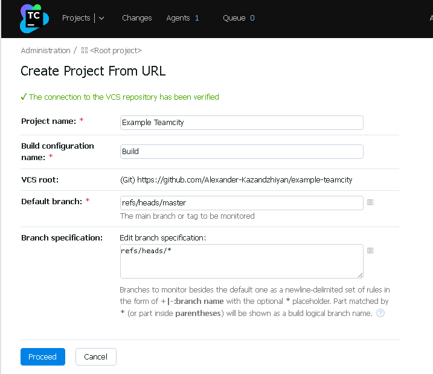

# Домашнее задание к занятию "09.04 Teamcity"

## Подготовка к выполнению

1. Поднимите инфраструктуру [teamcity](./teamcity/docker-compose.yml)
2. Если хочется, можете создать свою собственную инфраструктуру на основе той технологии, которая нравится. Инструкция по установке из [документации](https://www.jetbrains.com/help/teamcity/installing-and-configuring-the-teamcity-server.html)
3. Дождитесь запуска teamcity, выполните первоначальную настройку
4. Авторизуйте агент
5. Сделайте fork [репозитория](https://github.com/aragastmatb/example-teamcity)

## Основная часть

1. Создайте новый проект в teamcity на основе fork
2. Сделайте autodetect конфигурации
3. Сохраните необходимые шаги, запустите первую сборку master'a
4. Поменяйте условия сборки: если сборка по ветке `master`, то должен происходит `mvn clean package`, иначе `mvn clean test`
5. Мигрируйте `build configuration` в репозиторий
6. Создайте отдельную ветку `feature/add_reply` в репозитории
7. Напишите новый метод для класса Welcomer: метод должен возвращать произвольную реплику, содержащую слово `hunter`
8. Дополните тест для нового метода на поиск слова `hunter` в новой реплике
9. Сделайте push всех изменений в новую ветку в репозиторий
10. Убедитесь что сборка самостоятельно запустилась, тесты прошли успешно
11. Внесите изменения из произвольной ветки `feature/add_reply` в `master` через `Merge`
12. Убедитесь, что нет собранного артефакта в сборке по ветке `master`
13. Настройте конфигурацию так, чтобы она собирала `.jar` в артефакты сборки
14. Проведите повторную сборку мастера, убедитесь, что сбора прошла успешно и артефакты собраны
15. Проверьте, что конфигурация в репозитории содержит все настройки конфигурации из teamcity
16. В ответ предоставьте ссылку на репозиторий

---
## Выполнение


### Подготовка

1. Поднимите инфраструктуру [teamcity](./teamcity/docker-compose.yml)
2. Если хочется, можете создать свою собственную инфраструктуру на основе той технологии, которая нравится. Инструкция по установке из [документации](https://www.jetbrains.com/help/teamcity/installing-and-configuring-the-teamcity-server.html)
3. Дождитесь запуска teamcity, выполните первоначальную настройку

Приступим.  Будем поднимать сервисы на локальных онтейнерах с помощью `docker-compose`.
в файле docker-compose.yml посмотрели, каие образы нам потребуются:
```bash
user1@devopserubuntu:~$ cat docker-compose.yml
version: "3"
services:
  teamcity:
    image: jetbrains/teamcity-server
    volumes:
      - ~/teamcity/data/:/data/teamcity_server/datadir
      - ~/teamcity/logs/:/opt/teamcity/logs
    ports:
      - 8111:8111
  teamcity-agent:
    image: jetbrains/teamcity-agent
    depends_on:
      - teamcity
    volumes:
      - ~/teamcity/agent/:/data/teamcity_agent/conf
    environment:
      SERVER_URL: "http://teamcity:8111"
```
Скачиваем образы в локальный репозиторий:
```bash
user1@devopserubuntu:~$ sudo docker pull jetbrains/teamcity-server
Using default tag: latest
latest: Pulling from jetbrains/teamcity-server
8e5c1b329fe3: Pull complete
64dee48628f0: Pull complete
5a2d719b40dc: Pull complete
ca2e8e6655af: Pull complete
4c008ffb7caf: Pull complete
175900217477: Pull complete
975c3a4cd854: Pull complete
2f5d07f4b386: Pull complete
ae346c1c7409: Pull complete
00688a883120: Pull complete
3e7bbae24930: Pull complete
9cee82ded787: Pull complete
Digest: sha256:b4d2a754120e5127c7cf25a7fa2f7a5d6e1fb29c8ceebd23f15617973f34ea9b
Status: Downloaded newer image for jetbrains/teamcity-server:latest
docker.io/jetbrains/teamcity-server:latest

user1@devopserubuntu:~$ sudo docker pull jetbrains/teamcity-agent
Using default tag: latest
latest: Pulling from jetbrains/teamcity-agent
8e5c1b329fe3: Already exists
af04e3b0d368: Pull complete
751fa93adcf3: Pull complete
9804fd17adee: Pull complete
abd0efc03b48: Pull complete
c9676889c693: Pull complete
a8ef19137703: Pull complete
e354b09d03a9: Pull complete
4e83712a9f67: Pull complete
76f757d1188f: Pull complete
a515f4a9ff60: Pull complete
Digest: sha256:9dcd7e6704d6dae4ce2ca1768f304edcdbc40c28441ab692fa5bf39573bbca50
Status: Downloaded newer image for jetbrains/teamcity-agent:latest
docker.io/jetbrains/teamcity-agent:latest
```
Пробуем запустить:
```bash
user1@devopserubuntu:~$ sudo docker-compose up -d
[sudo] password for user1:
Creating network "user1_default" with the default driver
Creating user1_teamcity_1 ... done
Creating user1_teamcity-agent_1 ... done
```
Проверяем состояние:
```bash
user1@devopserubuntu:~$ sudo docker-compose ps
         Name                Command        State    Ports
----------------------------------------------------------
user1_teamcity-agent_1   /run-services.sh   Exit 1
user1_teamcity_1         /run-services.sh   Exit 1

user1@devopserubuntu:~$ sudo docker ps
CONTAINER ID   IMAGE     COMMAND   CREATED   STATUS    PORTS     NAMES
user1@devopserubuntu:~$ sudo docker ps -a
CONTAINER ID   IMAGE                       COMMAND                  CREATED              STATUS                          PORTS     NAMES
264acabd7a2e   jetbrains/teamcity-agent    "/run-services.sh"       About a minute ago   Exited (1) About a minute ago             user1_teamcity-agent_1
21801767d2bb   jetbrains/teamcity-server   "/run-services.sh"       About a minute ago   Exited (1) About a minute ago             user1_teamcity_1
```
Видим, что контейнеры создались. Но они не запущены, то есть сразу упали. Заглянем в их логи:
```bash
user1@devopserubuntu:~$ sudo docker logs user1_teamcity_1
/run-services.sh
/services/check-server-volumes.sh

>>> Permission problem: TEAMCITY_DATA_PATH '/data/teamcity_server/datadir' is not a writeable directory
>>> Permission problem: TEAMCITY_LOGS '/opt/teamcity/logs' is not a writeable directory

    Looks like some mandatory directories are not writable (see above).
    TeamCity container is running under 'tcuser' (1000/1000) user.

    A quick workaround: pass '-u 0' parameter to 'docker run' command to start it under 'root' user.
    The proper fix: run 'chown -R 1000:1000' on the corresponding volume(s), this can take noticeable time.

    If the problem persists after the permission fix, please check that the corresponding volume(s)
    are not used by stale stopped Docker containers ("docker container prune" command may help).
```
```bash
user1@devopserubuntu:~$ sudo docker logs user1_teamcity-agent_1
/run-services.sh
/services/run-docker.sh
/run-agent.sh
Will create new buildAgent.properties using distributive
TeamCity URL is provided: http://teamcity:8111
Will prepare agent config
cp: cannot create regular file '/data/teamcity_agent/conf/buildAgent.dist.properties': Permission denied
cp: cannot create regular file '/data/teamcity_agent/conf/buildAgent.properties': Permission denied
cp: cannot create regular file '/data/teamcity_agent/conf/log4j.dtd': Permission denied
cp: cannot create regular file '/data/teamcity_agent/conf/teamcity-agent-log4j2.xml': Permission denied
Error! Stopping the script.
```
Видим, что у обоих проблемы с работой в примонтированных папках, потому, что мы их даже не создавали. Смотрим в файле `docker-compose.yml`
```bash
user1@devopserubuntu:~$ pwd
/home/user1
user1@devopserubuntu:~$ mkdir teamcity
user1@devopserubuntu:~$ cd teamcity/
user1@devopserubuntu:~/teamcity$ mkdir data
user1@devopserubuntu:~/teamcity$ mkdir logs
user1@devopserubuntu:~/teamcity$ mkdir agent
user1@devopserubuntu:~/teamcity$ cd ..
user1@devopserubuntu:~$ chmod 775 -R teamcity/
user1@devopserubuntu:~$ sudo chown -R 1000:1000 teamcity/
```
После успешного запуска контейнеров открываем веб-интерфейс:


5. Авторизуйте агент

Теперь посмотрим, где наш агент.
Он в списке не авторизованных агентов.

авторизуем. Теперь он в разделе Connected.


6. Сделайте fork [репозитория](https://github.com/aragastmatb/example-teamcity)
Зашёл на гитхаб под своим аккаунтом, открыл ссылку на этот репозиторий и сделал fork
[https://github.com/Alexander-Kazandzhiyan/example-teamcity](https://github.com/Alexander-Kazandzhiyan/example-teamcity)

## Основная часть

1. Создайте новый проект в teamcity на основе fork




2. Сделайте autodetect конфигурации


3. Сохраните необходимые шаги, запустите первую сборку master'a.

Нажал на Run. Запустилась обработка на агенте


похоже всё завершилось успешно.

4. Поменяйте условия сборки: если сборка по ветке `master`, то должен происходит `mvn clean package`, иначе `mvn clean test`
5. Мигрируйте `build configuration` в репозиторий
6. Создайте отдельную ветку `feature/add_reply` в репозитории
7. Напишите новый метод для класса Welcomer: метод должен возвращать произвольную реплику, содержащую слово `hunter`
8. Дополните тест для нового метода на поиск слова `hunter` в новой реплике
9. Сделайте push всех изменений в новую ветку в репозиторий
10. Убедитесь что сборка самостоятельно запустилась, тесты прошли успешно
11. Внесите изменения из произвольной ветки `feature/add_reply` в `master` через `Merge`
12. Убедитесь, что нет собранного артефакта в сборке по ветке `master`
13. Настройте конфигурацию так, чтобы она собирала `.jar` в артефакты сборки
14. Проведите повторную сборку мастера, убедитесь, что сбора прошла успешно и артефакты собраны
15. Проверьте, что конфигурация в репозитории содержит все настройки конфигурации из teamcity
16. В ответ предоставьте ссылку на репозиторий

---

### Как оформить ДЗ?

Выполненное домашнее задание пришлите ссылкой на .md-файл в вашем репозитории.

---

---