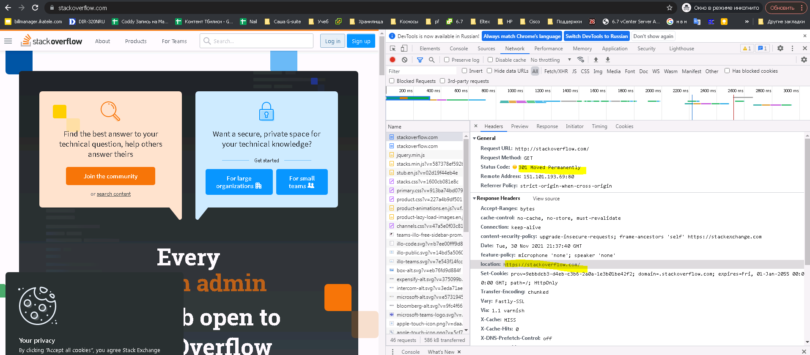
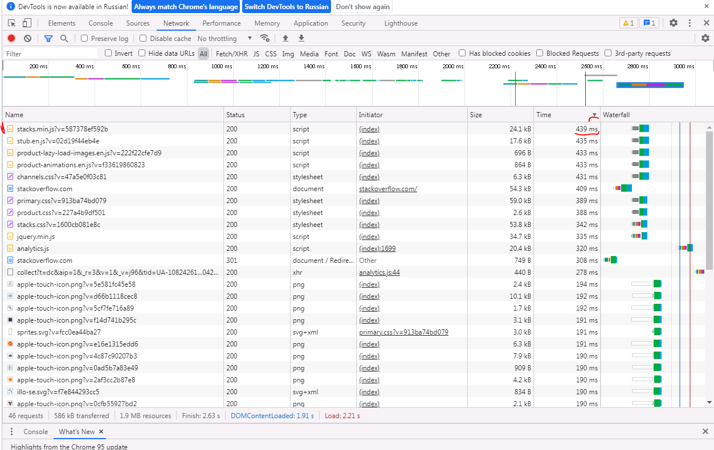

# Домашнее задание к занятию "3.6. Компьютерные сети, лекция 1"

1. Работа c HTTP через телнет.
- Подключитесь утилитой телнет к сайту stackoverflow.com
`telnet stackoverflow.com 80`
- отправьте HTTP запрос
```bash
GET /questions HTTP/1.0
HOST: stackoverflow.com
[press enter]
[press enter]
```
- В ответе укажите полученный HTTP код, что он означает?

Ответ:

```bash
[root@DevOpser tools]# telnet stackoverflow.com 80
Trying 151.101.129.69...
Connected to stackoverflow.com.
Escape character is '^]'.
GET /questions HTTP/1.0
HOST: stackoverflow.com

HTTP/1.1 301 Moved Permanently
cache-control: no-cache, no-store, must-revalidate
location: https://stackoverflow.com/questions
x-request-guid: 71dfcd96-fd0e-49b5-9085-aacdab3f9258
feature-policy: microphone 'none'; speaker 'none'
content-security-policy: upgrade-insecure-requests; frame-ancestors 'self' https://stackexchange.com
Accept-Ranges: bytes
Date: Tue, 30 Nov 2021 21:33:57 GMT
Via: 1.1 varnish
Connection: close
X-Served-By: cache-hel1410030-HEL
X-Cache: MISS
X-Cache-Hits: 0
X-Timer: S1638308038.808859,VS0,VE109
Vary: Fastly-SSL
X-DNS-Prefetch-Control: off
Set-Cookie: prov=9d6c3c26-9fb2-8fa1-2abb-1bd9f2292e99; domain=.stackoverflow.com; expires=Fri, 01-Jan-2055 00:00:00 GMT; path=/; HttpOnly

Connection closed by foreign host.
[root@DevOpser tools]# 
```
Мы получили код 301, что означает, что на сайте установлена безусловная постоянная переадресация на `https://stackoverflow.com/questions`.

2. Повторите задание 1 в браузере, используя консоль разработчика F12.
- откройте вкладку `Network`
- отправьте запрос http://stackoverflow.com
- найдите первый ответ HTTP сервера, откройте вкладку `Headers`
- укажите в ответе полученный HTTP код.
- проверьте время загрузки страницы, какой запрос обрабатывался дольше всего?
- приложите скриншот консоли браузера в ответ.

Ответ:


Дольше всего отрабатывал java скрипт, отмеченный на скриншоте


3. Какой IP адрес у вас в интернете?

Ответ:
Ради спортивного интереса будем определять свой адрес из командной строки. Воспользуемся первым же загугленным адресом сервера, возвращающего нам наш адрес:
```bash
[root@DevOpser tools]# curl -s http://tnx.nl/ip
194.190.8.221

[root@DevOpser tools]# curl -s http://tnx.nl/ip
162.55.33.177
```

4. Какому провайдеру принадлежит ваш IP адрес? Какой автономной системе AS? Воспользуйтесь утилитой `whois`

Ответ:
```bash
[root@DevOwhois -h whois.radb.net 162.55.33.177
route:          162.55.0.0/16
org:            ORG-HOA1-RIPE
descr:          HETZNER-DC
origin:         AS24940
mnt-by:         HOS-GUN
created:        2021-03-09T11:08:53Z
last-modified:  2021-03-09T11:08:53Z
source:         RIPE
remarks:        ****************************
remarks:        * THIS OBJECT IS MODIFIED
remarks:        * Please note that all data that is generally regarded as personal
remarks:        * data has been removed from this object.
remarks:        * To view the original object, please query the RIPE Database at:
remarks:        * http://www.ripe.net/whois
remarks:        ****************************
[root@DevOpser tools]# 
```
Так как моя ВМ выходит в интернет через тоннель, поднятый до ВМ на HETZNER, то соответственно провайдер получается HETZNER.

5. Через какие сети проходит пакет, отправленный с вашего компьютера на адрес 8.8.8.8? Через какие AS? Воспользуйтесь утилитой `traceroute`

Ответ:
Посмотрим с выводом информации о всех AS, а затем с попыткой разрезолвить имена:
```bash
[root@DevOpser tools]# traceroute -An 8.8.8.8
traceroute to 8.8.8.8 (8.8.8.8), 30 hops max, 60 byte packets
 1  10.20.8.253 [*]  0.509 ms  0.456 ms  0.429 ms
 2  10.1.2.2 [*]  51.377 ms  51.362 ms  51.334 ms
 3  172.31.1.1 [*]  59.459 ms  59.470 ms  59.379 ms
 4  136.243.182.31 [AS24940/AS33327]  51.938 ms  52.086 ms  51.852 ms
 5  * * *
 6  213.239.251.237 [AS24940]  52.875 ms  52.108 ms 213.239.251.233 [AS24940]  52.297 ms
 7  213.239.239.129 [AS24940]  51.926 ms 213.239.239.125 [AS24940]  59.558 ms 213.239.239.137 [AS24940]  51.715 ms
 8  213.239.252.37 [AS24940]  59.537 ms 213.239.229.73 [AS24940]  58.516 ms  65.544 ms
 9  213.239.224.217 [AS24940]  70.927 ms 213.239.245.126 [AS24940]  56.815 ms 213.239.245.86 [AS24940]  70.870 ms
10  142.250.169.172 [AS15169]  56.759 ms  56.788 ms  56.650 ms
11  * * *
12  8.8.8.8 [AS15169]  56.665 ms  56.787 ms  56.438 ms

[root@DevOpser tools]# traceroute -A 8.8.8.8 
traceroute to 8.8.8.8 (8.8.8.8), 30 hops max, 60 byte packets
 1  _gateway (10.20.8.253) [*]  0.452 ms  0.413 ms  0.390 ms
 2  10.1.2.2 (10.1.2.2) [*]  51.556 ms  51.541 ms  51.497 ms
 3  172.31.1.1 (172.31.1.1) [*]  62.841 ms  62.799 ms  62.802 ms
 4  12807.your-cloud.host (136.243.182.31) [AS24940/AS33327]  51.672 ms  51.803 ms  51.800 ms
 5  * * *
 6  213-239-251-233.clients.your-server.de (213.239.251.233) [AS24940]  52.458 ms 213-239-251-237.clients.your-server.de (213.239.251.237) [AS24940]  52.230 ms 213-239-251-233.clients.your-server.de (213.239.251.233) [AS24940]  52.205 ms
 7  * core23.fsn1.hetzner.com (213.239.239.125) [AS24940]  55.988 ms core24.fsn1.hetzner.com (213.239.239.129) [AS24940]  75.736 ms
 8  core5.fra.hetzner.com (213.239.224.254) [AS24940]  69.743 ms core0.fra.hetzner.com (213.239.252.41) [AS24940]  60.406 ms core1.fra.hetzner.com (213.239.203.153) [AS24940]  58.266 ms
 9  core8.fra.hetzner.com (213.239.252.9) [AS24940]  60.774 ms  58.560 ms  60.297 ms
10  142.250.169.172 (142.250.169.172) [AS15169]  58.386 ms  58.384 ms  57.316 ms
11  * * *
12  dns.google (8.8.8.8) [AS15169]  57.226 ms  56.820 ms  56.985 ms
```

6. Повторите задание 5 в утилите `mtr`. На каком участке наибольшая задержка - delay?

Ответ:
```bash
                                                                    My traceroute  [v0.92]
DevOpser (10.20.8.77)                                                                                                                 2021-12-01T02:03:55+0300
Keys:  Help   Display mode   Restart statistics   Order of fields   quit
                                                                                                                      Packets               Pings
 Host                                                                                                               Loss%   Snt   Last   Avg  Best  Wrst StDev
 1. AS???    10.20.8.253                                                                                             0.0%   101    0.2   1.0   0.2   2.1   0.5
 2. AS???    10.1.2.2                                                                                                0.0%   101   52.1  53.2  51.2  65.3   1.6
 3. AS???    172.31.1.1                                                                                              0.0%   101   57.6  57.5  54.6  61.1   1.2
 4. AS24940  136.243.182.31                                                                                          0.0%   101   52.8  53.1  51.4  56.0   0.9
 5. ???
 6. AS24940  213.239.251.237                                                                                         0.0%   100   55.3  57.3  52.0 114.0  11.3
 7. AS24940  213.239.239.137                                                                                        36.4%   100   59.6  59.8  51.8  81.2   8.0
 8. AS24940  213.239.224.250                                                                                         0.0%   100   58.4  59.1  56.1  73.1   2.4
 9. AS24940  213.239.224.217                                                                                         0.0%   100   58.7  59.4  56.5  73.0   2.6
10. AS15169  142.250.169.172                                                                                         0.0%   100   57.4  58.2  56.3  61.8   0.9
11. AS15169  108.170.236.175                                                                                         0.0%   100   59.0  58.0  56.3  59.7   0.9
12. AS15169  142.250.46.245                                                                                          0.0%   100   57.5  58.9  57.1  65.4   1.3
13. AS15169  8.8.8.8                                                                                                 0.0%   100   57.2  58.1  56.4  59.8   0.9

```
Очень интересный и признаюсь, неожиданный результат. Худшим узлом оказался 213.239.239.137 внутри Hetzler. Мало того, что там средняя зарежка выше остальных 59,8 так там ещё и потери 31%.

7. Какие DNS сервера отвечают за доменное имя dns.google? Какие A записи? воспользуйтесь утилитой `dig`

Ответ:

```bash
[root@DevOpser tools]# dig +trace dns.google

; <<>> DiG 9.11.26-RedHat-9.11.26-6.el8 <<>> +trace dns.google
;; global options: +cmd
.                       74934   IN      NS      m.root-servers.net.
.                       74934   IN      NS      b.root-servers.net.
.                       74934   IN      NS      c.root-servers.net.
.                       74934   IN      NS      d.root-servers.net.
.                       74934   IN      NS      e.root-servers.net.
.                       74934   IN      NS      f.root-servers.net.
.                       74934   IN      NS      g.root-servers.net.
.                       74934   IN      NS      h.root-servers.net.
.                       74934   IN      NS      a.root-servers.net.
.                       74934   IN      NS      i.root-servers.net.
.                       74934   IN      NS      j.root-servers.net.
.                       74934   IN      NS      k.root-servers.net.
.                       74934   IN      NS      l.root-servers.net.
.                       74934   IN      RRSIG   NS 8 0 518400 20211213170000 20211130160000 14748 . QUtvESXP9gds1KxpmhhGp+pBYzJWzNQRPf5bjEP6j5tI8DCguUe7Xr7z 98csXUj/nKPRf2wRC6cbjNABCY5QiuRKd+k4BNGYrv1hk/XR8FjBvJn/ 6eIKRm5eLOkHuXIuqhaoWlCbYyXhFUMtRveXcn5jTKRreS1bG0L16wxD 1WNo/b3eZv83ivXl/2YvifGjgjzZBkr+XIP1PkcguHYJZzky2BxFPluJ 4qgn/zs68ch3EbwbXnSvs7tXaVe9gmmZ9gjzT4ZHZIMaaWhpiZtH157H /ph/5TwhmugBnjd4LRslhHBKIeVxNGpmQ/EdavGkHeHPiWx6Kx6ul7oR DrdZQw==
;; Received 525 bytes from 8.8.8.8#53(8.8.8.8) in 57 ms

google.                 172800  IN      NS      ns-tld1.charlestonroadregistry.com.
google.                 172800  IN      NS      ns-tld2.charlestonroadregistry.com.
google.                 172800  IN      NS      ns-tld3.charlestonroadregistry.com.
google.                 172800  IN      NS      ns-tld4.charlestonroadregistry.com.
google.                 172800  IN      NS      ns-tld5.charlestonroadregistry.com.
google.                 86400   IN      DS      6125 8 2 80F8B78D23107153578BAD3800E9543500474E5C30C29698B40A3DB2 3ED9DA9F
google.                 86400   IN      RRSIG   DS 8 1 86400 20211213220000 20211130210000 14748 . ePDOUoYC6ug5yhIVu81GCg5h7NjkjDeMZHbAhGWE5Lxb7jfyRQBzDrEX TJhZ4cN+5/R2H8cfC9e2CslR9GusaXRYcuBw4SrqJlG9Sv4R9hFOLbbi ojZ/D+awPgvMMvASG8jFHwaMRAxSqYvGLwo5JskwAiqunw31clG4+QWM T5bbdq+kORgrj/NFpWcYCXZB1uebebRXFQjspeT2AlfXsZlq0paCUz2u /hnw9Jll0Bd7kCZTvqLFQ6JAHe3VTBmM1k2TFEz0ycBnohCRfRpbGXko 0wxyPdh6a7Wu56O2VzOzfXiY3VuH96sTduktw2qkXZEJ2SNCEIHM1SQt 38ZQ6A==
;; Received 730 bytes from 199.7.83.42#53(l.root-servers.net) in 84 ms

dns.google.             10800   IN      NS      ns3.zdns.google.
dns.google.             10800   IN      NS      ns2.zdns.google.
dns.google.             10800   IN      NS      ns4.zdns.google.
dns.google.             10800   IN      NS      ns1.zdns.google.
dns.google.             3600    IN      DS      56044 8 2 1B0A7E90AA6B1AC65AA5B573EFC44ABF6CB2559444251B997103D2E4 0C351B08
dns.google.             3600    IN      RRSIG   DS 8 2 3600 20211221073057 20211129073057 8830 google. 3gzis3UAc1P3Gapan3nCPNxIXXcTirligYTysMIAJxXY4QXDlAtjsx28 RQ1XoNWkkWCGRAMZBR3YYoWJD3gDCJeDtxAdPTMlb7rx3F1pw2oUtcdQ Yor4PjISZ8Z7uK7VhWSx7cR5IqpmGvN2CeXpjv2XJdH2J89jjudCgWzU 5g0=
;; Received 506 bytes from 216.239.36.105#53(ns-tld3.charlestonroadregistry.com) in 90 ms

dns.google.             900     IN      A       8.8.8.8
dns.google.             900     IN      A       8.8.4.4
dns.google.             900     IN      RRSIG   A 8 2 900 20211230161039 20211130161039 1773 dns.google. WZsaUGTLCI3XH7g+/Xgo9Lz9g5KEa53r90C5+sJ0KzmjQsNRBqbThHEz P1esYVsEScVJEOvLFjrWNMWav2reZYNYcIEcBpcEURIBkvFjeA864gsH 1YgMYcvERqS3FBx8vS3Cx5EzIFtTP395pxyrPw+H88W7Jz9r+7Zj42Ob mGA=
;; Received 241 bytes from 216.239.38.114#53(ns4.zdns.google) in 64 ms

```
Доменная зона содержит две Записи типа А:
dns.google.   8.8.4.4
dns.google.  8.8.8.8

За хранение этого домена отвечают:
ns3.zdns.google.
ns2.zdns.google.
ns4.zdns.google.
ns1.zdns.google.

8. Проверьте PTR записи для IP адресов из задания 7. Какое доменное имя привязано к IP? воспользуйтесь утилитой `dig`
В качестве ответов на вопросы можно приложите лог выполнения команд в консоли или скриншот полученных результатов.

9. Ответ: Делаем запросы обратной зоны по адресам:
```bash
[root@DevOpser tools]# dig -x 8.8.8.8

; <<>> DiG 9.11.26-RedHat-9.11.26-6.el8 <<>> -x 8.8.8.8
;; global options: +cmd
;; Got answer:
;; ->>HEADER<<- opcode: QUERY, status: NOERROR, id: 187
;; flags: qr rd ra; QUERY: 1, ANSWER: 1, AUTHORITY: 0, ADDITIONAL: 1

;; OPT PSEUDOSECTION:
; EDNS: version: 0, flags:; udp: 512
;; QUESTION SECTION:
;8.8.8.8.in-addr.arpa.          IN      PTR

;; ANSWER SECTION:
8.8.8.8.in-addr.arpa.   20953   IN      PTR     dns.google.

;; Query time: 56 msec
;; SERVER: 8.8.8.8#53(8.8.8.8)
;; WHEN: Wed Dec 01 02:29:24 MSK 2021
;; MSG SIZE  rcvd: 73

[root@DevOpser tools]# dig -x 8.8.4.4        

; <<>> DiG 9.11.26-RedHat-9.11.26-6.el8 <<>> -x 8.8.4.4
;; global options: +cmd
;; Got answer:
;; ->>HEADER<<- opcode: QUERY, status: NOERROR, id: 39330
;; flags: qr rd ra; QUERY: 1, ANSWER: 1, AUTHORITY: 0, ADDITIONAL: 1

;; OPT PSEUDOSECTION:
; EDNS: version: 0, flags:; udp: 512
;; QUESTION SECTION:
;4.4.8.8.in-addr.arpa.          IN      PTR

;; ANSWER SECTION:
4.4.8.8.in-addr.arpa.   20095   IN      PTR     dns.google.

;; Query time: 56 msec
;; SERVER: 8.8.8.8#53(8.8.8.8)
;; WHEN: Wed Dec 01 02:30:38 MSK 2021
;; MSG SIZE  rcvd: 73
```
Оба адреса указывают на одно и то-же имя домена dns.google. 


---

## Как сдавать задания

Обязательными к выполнению являются задачи без указания звездочки. Их выполнение необходимо для получения зачета и диплома о профессиональной переподготовке.

Задачи со звездочкой (*) являются дополнительными задачами и/или задачами повышенной сложности. Они не являются обязательными к выполнению, но помогут вам глубже понять тему.

Домашнее задание выполните в файле readme.md в github репозитории. В личном кабинете отправьте на проверку ссылку на .md-файл в вашем репозитории.

Также вы можете выполнить задание в [Google Docs](https://docs.google.com/document/u/0/?tgif=d) и отправить в личном кабинете на проверку ссылку на ваш документ.
Название файла Google Docs должно содержать номер лекции и фамилию студента. Пример названия: "1.1. Введение в DevOps — Сусанна Алиева".

Если необходимо прикрепить дополнительные ссылки, просто добавьте их в свой Google Docs.

Перед тем как выслать ссылку, убедитесь, что ее содержимое не является приватным (открыто на комментирование всем, у кого есть ссылка), иначе преподаватель не сможет проверить работу. Чтобы это проверить, откройте ссылку в браузере в режиме инкогнито.

[Как предоставить доступ к файлам и папкам на Google Диске](https://support.google.com/docs/answer/2494822?hl=ru&co=GENIE.Platform%3DDesktop)

[Как запустить chrome в режиме инкогнито ](https://support.google.com/chrome/answer/95464?co=GENIE.Platform%3DDesktop&hl=ru)

[Как запустить  Safari в режиме инкогнито ](https://support.apple.com/ru-ru/guide/safari/ibrw1069/mac)

Любые вопросы по решению задач задавайте в чате Slack.

---
