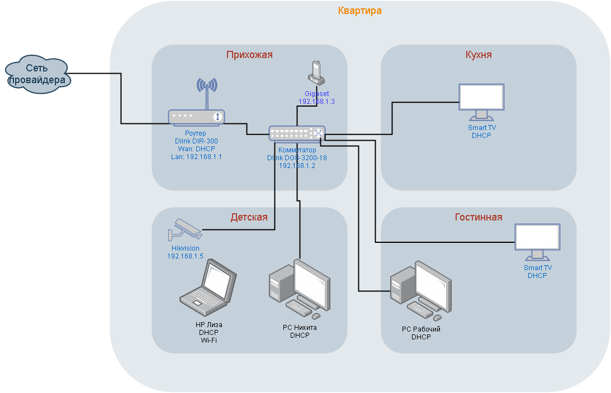

# Домашнее задание к занятию "3.8. Компьютерные сети, лекция 3"

1. Подключитесь к публичному маршрутизатору в интернет. Найдите маршрут к вашему публичному IP
```
telnet route-views.routeviews.org
Username: rviews
show ip route x.x.x.x/32
show bgp x.x.x.x/32
```

Ответ:
Подключился. Монстр какой-то. У него связанность просто чумовая. Что не введу - один хоп и приехали.
```bash
route-views>sh ip rou 194.190.8.3
Routing entry for 194.190.8.0/24
  Known via "bgp 6447", distance 20, metric 0
  Tag 6939, type external
  Last update from 64.71.137.241 7w0d ago
  Routing Descriptor Blocks:
  * 64.71.137.241, from 64.71.137.241, 7w0d ago
      Route metric is 0, traffic share count is 1
      AS Hops 2
      Route tag 6939
      MPLS label: none
```

```bash
route-views>sh ip bgp 194.190.8.3
BGP routing table entry for 194.190.8.0/24, version 45138531
Paths: (23 available, best #23, table default)
  Not advertised to any peer
  Refresh Epoch 1
  4901 6079 8359 29076 47213
    162.250.137.254 from 162.250.137.254 (162.250.137.254)
      Origin IGP, localpref 100, valid, external
      Community: 65000:10100 65000:10300 65000:10400
      path 7FE1075DA360 RPKI State not found
      rx pathid: 0, tx pathid: 0
  Refresh Epoch 3
  3303 42291 47213
    217.192.89.50 from 217.192.89.50 (138.187.128.158)
      Origin IGP, localpref 100, valid, external
      Community: 3303:1004 3303:1006 3303:1030 3303:3056 35598:100
      path 7FE0C2F55600 RPKI State not found
      rx pathid: 0, tx pathid: 0
  Refresh Epoch 1
  7018 1299 47213
    12.0.1.63 from 12.0.1.63 (12.0.1.63)
      Origin IGP, localpref 100, valid, external
      Community: 7018:5000 7018:37232
      path 7FE04C3BD690 RPKI State not found
      rx pathid: 0, tx pathid: 0
  Refresh Epoch 1
  7660 2516 41095 47213
    203.181.248.168 from 203.181.248.168 (203.181.248.168)
      Origin IGP, localpref 100, valid, external
      Community: 2516:1030 7660:9003
      path 7FE09A375AA8 RPKI State not found
      rx pathid: 0, tx pathid: 0
  Refresh Epoch 1
  3267 31500 47213
    194.85.40.15 from 194.85.40.15 (185.141.126.1)
      Origin IGP, metric 0, localpref 100, valid, external
      path 7FE1123F3490 RPKI State not found
      rx pathid: 0, tx pathid: 0
  Refresh Epoch 1
  57866 28917 42291 47213
    37.139.139.17 from 37.139.139.17 (37.139.139.17)
      Origin IGP, metric 0, localpref 100, valid, external
      Community: 0:6939 0:16276 28917:2000 57866:304 57866:501
      path 7FE0EA8E9828 RPKI State not found
      rx pathid: 0, tx pathid: 0
  Refresh Epoch 1
  3333 31500 47213
    193.0.0.56 from 193.0.0.56 (193.0.0.56)
      Origin IGP, localpref 100, valid, external
      path 7FDFFE375AB0 RPKI State not found
      rx pathid: 0, tx pathid: 0
  Refresh Epoch 1
  49788 12552 31500 47213
    91.218.184.60 from 91.218.184.60 (91.218.184.60)
      Origin IGP, localpref 100, valid, external
      Community: 12552:12000 12552:12100 12552:12101 12552:22000
      Extended Community: 0x43:100:1
      path 7FE0E0C76090 RPKI State not found
      rx pathid: 0, tx pathid: 0
  Refresh Epoch 1
  20912 3257 12389 42291 47213
    212.66.96.126 from 212.66.96.126 (212.66.96.126)
      Origin IGP, localpref 100, valid, external
      Community: 3257:4000 3257:8794 3257:50001 3257:50110 3257:54900 3257:54901 20912:65004
      path 7FE1163BE710 RPKI State not found
      rx pathid: 0, tx pathid: 0
  Refresh Epoch 1
  8283 1299 47213
    94.142.247.3 from 94.142.247.3 (94.142.247.3)
      Origin IGP, metric 0, localpref 100, valid, external
      Community: 1299:30000 8283:1 8283:101
      unknown transitive attribute: flag 0xE0 type 0x20 length 0x18
        value 0000 205B 0000 0000 0000 0001 0000 205B
              0000 0005 0000 0001 
      path 7FE011852398 RPKI State not found
      rx pathid: 0, tx pathid: 0
  Refresh Epoch 1
  3356 31500 47213
    4.68.4.46 from 4.68.4.46 (4.69.184.201)
      Origin IGP, metric 0, localpref 100, valid, external
      Community: 3356:2 3356:22 3356:100 3356:123 3356:507 3356:903 3356:2111 65000:8402
      path 7FE0AA3D4110 RPKI State not found
      rx pathid: 0, tx pathid: 0
  Refresh Epoch 1
  852 31133 35598 42291 47213
    154.11.12.212 from 154.11.12.212 (96.1.209.43)
      Origin IGP, metric 0, localpref 100, valid, external
      path 7FE00B5419B0 RPKI State not found
      rx pathid: 0, tx pathid: 0
  Refresh Epoch 1
  1221 4637 41095 47213
    203.62.252.83 from 203.62.252.83 (203.62.252.83)
      Origin IGP, localpref 100, valid, external
      path 7FE187D9F288 RPKI State not found
      rx pathid: 0, tx pathid: 0
  Refresh Epoch 1
  2497 1299 47213
    202.232.0.2 from 202.232.0.2 (58.138.96.254)
      Origin IGP, localpref 100, valid, external
      path 7FE0FA1C9E70 RPKI State not found
      rx pathid: 0, tx pathid: 0
  Refresh Epoch 1
  20130 6939 47213
    140.192.8.16 from 140.192.8.16 (140.192.8.16)
      Origin IGP, localpref 100, valid, external
      path 7FE15405D240 RPKI State not found
      rx pathid: 0, tx pathid: 0
  Refresh Epoch 1
  701 1273 31500 47213
    137.39.3.55 from 137.39.3.55 (137.39.3.55)
      Origin IGP, localpref 100, valid, external
      path 7FE113EFEEA8 RPKI State not found
      rx pathid: 0, tx pathid: 0
  Refresh Epoch 1
  3257 12389 42291 47213
    89.149.178.10 from 89.149.178.10 (213.200.83.26)
      Origin IGP, metric 10, localpref 100, valid, external
      Community: 3257:4000 3257:8794 3257:50001 3257:50110 3257:54900 3257:54901
      path 7FE0CC02B1D0 RPKI State not found
      rx pathid: 0, tx pathid: 0
  Refresh Epoch 1
  3549 3356 31500 47213
    208.51.134.254 from 208.51.134.254 (67.16.168.191)
      Origin IGP, metric 0, localpref 100, valid, external
      Community: 3356:2 3356:22 3356:100 3356:123 3356:507 3356:903 3356:2111 3549:2581 3549:30840
      path 7FE136ADCB50 RPKI State not found
      rx pathid: 0, tx pathid: 0
  Refresh Epoch 1
  53767 174 35598 42291 47213
    162.251.163.2 from 162.251.163.2 (162.251.162.3)
      Origin IGP, localpref 100, valid, external
      Community: 174:21101 174:22014 53767:5000
      unknown transitive attribute: flag 0xE0 type 0x20 length 0x18
        value 0000 8B0E 0000 0064 0000 33B6 0000 8B0E
              0000 0064 0000 BA94 
      path 7FE171BA8FA8 RPKI State not found
      rx pathid: 0, tx pathid: 0
  Refresh Epoch 1
  101 3491 20485 20485 42291 47213
    209.124.176.223 from 209.124.176.223 (209.124.176.223)
      Origin IGP, localpref 100, valid, external
      Community: 101:20300 101:22100 3491:300 3491:311 3491:9001 3491:9080 3491:9081 3491:9087 3491:62210 3491:62220 20485:10077
      path 7FE10A1240D8 RPKI State not found
      rx pathid: 0, tx pathid: 0
  Refresh Epoch 1
  3561 3910 3356 31500 47213
    206.24.210.80 from 206.24.210.80 (206.24.210.80)
      Origin IGP, localpref 100, valid, external
      path 7FE176BBE5C8 RPKI State not found
      rx pathid: 0, tx pathid: 0
  Refresh Epoch 1
  1351 8359 29076 47213
    132.198.255.253 from 132.198.255.253 (132.198.255.253)
      Origin IGP, localpref 100, valid, external
      path 7FE0CD72DF98 RPKI State not found
      rx pathid: 0, tx pathid: 0
  Refresh Epoch 1
  6939 47213
    64.71.137.241 from 64.71.137.241 (216.218.252.164)
      Origin IGP, localpref 100, valid, external, best
      path 7FE082FC0028 RPKI State not found
      rx pathid: 0, tx pathid: 0x0
route-views> 
```
Видим, что последний маршрут признан лучшим. Всего одна АС, а потом наша. Но на сама деле так как наша AS 47213 не имеет прямого соединения с 6939, а значит они связаны через IX, чья автономка видимо не отображается.  


2. Создайте dummy0 интерфейс в Ubuntu. Добавьте несколько статических маршрутов. Проверьте таблицу маршрутизации.

Ответ:
```bash
vagrant@vagrant:/tmp/new$ cat /etc/modules
# /etc/modules: kernel modules to load at boot time.
#
# This file contains the names of kernel modules that should be loaded
# at boot time, one per line. Lines beginning with "#" are ignored.


vagrant@vagrant:/tmp/new$ sudo echo "dummy" | sudo tee -a /etc/modules
dummy

vagrant@vagrant:/tmp/new$ cat /etc/modules
# /etc/modules: kernel modules to load at boot time.
#
# This file contains the names of kernel modules that should be loaded
# at boot time, one per line. Lines beginning with "#" are ignored.

dummy

vagrant@vagrant:/tmp/new$ echo "options dummy numdummies=2" | sudo tee /etc/modprobe.d/dummy.conf
options dummy numdummies=2

```
Добавляем в файл настройки интерфейса:

```bash
vim /etc/network/interfaces
......

vagrant@vagrant:/tmp/new$ cat  /etc/network/interfaces
# interfaces(5) file used by ifup(8) and ifdown(8)
# Include files from /etc/network/interfaces.d:
source-directory /etc/network/interfaces.d

auto dummy0
iface dummy0 inet static
address 22.2.2.2/30
pre-up ip link add dummy0 type dummy
post-down ip link del dummy0

vagrant@vagrant:/tmp/new$
vagrant@vagrant:/tmp/new$ sudo systemctl restart networking.service
vagrant@vagrant:/tmp/new$ ip address
1: lo: <LOOPBACK,UP,LOWER_UP> mtu 65536 qdisc noqueue state UNKNOWN group default qlen 1000
    link/loopback 00:00:00:00:00:00 brd 00:00:00:00:00:00
    inet 127.0.0.1/8 scope host lo
       valid_lft forever preferred_lft forever
    inet6 ::1/128 scope host
       valid_lft forever preferred_lft forever
2: eth0: <BROADCAST,MULTICAST,UP,LOWER_UP> mtu 1500 qdisc fq_codel state UP group default qlen 1000
    link/ether 08:00:27:73:60:cf brd ff:ff:ff:ff:ff:ff
    inet 10.0.2.15/24 brd 10.0.2.255 scope global dynamic eth0
       valid_lft 73318sec preferred_lft 73318sec
    inet6 fe80::a00:27ff:fe73:60cf/64 scope link
       valid_lft forever preferred_lft forever
5: dummy0: <BROADCAST,NOARP,UP,LOWER_UP> mtu 1500 qdisc noqueue state UNKNOWN group default qlen 1000
    link/ether f2:78:91:dd:4c:23 brd ff:ff:ff:ff:ff:ff
    inet 22.2.2.2/30 brd 22.2.2.3 scope global dummy0
       valid_lft forever preferred_lft forever
    inet6 fe80::f078:91ff:fedd:4c23/64 scope link
       valid_lft forever preferred_lft forever
```
Видим, что интерфейс поднялся.

Добавляем статические маршруты:
```bash

vagrant@vagrant:/tmp/new$ sudo ip route add 16.16.16.0/24 via 10.0.2.1
vagrant@vagrant:/tmp/new$ sudo ip route add 111.11.0.0/16 via 10.0.2.1

vagrant@vagrant:/tmp/new$ ip route show
default via 10.0.2.2 dev eth0 proto dhcp src 10.0.2.15 metric 100
10.0.2.0/24 dev eth0 proto kernel scope link src 10.0.2.15
10.0.2.2 dev eth0 proto dhcp scope link src 10.0.2.15 metric 100
16.16.16.0/24 via 10.0.2.1 dev eth0
22.2.2.0/30 dev dummy0 proto kernel scope link src 22.2.2.2
111.11.0.0/16 via 10.0.2.1 dev eth0
```
3. Проверьте открытые TCP порты в Ubuntu, какие протоколы и приложения используют эти порты? Приведите несколько примеров.

Ответ:
```bash
vagrant@vagrant:/tmp/new$ sudo ss -tnlp
State  Recv-Q Send-Q   Local Address:Port   Peer Address:Port Process

LISTEN 0      4096           0.0.0.0:111         0.0.0.0:*     users:(("rpcbind",pid=697,fd=4),("systemd",pid=1,fd=35))

LISTEN 0      4096     127.0.0.53%lo:53          0.0.0.0:*     users:(("systemd-resolve",pid=698,fd=13))

LISTEN 0      128            0.0.0.0:22          0.0.0.0:*     users:(("sshd",pid=886,fd=3))

LISTEN 0      4096              [::]:111            [::]:*     users:(("rpcbind",pid=697,fd=6),("systemd",pid=1,fd=37))

LISTEN 0      128               [::]:22             [::]:*     users:(("sshd",pid=886,fd=4))

```
По TCP На 22 порту слушает процесс sshd, на 53 локальный резолвер DNS, на 111 служба удалённого запука процедур RPC. 

4. Проверьте используемые UDP сокеты в Ubuntu, какие протоколы и приложения используют эти порты?

Ответ:
```bash
vagrant@vagrant:/tmp/new$ sudo ss -unlp
State  Recv-Q Send-Q   Local Address:Port   Peer Address:Port Process

UNCONN 0      0        127.0.0.53%lo:53          0.0.0.0:*     users:(("systemd-resolve",pid=698,fd=12))

UNCONN 0      0       10.0.2.15%eth0:68          0.0.0.0:*     users:(("systemd-network",pid=445,fd=20))

UNCONN 0      0              0.0.0.0:111         0.0.0.0:*     users:(("rpcbind",pid=697,fd=5),("systemd",pid=1,fd=36))

UNCONN 0      0                 [::]:111            [::]:*     users:(("rpcbind",pid=697,fd=7),("systemd",pid=1,fd=38))
```
UDP порты слушают: 53 - локальный резолвер DNS, 68 - systemd-network, на 111 снова RPC

5. Используя diagrams.net, создайте L3 диаграмму вашей домашней сети или любой другой сети, с которой вы работали. 

Ответ: Схему прилагаю



 ---
## Задание для самостоятельной отработки (необязательно к выполнению)

6*. Установите Nginx, настройте в режиме балансировщика TCP или UDP.

7*. Установите bird2, настройте динамический протокол маршрутизации RIP.

8*. Установите Netbox, создайте несколько IP префиксов, используя curl проверьте работу API.

 ---

## Как сдавать задания

Обязательными к выполнению являются задачи без указания звездочки. Их выполнение необходимо для получения зачета и диплома о профессиональной переподготовке.

Задачи со звездочкой (*) являются дополнительными задачами и/или задачами повышенной сложности. Они не являются обязательными к выполнению, но помогут вам глубже понять тему.

Домашнее задание выполните в файле readme.md в github репозитории. В личном кабинете отправьте на проверку ссылку на .md-файл в вашем репозитории.

Также вы можете выполнить задание в [Google Docs](https://docs.google.com/document/u/0/?tgif=d) и отправить в личном кабинете на проверку ссылку на ваш документ.
Название файла Google Docs должно содержать номер лекции и фамилию студента. Пример названия: "1.1. Введение в DevOps — Сусанна Алиева".

Если необходимо прикрепить дополнительные ссылки, просто добавьте их в свой Google Docs.

Перед тем как выслать ссылку, убедитесь, что ее содержимое не является приватным (открыто на комментирование всем, у кого есть ссылка), иначе преподаватель не сможет проверить работу. Чтобы это проверить, откройте ссылку в браузере в режиме инкогнито.

[Как предоставить доступ к файлам и папкам на Google Диске](https://support.google.com/docs/answer/2494822?hl=ru&co=GENIE.Platform%3DDesktop)

[Как запустить chrome в режиме инкогнито ](https://support.google.com/chrome/answer/95464?co=GENIE.Platform%3DDesktop&hl=ru)

[Как запустить  Safari в режиме инкогнито ](https://support.apple.com/ru-ru/guide/safari/ibrw1069/mac)

Любые вопросы по решению задач задавайте в чате Slack.

---
