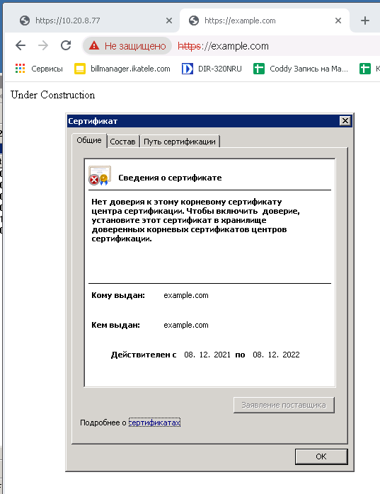
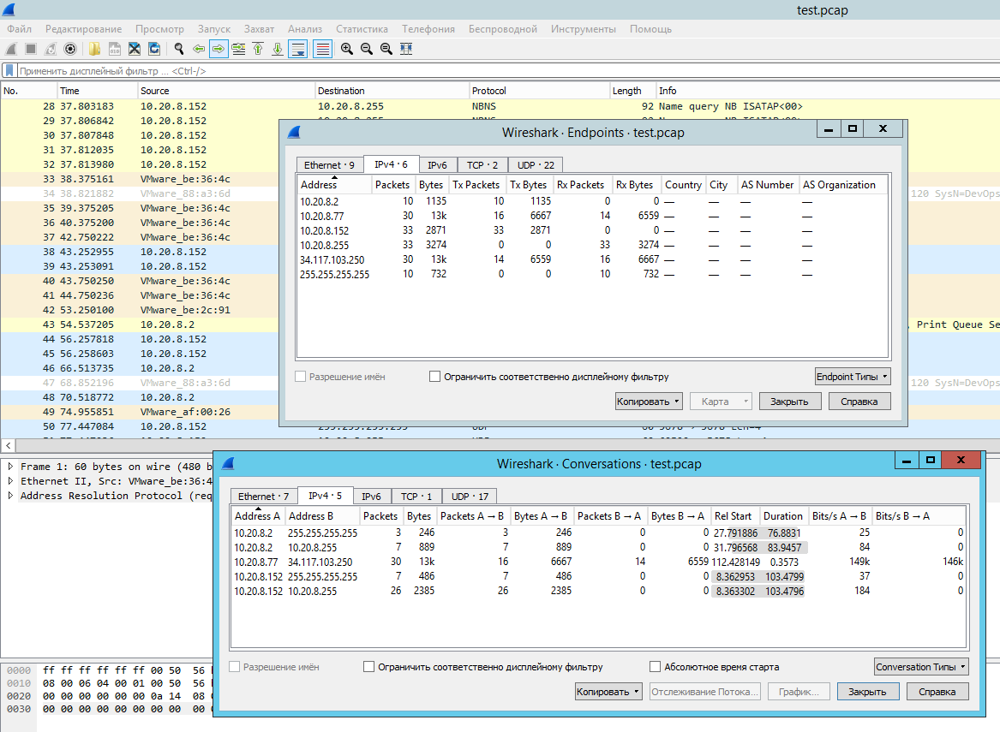

# Домашнее задание к занятию "3.9. Элементы безопасности информационных систем"

1. Установите Bitwarden плагин для браузера. Зарегестрируйтесь и сохраните несколько паролей.

Ответ: Установил. Зарегистрировался в их системе. Установил приложение также для телефона. Сохранил пароль от bitbucket. Вижу его и в плагине на компьютере и в мобильном приложении.

2. Установите Google authenticator на мобильный телефон. Настройте вход в Bitwarden акаунт через Google authenticator OTP.

Ответ: Включил двухфакторную аутентификацию. Подключтл Google Authenticator. При входе в плагин с нового устройства запрашивается OTP. 

3. Установите apache2, сгенерируйте самоподписанный сертификат, настройте тестовый сайт для работы по HTTPS.

Ответ: Устанавливаю Apache:

```bash
[root@DevOpser ~]# yum install httpd
......

[root@DevOpser ~]# systemctl start httpd

[root@DevOpser ~]# systemctl status httpd
● httpd.service - The Apache HTTP Server
   Loaded: loaded (/usr/lib/systemd/system/httpd.service; enabled; vendor preset: disabled)
   Active: active (running) since Wed 2021-12-08 09:04:51 MSK; 3min 27s ago
     Docs: man:httpd.service(8)
 Main PID: 8493 (httpd)
   Status: "Running, listening on: port 80"
    Tasks: 213 (limit: 11396)
   Memory: 32.9M
   CGroup: /system.slice/httpd.service
           ├─8493 /usr/sbin/httpd -DFOREGROUND
           ├─8494 /usr/sbin/httpd -DFOREGROUND
           ├─8495 /usr/sbin/httpd -DFOREGROUND
           ├─8496 /usr/sbin/httpd -DFOREGROUND
           └─8497 /usr/sbin/httpd -DFOREGROUND

Dec 08 09:04:51 DevOpser systemd[1]: Starting The Apache HTTP Server...
Dec 08 09:04:51 DevOpser httpd[8493]: AH00558: httpd: Could not reliably determine the servers fully qualified domain name, using fe80::1f9e:a973:b362:2f57. >
Dec 08 09:04:51 DevOpser systemd[1]: Started The Apache HTTP Server.
Dec 08 09:04:52 DevOpser httpd[8493]: Server configured, listening on: port 80
[root@DevOpser ~]# 
[root@DevOpser ~]# 
[root@DevOpser ~]# netstat -apn | grep http
tcp6       0      0 :::80                   :::*                    LISTEN      8493/httpd          
```
Видим, что он запустился на 80 порту только ipv6

Доустанавливаем модуль SSL
`yum install mod_ssl.x86_64` 

В папку /var/www/html кладём файл index.html c текстом Under Construction.

Генерируем самоподписанный сертификат:
```bash
[root@DevOpser ssl]# sudo openssl req -x509 -nodes -days 365 -newkey rsa:2048 \-keyout /etc/ssl/private/apache-selfsigned.key \-out /etc/ssl/certs/apache-selfsigned.crt \-subj "/C=RU/ST=Moscow/L=Moscow/O=Company Name/OU=Org/CN=example.com"
Generating a RSA private key
...............................................................................................+++++
...................+++++
writing new private key to '/etc/ssl/private/apache-selfsigned.key'
-----
```
В папке /etc/ssl/certs появился публичный ключ: apache-selfsigned.crt
В папке /etc/ssl/private появился закрытый ключ apache-selfsigned.key

По ссылке https://ssl-config.mozilla.org/#server=apache&version=2.4.41&config=intermediate&openssl=1.1.1k&guideline=5.6
генерируем кусочек конфига и исправляем пути к сертификату и ключу.
```bash
# generated 2021-12-08, Mozilla Guideline v5.6, Apache 2.4.41, OpenSSL 1.1.1k, intermediate configuration
# https://ssl-config.mozilla.org/#server=apache&version=2.4.41&config=intermediate&openssl=1.1.1k&guideline=5.6

# this configuration requires mod_ssl, mod_socache_shmcb, mod_rewrite, and mod_headers
<VirtualHost *:80>
    RewriteEngine On
    RewriteCond %{REQUEST_URI} !^/\.well\-known/acme\-challenge/
    RewriteRule ^(.*)$ https://%{HTTP_HOST}$1 [R=301,L]
</VirtualHost>

<VirtualHost *:443>
    SSLEngine on

#   curl https://ssl-config.mozilla.org/ffdhe2048.txt >> /path/to/signed_cert_and_intermediate_certs_and_dhparams
    SSLCertificateFile      /etc/ssl/certs/apache-selfsigned.crt
    SSLCertificateKeyFile   /etc/ssl/private/apache-selfsigned.key

# enable HTTP/2, if available
    Protocols h2 http/1.1

# HTTP Strict Transport Security (mod_headers is required) (63072000 seconds)
    Header always set Strict-Transport-Security "max-age=63072000"
</VirtualHost>

# intermediate configuration
    SSLProtocol             all -SSLv3 -TLSv1 -TLSv1.1
    SSLCipherSuite          ECDHE-ECDSA-AES128-GCM-SHA256:ECDHE-RSA-AES128-GCM-SHA256:ECDHE-ECDSA-AES256-GCM-SHA384:ECDHE-RSA-AES256-GCM-SHA384:ECDHE-ECDSA-CHA
CHA20-POLY1305:ECDHE-RSA-CHACHA20-POLY1305:DHE-RSA-AES128-GCM-SHA256:DHE-RSA-AES256-GCM-SHA384
    SSLHonorCipherOrder     off
    SSLSessionTickets       off

    SSLUseStapling On
    SSLStaplingCache "shmcb:logs/ssl_stapling(32768)"
```
Дописываем его в конец файла httpd.conf
Исправляем также в файле /etc/httpd/conf.d/ssl.conf путь к сертификату и ключу.

Кроме того, нужно проследить, чтобы в конфиге ssl.conf была поправлена строка:
`Listen 10.20.8.77:443 https`
иначе при указании дефолтного `Listen 443 https` апач будет слушать только на ipv6.

То же самое в файле httpd.conf должно быть  `Listen 10.20.8.77:80`  вместо `Listen 80`.

Проверяем корректность настроек и Перезапускаем:
```bash
[root@DevOpser conf.d]# apachectl configtest   
Syntax OK
[root@DevOpser conf.d]# systemctl restart httpd  
```

На своей машине в файле hosts направляем домен example.com на адрес нашего сервера.
Пробуем открыть.




4. Проверьте на TLS уязвимости произвольный сайт в интернете.

Ответ: 
Скачаем git с разработкой утилиты тестирования, перейдём в папку и запустим, указав сервер для проверки:
```bash
git clone --depth 1 https://github.com/drwetter/testssl.sh.git
cd testssl.sh
./testssl.sh https://hoponhopoff-tbilisi.com
```
Проверка выполнилась.
```bash
###########################################################
    testssl.sh       3.1dev from https://testssl.sh/dev/
    (dc782a8 2021-12-08 11:50:55 -- )

      This program is free software. Distribution and
             modification under GPLv2 permitted.
      USAGE w/o ANY WARRANTY. USE IT AT YOUR OWN RISK!

       Please file bugs @ https://testssl.sh/bugs/

###########################################################

 Using "OpenSSL 1.0.2-chacha (1.0.2k-dev)" [~183 ciphers]
 on DevOpser:./bin/openssl.Linux.x86_64
 (built: "Jan 18 17:12:17 2019", platform: "linux-x86_64")


 Start 2021-12-08 18:21:01        -->> 194.190.8.200:443 (hoponhopoff-tbilisi.com) <<--

 rDNS (194.190.8.200):   oneginrooms.ge.
 Service detected:       HTTP


 Testing protocols via sockets except NPN+ALPN 

 SSLv2      not offered (OK)
 SSLv3      not offered (OK)
 TLS 1      offered (deprecated)
 TLS 1.1    offered (deprecated)
 TLS 1.2    offered (OK)
 TLS 1.3    not offered and downgraded to a weaker protocol
 NPN/SPDY   h2, http/1.1 (advertised)
 ALPN/HTTP2 h2, http/1.1 (offered)

 Testing cipher categories 

 NULL ciphers (no encryption)                      not offered (OK)
 Anonymous NULL Ciphers (no authentication)        not offered (OK)
 Export ciphers (w/o ADH+NULL)                     not offered (OK)
 LOW: 64 Bit + DES, RC[2,4], MD5 (w/o export)      not offered (OK)
 Triple DES Ciphers / IDEA                         not offered
 Obsoleted CBC ciphers (AES, ARIA etc.)            offered
 Strong encryption (AEAD ciphers) with no FS       offered (OK)
 Forward Secrecy strong encryption (AEAD ciphers)  offered (OK)


 Testing server's cipher preferences 

 Has server cipher order?     yes (OK)
 Negotiated protocol          TLSv1.2
 Negotiated cipher            ECDHE-RSA-AES128-GCM-SHA256, 256 bit ECDH (P-256)
 Cipher per protocol

Hexcode  Cipher Suite Name (OpenSSL)       KeyExch.   Encryption  Bits     Cipher Suite Name (IANA/RFC)
-----------------------------------------------------------------------------------------------------------------------------
SSLv2
 - 
SSLv3
 - 
TLSv1 (server order)
 xc013   ECDHE-RSA-AES128-SHA              ECDH 256   AES         128      TLS_ECDHE_RSA_WITH_AES_128_CBC_SHA                 
 xc014   ECDHE-RSA-AES256-SHA              ECDH 256   AES         256      TLS_ECDHE_RSA_WITH_AES_256_CBC_SHA                 
 x2f     AES128-SHA                        RSA        AES         128      TLS_RSA_WITH_AES_128_CBC_SHA                       
 x35     AES256-SHA                        RSA        AES         256      TLS_RSA_WITH_AES_256_CBC_SHA                       
 x84     CAMELLIA256-SHA                   RSA        Camellia    256      TLS_RSA_WITH_CAMELLIA_256_CBC_SHA                  
 x41     CAMELLIA128-SHA                   RSA        Camellia    128      TLS_RSA_WITH_CAMELLIA_128_CBC_SHA                  
TLSv1.1 (server order)
 xc013   ECDHE-RSA-AES128-SHA              ECDH 256   AES         128      TLS_ECDHE_RSA_WITH_AES_128_CBC_SHA                 
 xc014   ECDHE-RSA-AES256-SHA              ECDH 256   AES         256      TLS_ECDHE_RSA_WITH_AES_256_CBC_SHA                 
 x2f     AES128-SHA                        RSA        AES         128      TLS_RSA_WITH_AES_128_CBC_SHA                       
 x35     AES256-SHA                        RSA        AES         256      TLS_RSA_WITH_AES_256_CBC_SHA                       
 x84     CAMELLIA256-SHA                   RSA        Camellia    256      TLS_RSA_WITH_CAMELLIA_256_CBC_SHA                  
 x41     CAMELLIA128-SHA                   RSA        Camellia    128      TLS_RSA_WITH_CAMELLIA_128_CBC_SHA                  
TLSv1.2 (server order)
 xc02f   ECDHE-RSA-AES128-GCM-SHA256       ECDH 253   AESGCM      128      TLS_ECDHE_RSA_WITH_AES_128_GCM_SHA256              
 xc030   ECDHE-RSA-AES256-GCM-SHA384       ECDH 253   AESGCM      256      TLS_ECDHE_RSA_WITH_AES_256_GCM_SHA384              
 xcca8   ECDHE-RSA-CHACHA20-POLY1305       ECDH 253   ChaCha20    256      TLS_ECDHE_RSA_WITH_CHACHA20_POLY1305_SHA256        
 xc027   ECDHE-RSA-AES128-SHA256           ECDH 253   AES         128      TLS_ECDHE_RSA_WITH_AES_128_CBC_SHA256              
 xc028   ECDHE-RSA-AES256-SHA384           ECDH 253   AES         256      TLS_ECDHE_RSA_WITH_AES_256_CBC_SHA384              
 xc013   ECDHE-RSA-AES128-SHA              ECDH 253   AES         128      TLS_ECDHE_RSA_WITH_AES_128_CBC_SHA                 
 xc014   ECDHE-RSA-AES256-SHA              ECDH 253   AES         256      TLS_ECDHE_RSA_WITH_AES_256_CBC_SHA                 
 xc061   ECDHE-ARIA256-GCM-SHA384          ECDH 253   ARIAGCM     256      TLS_ECDHE_RSA_WITH_ARIA_256_GCM_SHA384             
 xc060   ECDHE-ARIA128-GCM-SHA256          ECDH 253   ARIAGCM     128      TLS_ECDHE_RSA_WITH_ARIA_128_GCM_SHA256             
 xc077   ECDHE-RSA-CAMELLIA256-SHA384      ECDH 253   Camellia    256      TLS_ECDHE_RSA_WITH_CAMELLIA_256_CBC_SHA384         
 xc076   ECDHE-RSA-CAMELLIA128-SHA256      ECDH 253   Camellia    128      TLS_ECDHE_RSA_WITH_CAMELLIA_128_CBC_SHA256         
 x9c     AES128-GCM-SHA256                 RSA        AESGCM      128      TLS_RSA_WITH_AES_128_GCM_SHA256                    
 x9d     AES256-GCM-SHA384                 RSA        AESGCM      256      TLS_RSA_WITH_AES_256_GCM_SHA384                    
 x3c     AES128-SHA256                     RSA        AES         128      TLS_RSA_WITH_AES_128_CBC_SHA256                    
 x3d     AES256-SHA256                     RSA        AES         256      TLS_RSA_WITH_AES_256_CBC_SHA256                    
 x2f     AES128-SHA                        RSA        AES         128      TLS_RSA_WITH_AES_128_CBC_SHA                       
 x35     AES256-SHA                        RSA        AES         256      TLS_RSA_WITH_AES_256_CBC_SHA                       
 xc0a1   AES256-CCM8                       RSA        AESCCM8     256      TLS_RSA_WITH_AES_256_CCM_8                         
 xc09d   AES256-CCM                        RSA        AESCCM      256      TLS_RSA_WITH_AES_256_CCM                           
 xc051   ARIA256-GCM-SHA384                RSA        ARIAGCM     256      TLS_RSA_WITH_ARIA_256_GCM_SHA384                   
 xc0a0   AES128-CCM8                       RSA        AESCCM8     128      TLS_RSA_WITH_AES_128_CCM_8                         
 xc09c   AES128-CCM                        RSA        AESCCM      128      TLS_RSA_WITH_AES_128_CCM                           
 xc050   ARIA128-GCM-SHA256                RSA        ARIAGCM     128      TLS_RSA_WITH_ARIA_128_GCM_SHA256                   
 xc0     CAMELLIA256-SHA256                RSA        Camellia    256      TLS_RSA_WITH_CAMELLIA_256_CBC_SHA256               
 xba     CAMELLIA128-SHA256                RSA        Camellia    128      TLS_RSA_WITH_CAMELLIA_128_CBC_SHA256               
 x84     CAMELLIA256-SHA                   RSA        Camellia    256      TLS_RSA_WITH_CAMELLIA_256_CBC_SHA                  
 x41     CAMELLIA128-SHA                   RSA        Camellia    128      TLS_RSA_WITH_CAMELLIA_128_CBC_SHA                  
TLSv1.3
 - 


 Testing robust forward secrecy (FS) -- omitting Null Authentication/Encryption, 3DES, RC4 

 FS is offered (OK)           ECDHE-RSA-AES256-GCM-SHA384 ECDHE-RSA-AES256-SHA384 ECDHE-RSA-AES256-SHA ECDHE-RSA-CHACHA20-POLY1305
                              ECDHE-RSA-CAMELLIA256-SHA384 ECDHE-ARIA256-GCM-SHA384 ECDHE-RSA-AES128-GCM-SHA256 ECDHE-RSA-AES128-SHA256 ECDHE-RSA-AES128-SHA
                              ECDHE-RSA-CAMELLIA128-SHA256 ECDHE-ARIA128-GCM-SHA256 
 Elliptic curves offered:     prime256v1 secp384r1 secp521r1 X25519 X448 


 Testing server defaults (Server Hello) 

 TLS extensions (standard)    "renegotiation info/#65281" "server name/#0" "EC point formats/#11" "session ticket/#35" "next protocol/#13172"
                              "max fragment length/#1" "application layer protocol negotiation/#16" "encrypt-then-mac/#22" "extended master secret/#23"
 Session Ticket RFC 5077 hint 300 seconds, session tickets keys seems to be rotated < daily
 SSL Session ID support       yes
 Session Resumption           Tickets: yes, ID: no
 TLS clock skew               Random values, no fingerprinting possible 
 Client Authentication        none
 Signature Algorithm          SHA256 with RSA
 Server key size              RSA 2048 bits (exponent is 65537)
 Server key usage             Digital Signature, Key Encipherment
 Server extended key usage    TLS Web Server Authentication, TLS Web Client Authentication
 Serial                       03EA1D1631F0EF89B79592CFD9BE17CA3913 (OK: length 18)
 Fingerprints                 SHA1 C3C7EBC2FCDDB7BBA7A381B60ED6525ACD4521B5
                              SHA256 4A4DBBFE194291535D20C31142183DAAA2E27ACAFB04517FBCD85E9AC70B79F1
 Common Name (CN)             hoponhopoff-tbilisi.com  (CN in response to request w/o SNI: Parallels Panel )
 subjectAltName (SAN)         city-sightseeing.ge citysightseeing.ge hoponhopoff-tbilisi.com hoponhopoff.ge www.city-sightseeing.ge www.citysightseeing.ge
                              www.hoponhopoff-tbilisi.com www.hoponhopoff.ge 
 Trust (hostname)             Ok via SAN and CN (SNI mandatory)
 Chain of trust               Ok   
 EV cert (experimental)       no 
 Certificate Validity (UTC)   59 >= 30 days (2021-11-08 06:24 --> 2022-02-06 06:24)
 ETS/"eTLS", visibility info  not present
 Certificate Revocation List  --
 OCSP URI                     http://r3.o.lencr.org
 OCSP stapling                not offered
 OCSP must staple extension   --
 DNS CAA RR (experimental)    not offered
 Certificate Transparency     yes (certificate extension)
 Certificates provided        3
 Issuer                       R3 (Let's Encrypt from US)
 Intermediate cert validity   #1: ok > 40 days (2025-09-15 16:00). R3 <-- ISRG Root X1
                              #2: ok > 40 days (2024-09-30 18:14). ISRG Root X1 <-- DST Root CA X3
 Intermediate Bad OCSP (exp.) Ok


 Testing HTTP header response @ "/" 

 HTTP Status Code             200 OK
 HTTP clock skew              +1 sec from localtime
 Strict Transport Security    not offered
 Public Key Pinning           --
 Server banner                nginx
 Application banner           X-Powered-By: PleskLin
 Cookie(s)                    (none issued at "/")
 Security headers             Referrer-Policy: no-referrer-when-downgrade
 Reverse Proxy banner         --


 Testing vulnerabilities 

 Heartbleed (CVE-2014-0160)                not vulnerable (OK), no heartbeat extension
 CCS (CVE-2014-0224)                       not vulnerable (OK)
 Ticketbleed (CVE-2016-9244), experiment.  not vulnerable (OK)
 ROBOT                                     not vulnerable (OK)
 Secure Renegotiation (RFC 5746)           supported (OK)
 Secure Client-Initiated Renegotiation     not vulnerable (OK)
 CRIME, TLS (CVE-2012-4929)                not vulnerable (OK)
 BREACH (CVE-2013-3587)                    potentially NOT ok, "gzip" HTTP compression detected. - only supplied "/" tested
                                           Can be ignored for static pages or if no secrets in the page
 POODLE, SSL (CVE-2014-3566)               not vulnerable (OK), no SSLv3 support
 TLS_FALLBACK_SCSV (RFC 7507)              Downgrade attack prevention supported (OK)
 SWEET32 (CVE-2016-2183, CVE-2016-6329)    not vulnerable (OK)
 FREAK (CVE-2015-0204)                     not vulnerable (OK)
 DROWN (CVE-2016-0800, CVE-2016-0703)      not vulnerable on this host and port (OK)
                                           make sure you don't use this certificate elsewhere with SSLv2 enabled services
                                           https://censys.io/ipv4?q=4A4DBBFE194291535D20C31142183DAAA2E27ACAFB04517FBCD85E9AC70B79F1 could help you to find out
 LOGJAM (CVE-2015-4000), experimental      not vulnerable (OK): no DH EXPORT ciphers, no DH key detected with <= TLS 1.2
 BEAST (CVE-2011-3389)                     TLS1: ECDHE-RSA-AES128-SHA ECDHE-RSA-AES256-SHA AES128-SHA AES256-SHA CAMELLIA256-SHA CAMELLIA128-SHA 
                                           VULNERABLE -- but also supports higher protocols  TLSv1.1 TLSv1.2 (likely mitigated)
 LUCKY13 (CVE-2013-0169), experimental     potentially VULNERABLE, uses cipher block chaining (CBC) ciphers with TLS. Check patches
 Winshock (CVE-2014-6321), experimental    not vulnerable (OK) - ARIA, CHACHA or CCM ciphers found
 RC4 (CVE-2013-2566, CVE-2015-2808)        no RC4 ciphers detected (OK)


 Running client simulations (HTTP) via sockets 

 Browser                      Protocol  Cipher Suite Name (OpenSSL)       Forward Secrecy
------------------------------------------------------------------------------------------------
 Android 4.4.2                TLSv1.2   ECDHE-RSA-AES128-GCM-SHA256       256 bit ECDH (P-256)
 Android 5.0.0                TLSv1.2   ECDHE-RSA-AES128-GCM-SHA256       256 bit ECDH (P-256)
 Android 6.0                  TLSv1.2   ECDHE-RSA-AES128-GCM-SHA256       256 bit ECDH (P-256)
 Android 7.0 (native)         TLSv1.2   ECDHE-RSA-AES128-GCM-SHA256       256 bit ECDH (P-256)
 Android 8.1 (native)         TLSv1.2   ECDHE-RSA-AES128-GCM-SHA256       253 bit ECDH (X25519)
 Android 9.0 (native)         TLSv1.2   ECDHE-RSA-AES128-GCM-SHA256       253 bit ECDH (X25519)
 Android 10.0 (native)        TLSv1.2   ECDHE-RSA-AES128-GCM-SHA256       253 bit ECDH (X25519)
 Chrome 74 (Win 10)           TLSv1.2   ECDHE-RSA-AES128-GCM-SHA256       253 bit ECDH (X25519)
 Chrome 79 (Win 10)           TLSv1.2   ECDHE-RSA-AES128-GCM-SHA256       253 bit ECDH (X25519)
 Firefox 66 (Win 8.1/10)      TLSv1.2   ECDHE-RSA-AES128-GCM-SHA256       253 bit ECDH (X25519)
 Firefox 71 (Win 10)          TLSv1.2   ECDHE-RSA-AES128-GCM-SHA256       253 bit ECDH (X25519)
 IE 6 XP                      No connection
 IE 8 Win 7                   TLSv1.0   ECDHE-RSA-AES128-SHA              256 bit ECDH (P-256)
 IE 8 XP                      No connection
 IE 11 Win 7                  TLSv1.2   ECDHE-RSA-AES128-SHA256           256 bit ECDH (P-256)
 IE 11 Win 8.1                TLSv1.2   ECDHE-RSA-AES128-SHA256           256 bit ECDH (P-256)
 IE 11 Win Phone 8.1          TLSv1.2   ECDHE-RSA-AES128-SHA256           256 bit ECDH (P-256)
 IE 11 Win 10                 TLSv1.2   ECDHE-RSA-AES128-GCM-SHA256       256 bit ECDH (P-256)
 Edge 15 Win 10               TLSv1.2   ECDHE-RSA-AES128-GCM-SHA256       253 bit ECDH (X25519)
 Edge 17 (Win 10)             TLSv1.2   ECDHE-RSA-AES128-GCM-SHA256       253 bit ECDH (X25519)
 Opera 66 (Win 10)            TLSv1.2   ECDHE-RSA-AES128-GCM-SHA256       253 bit ECDH (X25519)
 Safari 9 iOS 9               TLSv1.2   ECDHE-RSA-AES128-GCM-SHA256       256 bit ECDH (P-256)
 Safari 9 OS X 10.11          TLSv1.2   ECDHE-RSA-AES128-GCM-SHA256       256 bit ECDH (P-256)
 Safari 10 OS X 10.12         TLSv1.2   ECDHE-RSA-AES128-GCM-SHA256       256 bit ECDH (P-256)
 Safari 12.1 (iOS 12.2)       TLSv1.2   ECDHE-RSA-AES128-GCM-SHA256       253 bit ECDH (X25519)
 Safari 13.0 (macOS 10.14.6)  TLSv1.2   ECDHE-RSA-AES128-GCM-SHA256       253 bit ECDH (X25519)
 Apple ATS 9 iOS 9            TLSv1.2   ECDHE-RSA-AES128-GCM-SHA256       256 bit ECDH (P-256)
 Java 6u45                    TLSv1.0   AES128-SHA                        No FS
 Java 7u25                    TLSv1.0   ECDHE-RSA-AES128-SHA              256 bit ECDH (P-256)
 Java 8u161                   TLSv1.2   ECDHE-RSA-AES128-GCM-SHA256       256 bit ECDH (P-256)
 Java 11.0.2 (OpenJDK)        TLSv1.2   ECDHE-RSA-AES128-GCM-SHA256       256 bit ECDH (P-256)
 Java 12.0.1 (OpenJDK)        TLSv1.2   ECDHE-RSA-AES128-GCM-SHA256       256 bit ECDH (P-256)
 OpenSSL 1.0.2e               TLSv1.2   ECDHE-RSA-AES128-GCM-SHA256       256 bit ECDH (P-256)
 OpenSSL 1.1.0l (Debian)      TLSv1.2   ECDHE-RSA-AES128-GCM-SHA256       253 bit ECDH (X25519)
 OpenSSL 1.1.1d (Debian)      TLSv1.2   ECDHE-RSA-AES128-GCM-SHA256       253 bit ECDH (X25519)
 Thunderbird (68.3)           TLSv1.2   ECDHE-RSA-AES128-GCM-SHA256       253 bit ECDH (X25519)


 Rating (experimental) 

 Rating specs (not complete)  SSL Labs's 'SSL Server Rating Guide' (version 2009q from 2020-01-30)
 Specification documentation  https://github.com/ssllabs/research/wiki/SSL-Server-Rating-Guide
 Protocol Support (weighted)  95 (28)
 Key Exchange     (weighted)  90 (27)
 Cipher Strength  (weighted)  90 (36)
 Final Score                  91
 Overall Grade                B
 Grade cap reasons            Grade capped to B. TLS 1.1 offered
                              Grade capped to B. TLS 1.0 offered
                              Grade capped to A. HSTS is not offered
```

5. Установите на Ubuntu ssh сервер, сгенерируйте новый приватный ключ. Скопируйте свой публичный ключ на другой сервер. Подключитесь к серверу по SSH-ключу.

Ответ:
Будем организовывать подключение по SSH с Ubuntu на Alma Linux.
На Alma Linux создадис юзера, под которым планируем подключаться.
```bash
[root@DevOpser testssl.sh]# useradd user-4-ssh-test
[root@DevOpser testssl.sh]# passwd user-4-ssh-test 
Changing password for user user-4-ssh-test.
New password: 
BAD PASSWORD: The password fails the dictionary check - it is based on a dictionary word
Retype new password: 
passwd: all authentication tokens updated successfully.
```
Проверяем, что пользователь имеет право на логин и шелл:
```bash
[root@DevOpser testssl.sh]# cat /etc/passwd | grep bash
root:x:0:0:root:/root:/bin/bash
user-4-ssh-test:x:1000:1000::/home/user-4-ssh-test:/bin/bash
```
С Ubuntu проверяем, что можно подключиться по ssh на Alma Linux просто используя пароль пользователя
```bash
vagrant@vagrant:/tmp/new$ ssh user-4-ssh-test@10.20.8.77
The authenticity of host '10.20.8.77 (10.20.8.77)' can't be established.
ECDSA key fingerprint is SHA256:1nBDe8mtf+6yXvfQKjRO8521AnfdpTfnWnHMZovlVRE.
Are you sure you want to continue connecting (yes/no/[fingerprint])? yes
Warning: Permanently added '10.20.8.77' (ECDSA) to the list of known hosts.
user-4-ssh-test@10.20.8.77's password:
Last login: Wed Dec  8 18:43:19 2021 from 10.20.8.7
[user-4-ssh-test@DevOpser ~]$ uname -a
Linux DevOpser 4.18.0-348.2.1.el8_5.x86_64 #1 SMP Mon Nov 15 09:17:08 EST 2021 x86_64 x86_64 x86_64 GNU/Linux
[user-4-ssh-test@DevOpser ~]$ who am i
user-4-ssh-test pts/4        2021-12-08 22:37 (10.20.8.7)
[user-4-ssh-test@DevOpser ~]$
```
Получилось.

Если бы не получилось подключение, то стоило бы протестировать по какой причине с помощью команды 
```bash
vagrant@vagrant:/tmp/new$ sudo ssh-audit 10.20.8.77
```

Теперь будем настраивать возможность подключения по ssh c Ubuntu на Alma без использования пароля.
На Ubuntu генерируем пару ключей (при этом мы залогинены под юзером vagrant):
```bash
vagrant@vagrant:~$ ssh-keygen
Generating public/private rsa key pair.
Enter file in which to save the key (/home/vagrant/.ssh/id_rsa):
Created directory '/home/vagrant/.ssh'.
Enter passphrase (empty for no passphrase):
Enter same passphrase again:
Your identification has been saved in /home/vagrant/.ssh/id_rsa
Your public key has been saved in /home/vagrant/.ssh/id_rsa.pub
The key fingerprint is:
SHA256:AqxsfhkJMn0MUuHC6nGyZuUNBCZzKVX2mAA1ZebNHlU vagrant@vagrant
The keys randomart image is:
+---[RSA 3072]----+
|=BX=*   ..E      |
|=*o@ * .         |
|+o+.O =          |
|.=.+ + .         |
|.o++o o S        |
|.oB oo .         |
| =..o.           |
|o  .             |
|                 |
+----[SHA256]-----+
vagrant@vagrant:~$
vagrant@vagrant:~$ ls -la .ssh
total 16
drwx------ 2 vagrant vagrant 4096 Dec  8 19:51 .
drwxr-xr-x 6 vagrant vagrant 4096 Dec  8 19:51 ..
-rw------- 1 vagrant vagrant 2602 Dec  8 19:51 id_rsa
-rw-r--r-- 1 vagrant vagrant  569 Dec  8 19:51 id_rsa.pub
```
Убедились, что в папке .ssh в домашенй папке юзера создались файлы ключей приватный и публичный.

Теперь наша задача разместить публичный ключ на сервере Alma, к которому будем подключаться. Задача в том, чтобы открытый ключ попал в файл .ssh/authorized_keys в домашней папке юзера, под которым мы должны подключаться с Ubuntu на Alma. Можно убедиться, что такой папки пока нет на Alma. 
Можно это размещение сделать руками, а можно с помощью утилиты:
```bash
vagrant@vagrant:~$ ssh-copy-id user-4-ssh-test@10.20.8.77
/usr/bin/ssh-copy-id: INFO: Source of key(s) to be installed: "/home/vagrant/.ssh/id_rsa.pub"
The authenticity of host '10.20.8.77 (10.20.8.77)' can't be established.
ECDSA key fingerprint is SHA256:1nBDe8mtf+6yXvfQKjRO8521AnfdpTfnWnHMZovlVRE.
Are you sure you want to continue connecting (yes/no/[fingerprint])? yes
/usr/bin/ssh-copy-id: INFO: attempting to log in with the new key(s), to filter out any that are already installed
/usr/bin/ssh-copy-id: INFO: 1 key(s) remain to be installed -- if you are prompted now it is to install the new keys
user-4-ssh-test@10.20.8.77's password:

Number of key(s) added: 1

Now try logging into the machine, with:   "ssh 'user-4-ssh-test@10.20.8.77'"
and check to make sure that only the key(s) you wanted were added.
```
Получилось. Проверяем, что на Alma под нужным юзером появилась папка и файл.
```bash
[root@DevOpser ~]# ls -la /home/user-4-ssh-test/.ssh/
total 4
drwx------ 2 user-4-ssh-test user-4-ssh-test  29 Dec  8 23:04 .
drwx------ 3 user-4-ssh-test user-4-ssh-test  95 Dec  8 23:04 ..
-rw------- 1 user-4-ssh-test user-4-ssh-test 569 Dec  8 23:04 authorized_keys

[root@DevOpser ~]# cat /home/user-4-ssh-test/.ssh/authorized_keys 
ssh-rsa AAAAB3NzaC1yc2EAAAADAQABAAABgQDNWNPhkkl9UgEEMyYBtUUteVSS2OjdATE35dCnRfmqQmNVjXIUafcrWJeRxZF00v/yDIuC+sV/lcw3nRjNEHYjUdgivvuQsY/1dOz28zNf/oUrwCKUvtYaF4GErA9mUJguz+pTCapLJ93585XfkZkM0cAXgELwkPjAMDAs29f/G4Dsb24BP7QKbqhDiWtJFcIaAUV6IV81nBU1XcVA8qN/hRQT3se5F6+hpq77uVNFIx65hSBnrgPRnketVlACYlTFZgIGtcGWEOUlR/nvhJcbREkmpPJ9vJbjQQd1P2tF1+lGHnKyJuuKDF05pruPQ7ILpcxM2We7CVFNwNaXcy86BtzuHeruVM9u7lulWPjORcg2qTsW7MZXMDybBV+O5bsfjkeoSwymmKVQuawnUpxouqRMrQnrCHFAqoJUmPsPmgeyUiLxK07D9Vwql18cUVFy8X3+lCCTO8lmuimfMYmndcOJk2CiDBhFSkDHDTuRgSOpwHBDsdfnfgF6VGPZ8Jk= vagrant@vagrant
[root@DevOpser ~]# 
```
Отлично, всё получилось.

На всякий случай вот это ручной способ переноса публичного ключа: 

`cat ~/.ssh/id_rsa.pub | ssh username@remote_host "mkdir -p ~/.ssh && cat >> ~/.ssh/authorized_keys"`

Теперь пробуем подключиться с Ubuntu из под юзера vagrant к серверу Alma под юзером user-4-ssh-test:
```bash
vagrant@vagrant:~$
vagrant@vagrant:~$ uname -a
Linux vagrant 5.4.0-80-generic #90-Ubuntu SMP Fri Jul 9 22:49:44 UTC 2021 x86_64 x86_64 x86_64 GNU/Linux
vagrant@vagrant:~$
vagrant@vagrant:~$ ssh user-4-ssh-test@10.20.8.77
Last login: Wed Dec  8 23:09:11 2021 from 10.20.8.7
[user-4-ssh-test@DevOpser ~]$
[user-4-ssh-test@DevOpser ~]$ uname -a
Linux DevOpser 4.18.0-348.2.1.el8_5.x86_64 #1 SMP Mon Nov 15 09:17:08 EST 2021 x86_64 x86_64 x86_64 GNU/Linux
[user-4-ssh-test@DevOpser ~]$
[user-4-ssh-test@DevOpser ~]$ exit
logout
Connection to 10.20.8.77 closed.
```
Получилось. Видно, что мы были в терминале Ubuntu, а потом оказались в терминале Alma Linux и при подключении пароль у нас не запрашивали.
Задача выполнена.

6. Переименуйте файлы ключей из задания 5. Настройте файл конфигурации SSH клиента, так чтобы вход на удаленный сервер осуществлялся по имени сервера.

Ответ: Переименовываем
```bash
vagrant@vagrant:~$ cd .ssh
vagrant@vagrant:~/.ssh$ ls
id_rsa  id_rsa.pub  known_hosts
vagrant@vagrant:~/.ssh$ mv id_rsa id_rsa-private-key-for-ssh-connections
vagrant@vagrant:~/.ssh$ mv id_rsa.pub id_rsa-public-key-for-ssh-connections.pub
vagrant@vagrant:~/.ssh$ ls -la
total 20
drwx------ 2 vagrant vagrant 4096 Dec  8 20:18 .
drwxr-xr-x 6 vagrant vagrant 4096 Dec  8 19:51 ..
-rw------- 1 vagrant vagrant 2602 Dec  8 19:51 id_rsa-private-key-for-ssh-connections
-rw-r--r-- 1 vagrant vagrant  569 Dec  8 19:51 id_rsa-public-key-for-ssh-connections.pub
-rw-r--r-- 1 vagrant vagrant  222 Dec  8 20:04 known_hosts
```
Создаём файл Config для ssh подключений и назначаем ему права:
```bash
vagrant@vagrant:~$ touch ~/.ssh/config && chmod 600 ~/.ssh/config
vagrant@vagrant:~$ cd .ssh
vagrant@vagrant:~/.ssh$ ls -la
total 20
drwx------ 2 vagrant vagrant 4096 Dec  8 20:24 .
drwxr-xr-x 6 vagrant vagrant 4096 Dec  8 19:51 ..
-rw------- 1 vagrant vagrant    0 Dec  8 20:24 config
-rw------- 1 vagrant vagrant 2602 Dec  8 19:51 id_rsa-private-key-for-ssh-connections
-rw-r--r-- 1 vagrant vagrant  569 Dec  8 19:51 id_rsa-public-key-for-ssh-connections.pub
-rw-r--r-- 1 vagrant vagrant  222 Dec  8 20:04 known_hosts
vagrant@vagrant:~/.ssh$
```
Видим, что он появился с правами только у владельца. Введём в него настройки соединения:
Структура файла настроек должна быть такая:
Отдельно для каждого конкретного сервера, куда будем подключаться и в конце дефолтные настройки для всех других серверов
```buildoutcfg
Host hostname1   
SSH_опции Значения

Host *
SSH_опции Значения
```
Итак делаем файл. Смотрим::
```bash
vagrant@vagrant:~/.ssh$ cat config
Host AlmaLinux
HostName 10.20.8.77
IdentityFile ~/.ssh/id_rsa-private-key-for-ssh-connections
User user-4-ssh-test
#Port 2222
#StrictHostKeyChecking no

Host *
User root
IdentityFile ~/.ssh/id_rsa-private-key-for-ssh-connections
Protocol 2
```

Пробуем подключиться по псевдониму сервера, как он указан в файле 
```bash
vagrant@vagrant:~/.ssh$ ssh AlmaLinux
Last login: Wed Dec  8 23:09:50 2021 from 10.20.8.7
[user-4-ssh-test@DevOpser ~]$
```
Получилось.

8. Соберите дамп трафика утилитой tcpdump в формате pcap, 100 пакетов. Откройте файл pcap в Wireshark.
Ответ: Запускаем сбор дампа на интерфейсе исключая ssh трафик (мы по ssh подключены), и исключая DNS тарффик, при помощи которого tcpdump пытается резолвить все доменные имена:
```bash
[root@DevOpser ~]# tcpdump -i ens192 -c 100 not port 22 and not port 53 -w test.pcap
dropped privs to tcpdump
tcpdump: listening on ens192, link-type EN10MB (Ethernet), capture size 262144 bytes
100 packets captured
100 packets received by filter
0 packets dropped by kernel

[root@DevOpser ~]# ls -la test.pcap
-rw-r--r-- 1 tcpdump tcpdump 21228 Dec  9 00:03 test.pcap
```
Видим, что файл создался.
Посмотрим его в Wareshark:


 ---
## Задание для самостоятельной отработки (необязательно к выполнению)

8*. Просканируйте хост scanme.nmap.org. Какие сервисы запущены?

Ответ: Просканируем хост в разных режимах на порты TCP и UDP С определением OS:
```bash
[root@DevOpser ~]# nmap -O scanme.nmap.org
Starting Nmap 7.70 ( https://nmap.org ) at 2021-12-09 00:20 MSK
Nmap scan report for scanme.nmap.org (45.33.32.156)
Host is up (0.20s latency).
Other addresses for scanme.nmap.org (not scanned): 2600:3c01::f03c:91ff:fe18:bb2f
Not shown: 996 closed ports
PORT      STATE SERVICE
22/tcp    open  ssh
80/tcp    open  http
9929/tcp  open  nping-echo
31337/tcp open  Elite
Aggressive OS guesses: HP P2000 G3 NAS device (93%), Linux 2.6.32 (92%), Linux 2.6.32 - 3.1 (92%), Ubiquiti AirOS 5.5.9 (92%), Ubiquiti Pico Station WAP (AirOS 5.2.6) (92%), Linux 2.6.32 - 3.13 (92%), Linux 3.0 - 3.2 (92%), Infomir MAG-250 set-top box (91%), Ubiquiti AirMax NanoStation WAP (Linux 2.6.32) (91%), Linux 3.7 (91%)
No exact OS matches for host (test conditions non-ideal).
Network Distance: 13 hops

OS detection performed. Please report any incorrect results at https://nmap.org/submit/ .
Nmap done: 1 IP address (1 host up) scanned in 10.78 seconds

[root@DevOpser ~]# nmap -sU scanme.nmap.org                  
Starting Nmap 7.70 ( https://nmap.org ) at 2021-12-09 00:36 MSK
Nmap scan report for scanme.nmap.org (45.33.32.156)
Host is up (0.19s latency).
Other addresses for scanme.nmap.org (not scanned): 2600:3c01::f03c:91ff:fe18:bb2f
Not shown: 997 closed ports
PORT    STATE         SERVICE
67/udp  open|filtered dhcps
68/udp  open|filtered dhcpc
123/udp open          ntp

Nmap done: 1 IP address (1 host up) scanned in 1095.80 seconds

```
Видим, что это какое-то хранилище HP и на нём открыты TCP Порты  22- SSH, 80 - http, 9929 -nping-echo и 
31337 -Elite, а также есть там сервер NTP на UDP порту 123, и похоже DHCP Сервер на 67 и 68 портах, к которым доступ закрыт.

Посмотрим маршрут до узла. Я знаю, что он проходит через VPN в Германию. Поэтому также проверим, что творится с MTU по ходу этого длинного маршрута:
```bash
[root@DevOpser ~]# nmap -sn -Pn --traceroute scanme.nmap.org  
Starting Nmap 7.70 ( https://nmap.org ) at 2021-12-09 00:22 MSK
Nmap scan report for scanme.nmap.org (45.33.32.156)
Host is up (0.19s latency).
Other addresses for scanme.nmap.org (not scanned): 2600:3c01::f03c:91ff:fe18:bb2f

TRACEROUTE (using proto 1/icmp)
HOP RTT       ADDRESS
1   0.21 ms   10.20.8.253
2   45.72 ms  10.1.2.2
3   53.10 ms  172.31.1.1
4   46.42 ms  12725.your-cloud.host (136.243.181.150)
5   ...
6   46.84 ms  213-239-251-249.clients.your-server.de (213.239.251.249)
7   55.25 ms  core23.fsn1.hetzner.com (213.239.239.125)
8   55.05 ms  core1.fra.hetzner.com (213.239.203.153)
9   53.21 ms  ae18.cr6-fra2.ip4.gtt.net (154.14.78.153)
10  198.02 ms ae3.cr5-sjc1.ip4.gtt.net (89.149.180.38)
11  194.09 ms ip4.gtt.net (208.116.213.134)
12  197.14 ms if-2-4.csw6-fnc1.linode.com (173.230.159.87)
13  193.19 ms scanme.nmap.org (45.33.32.156)

Nmap done: 1 IP address (1 host up) scanned in 3.58 seconds
[root@DevOpser ~]# 

[root@DevOpser ~]# nmap --script path-mtu scanme.nmap.org
Starting Nmap 7.70 ( https://nmap.org ) at 2021-12-09 00:21 MSK
Nmap scan report for scanme.nmap.org (45.33.32.156)
Host is up (0.20s latency).
Other addresses for scanme.nmap.org (not scanned): 2600:3c01::f03c:91ff:fe18:bb2f
Not shown: 996 closed ports
PORT      STATE SERVICE
22/tcp    open  ssh
80/tcp    open  http
9929/tcp  open  nping-echo
31337/tcp open  Elite

Host script results:
|_path-mtu: PMTU == 1426

Nmap done: 1 IP address (1 host up) scanned in 2.72 seconds
```
Ну похоже с MTU проблем нет 1426 вполне нормально.

9*. Установите и настройте фаервол ufw на web-сервер из задания 3. Откройте доступ снаружи только к портам 22,80,443

Ответ: 
Гасим какой-то новомодный фаервол
`[root@DevOpser sysconfig]# systemctl stop firewalld.service`
`[root@DevOpser sysconfig]# systemctl disable firewalld.service`

Будем работать с iptables.
Судя по всему он уже стоит в системе. Но не в виде сервиса. Добавим
```bash
yum install iptables-services
systemctl enable iptables.service
```
Он открыт по-умолчанию не имея никаких правил. 
Попробуем его настроить.

Перед настройкой фаервола на Alma Linux выполим сканирование этого сервера с Ubuntu:
```bash
vagrant@vagrant:~/.ssh$ sudo nmap 10.20.8.77
Starting Nmap 7.80 ( https://nmap.org ) at 2021-12-09 02:29 RTZ 2 (ceia)
Nmap scan report for 10.20.8.77
Host is up (0.00015s latency).
Not shown: 996 closed ports
PORT     STATE SERVICE
22/tcp   open  ssh
80/tcp   open  http
443/tcp  open  https
9100/tcp open  jetdirect
MAC Address: 00:50:56:88:A3:6D (VMware)

Nmap done: 1 IP address (1 host up) scanned in 0.50 seconds

```
Видим, например порт 9100. Возвращаемся на Alma Linux. 

Конечно можно для конфигурирования руками вводить команды из командной строки, но так как я подключён по ssh и не хочу потерять доступ к серверу, то всё-же пропишу всё в файле, а потом применю его.
Делаем такой iptables:

```bash
[root@DevOpser ~]# cat /etc/sysconfig/iptables
*filter
:INPUT DROP [0:0]
:FORWARD DROP [0:0]
:OUTPUT ACCEPT [0:0]

-A INPUT -m state --state RELATED,ESTABLISHED -j ACCEPT

-A INPUT -p tcp --dport 80 -j ACCEPT
-A INPUT -p tcp --dport 443 -j ACCEPT
-A INPUT -p tcp --dport 22 -j ACCEPT

COMMIT
```
Перезапускаем iptables.

Проводим повторное сканирование:
```bash
$ sudo nmap 10.20.8.77
Starting Nmap 7.80 ( https://nmap.org ) at 2021-12-09 02:27 RTZ 2 (ceia)
Nmap scan report for 10.20.8.77
Host is up (0.00023s latency).
Not shown: 997 filtered ports
PORT    STATE SERVICE
22/tcp  open  ssh
80/tcp  open  http
443/tcp open  https
MAC Address: 00:50:56:88:A3:6D (VMware)

Nmap done: 1 IP address (1 host up) scanned in 4.89 seconds
```
Как и ожидалось порт 9100 больше не виден.

 ---

## Как сдавать задания

Обязательными к выполнению являются задачи без указания звездочки. Их выполнение необходимо для получения зачета и диплома о профессиональной переподготовке.

Задачи со звездочкой (*) являются дополнительными задачами и/или задачами повышенной сложности. Они не являются обязательными к выполнению, но помогут вам глубже понять тему.

Домашнее задание выполните в файле readme.md в github репозитории. В личном кабинете отправьте на проверку ссылку на .md-файл в вашем репозитории.

Также вы можете выполнить задание в [Google Docs](https://docs.google.com/document/u/0/?tgif=d) и отправить в личном кабинете на проверку ссылку на ваш документ.
Название файла Google Docs должно содержать номер лекции и фамилию студента. Пример названия: "1.1. Введение в DevOps — Сусанна Алиева".

Если необходимо прикрепить дополнительные ссылки, просто добавьте их в свой Google Docs.

Перед тем как выслать ссылку, убедитесь, что ее содержимое не является приватным (открыто на комментирование всем, у кого есть ссылка), иначе преподаватель не сможет проверить работу. Чтобы это проверить, откройте ссылку в браузере в режиме инкогнито.

[Как предоставить доступ к файлам и папкам на Google Диске](https://support.google.com/docs/answer/2494822?hl=ru&co=GENIE.Platform%3DDesktop)

[Как запустить chrome в режиме инкогнито ](https://support.google.com/chrome/answer/95464?co=GENIE.Platform%3DDesktop&hl=ru)

[Как запустить  Safari в режиме инкогнито ](https://support.apple.com/ru-ru/guide/safari/ibrw1069/mac)

Любые вопросы по решению задач задавайте в чате учебной группы.

---
