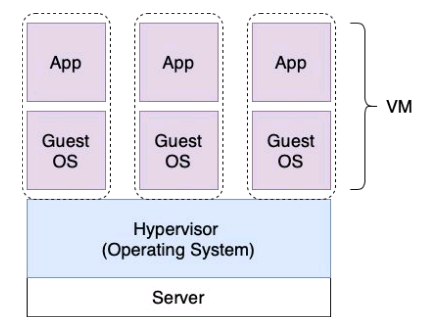
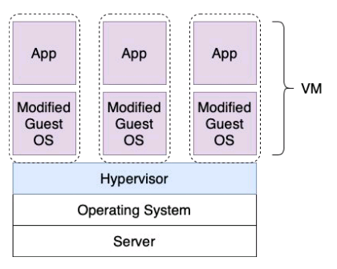
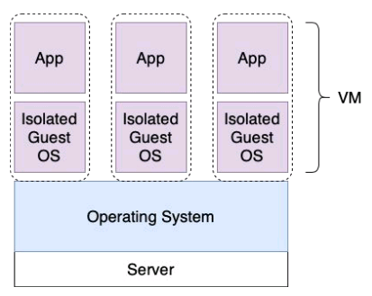

# Домашнее задание к занятию "5.1. Введение в виртуализацию. Типы и функции гипервизоров. Обзор рынка вендоров и областей применения."

## Задача 1

Опишите кратко, как вы поняли: в чем основное отличие полной (аппаратной) виртуализации, паравиртуализации и виртуализации на основе ОС.

### Ответ:
Полная (аппаратная) виртуализация.  

Гипервизор сам представляет собой операционную систему, установленную на физическом сервере. Виртуальным машинам предоставляеся доступ к аппаратным ресурсам через слой драйверов виртуальных устройств, которые предоставляет им гипервизор. ВМ могут быть с любой ОС, ну или почти с любой из широкого списка, поддерживаемых гипервизором. Гостевые ОС остаются оригинальными.

Паравиртуализация.

На физическом сервере устанавливается ОС. На ОС устанавливается Служба Гипервизора. Гипервизор не имеет прямого доступа к аппаратным ресурсам сервера, а работает через слой ОС сервера. Ядра гостевых ОС должны быть изменены поэтому число поддерживаемых гостевых ОС меньше чем для аппаратной виртуализации. 

Виртуализация на основе ОС.

Изолированные ВМ запускаются на базе ОС, установленной на физическом сервере. Роль гипервизора выполняет ОС. Гостевые ОС должны совпадать с ОС сервера (другие гостевые ОС запустить в ВМ нельзя).

## Задача 2

Выберите один из вариантов использования организации физических серверов, в зависимости от условий использования.

Организация серверов:
- физические сервера,
- паравиртуализация,
- виртуализация уровня ОС.

Условия использования:
- Высоконагруженная база данных, чувствительная к отказу.
- Различные web-приложения.
- Windows системы для использования бухгалтерским отделом.
- Системы, выполняющие высокопроизводительные расчеты на GPU.

Опишите, почему вы выбрали к каждому целевому использованию такую организацию.

### Ответ

1) Для Систем, выполняющих высокопроизводительные расчеты на GPU имеет смысл использовать физические серверы. 

Традиционное Объяснение: Не имеет смысла запускать такие системы через слой виртуализации, так как утилизация вычислительных ресурсов у этих систем и так, как правило, 100%. Кроме того, до недавнего времени гипервизоры не умели предоставлять ВМ одновременный доступ к GPU.

Моё собственное мнение (не претендующее на 100% правоту):

Однако (в случае если у нас с Вами речь не идёт про майнинг, который занимает 100% времени 100% GPU), Считаю нужным отметить, что в данный момент Возможна реализация этой задачи и с помощью виртуализации и она имеет смысл в случаях, когда сойдутся несколько из этих условий:
- требуется высокая доступность (отказоустойчивость) систем, выполняющих рассчёты; Пояснение: ВМ легче быстро восстановить в случае неисправности гостевой ОС, чем физ сервер. ВМ проще перенести на новый физ сервер при выходе из строя старого и продолжить работу.
- имеется несколько физических серверов с нужной аппаратной составляющей (GPU); Пояснение: Несколько физ серверов, объединённых в кластер можно было бы лучше утилизировать, распределяя по ним нагрузку с помощью ВМ, которые могут мигрировать между ними автоматически. 
- а особенно если, например, не все системы, нужные предприятию, производящие работу с GPU работают одновременно. Например в компании 3 отдела: Дизайнеры, 3д - аниматоры и Видеоредакторы рекламных роликов. И на компанию 2 сервера с GPU или вообще один. При этом наверняка нагрузка от разных отделов будет приходить на сервер не одновременно, а в разные моменты времени, а занчит нет смысла покупать отдельные серверы и отдавать каждому отделу. Я бы сделал ВМ для каждого отдела.

2) Windows системы для использования бухгалтерским отделом имеет смысл реализовывать через паравиртуализацию. 

Объяснение: В сравнении с использованием физ серверов, паравиртуализация (или аппаратная виртуализация) даёт возможность получить лучшую утилизацию физ серверов, получить возможность повысить отказоустойчивость систем при помощи различных методов (резервное копирование ВМ позволяет очень быстро восстановить работоспособность систем в случае, как неисправность в гостевых ОС, так и повреждения БД). Виртуализация позволяет без проблем застраховаться на случай выхода из строя физ серверов. 

3) Различные web-приложения можно запускать на виртуализации уровня ОС. Хотя можно было бы использовать любые системы вируализации, но и этой будет достаточно так как как правило гостевые ОС одни и те-же Linux-подобные. Мы получаем возможности утилизации физ серверов, отказоустойчивость, простое и быстрое резервное копирование и восстановление ВМ.

## Задача 3

Выберите подходящую систему управления виртуализацией для предложенного сценария. Детально опишите ваш выбор.

Сценарии:

1. 100 виртуальных машин на базе Linux и Windows, общие задачи, нет особых требований. Преимущественно Windows based инфраструктура, требуется реализация программных балансировщиков нагрузки, репликации данных и автоматизированного механизма создания резервных копий.
2. Требуется наиболее производительное бесплатное open source решение для виртуализации небольшой (20-30 серверов) инфраструктуры на базе Linux и Windows виртуальных машин.
3. Необходимо бесплатное, максимально совместимое и производительное решение для виртуализации Windows инфраструктуры.
4. Необходимо рабочее окружение для тестирования программного продукта на нескольких дистрибутивах Linux.

### Ответ
1. 100 виртуальных машин на базе Linux и Windows, общие задачи, нет особых требований. Преимущественно Windows based инфраструктура, требуется реализация программных балансировщиков нагрузки, репликации данных и автоматизированного механизма создания резервных копий.

Так как нет требования найти бесплатное решение, то я бы предложил использовать VMware Vsphere. В зависимости от нагрузки со стороны ВМ, потребуется 5-10 физических серверов с установленным ESXi. На ВМ в рамках этого кластера виртуализации можно поднять и программные балансировщики нагрузки и реализовать репликацию данных. А автоматизацию резервного копирования в этой инфраструктуре было бы хорошо реализовать с помощью решения Veeam Backup and Replication.

2. Требуется наиболее производительное бесплатное open source решение для виртуализации небольшой (20-30 серверов) инфраструктуры на базе Linux и Windows виртуальных машин.

В этом случае я бы использовал несколько серверов с KVM, который является бесплатным решением с открытым кодом и при этом позволяет запускать ВМ с разными ОС.

3. Необходимо бесплатное, максимально совместимое и производительное решение для виртуализации Windows инфраструктуры.

Если бы не было требования бесплатности, то можно было бы предложить Hyper-V, но раз требуется бесплатное решение, то остаётся только вариант KVM

4. Необходимо рабочее окружение для тестирования программного продукта на нескольких дистрибутивах Linux.

Если имеется ввиду, что необходимо протестировать работу программного продукта на разных ОС семейства Linux, то можно предложить создать несколько ВМ на разных дистрибутивах гостевой ОС и протестировать работу на них.

## Задача 4

Опишите возможные проблемы и недостатки гетерогенной среды виртуализации (использования нескольких систем управления виртуализацией одновременно) и что необходимо сделать для минимизации этих рисков и проблем. Если бы у вас был выбор, то создавали бы вы гетерогенную среду или нет? Мотивируйте ваш ответ примерами.

### Ответ

Гетерогенная среда виртуализации предполагает, что у нас в инфраструктуре присутствуют разные гипервизоры. Какие я вижу минусы у этого сценария:
1) нет единой централизованной системы управления гипервизорами из чего вытекают следующие проблемы:
- не возможно управлять всей инфраструктурой из единого места
- не возможно осуществить миграцию ВМ между разными гипервизорами не то что живую миграцию, а вообще перенести ВМ без танцев с бубнами и лохматых конвертеров.
- как следствие - не возможно оперативно выводить из работы физ серверы для обслуживания (апгрейда, апдейта, ремонта)
2) так как разные гипервизоры используют разные файловые системы, то невозможно сделать нормальное общее хранилище данных (например подключенное по iSCSI или FC), для размещения на нём ВМ, "живущих" на разных гипервизорах за исключением "костыльных" вариантов SMB или NFS, которые возможно, будут поддерживаться несколькими разными гипервизорами, но это точно не продакшн-вариант.  Короче говоря возможно придётся либо отказаться от общих хранилищ либо выделать хранилище для каждого типа гипервизоров.
3) дополнительная нагрузка и повышенная квалификация персонала техподдержки, которые должны хорошо знать несколько систем виртуализации. 
4) системы резервного копирования поддерживают в лучшем случае 1-2 разновидности гипервизоров, поэтому разводить зоопарк гипервизоров это значит разводить зоопарк систем резервного копирования ВМ.
5) система мониторинга. Конечно можно в рамках одной системы мониторинга наблюдать за всеми гипервизорами, но придётся попотеть, чтобы приготовить шаблоны для них.

Я бы максимально постарался переубедить заказчиков или руководителей, которым пришла в голову идея создать такую инфраструктуру. А если будут настаивать, что им в рамках одной инфраструктуры хочется зачем-то получить разные гипервизоры, я бы попытался предложить сделать всю инфраструктуру на одном варианте гипервизора (аппаратной виртуализации (например развернуть кластер Vsphere)) и ТААА-ДАААМ... запускать другие гипервизоры внутри ВМ. (используя проброс технологии VT-x внутрь ВМ) (Мне удалось для прохождения этих курсов заставить VitrualBox работать в Windows server, запущенном на ВМ внутри ESXi)
А уж Docker точно внутри ВМ будет работать без проблем, самонадеянно думаю, что и другие гипервизоры можно запустить внутри ВМ с большими или меньшими усилиями. 
Таким образом мы решаем большинство или даже все из перечисленных минусов за исключением спорного вопроса с производительностью нагромождения ВМ внутри гипервизора, работающего внутри ВМ.