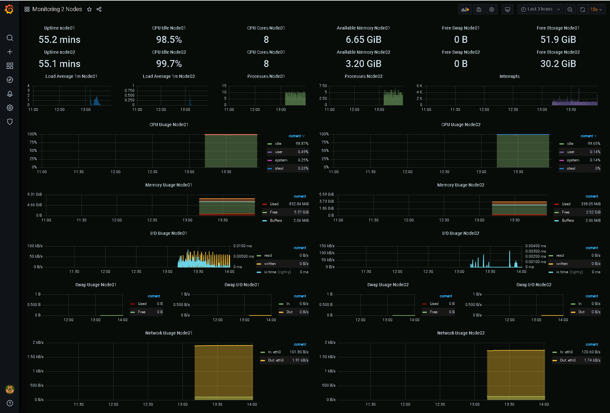

# Домашнее задание к занятию "5.4. Оркестрация группой Docker контейнеров на примере Docker Compose"


---
## Задача 1

Создать собственный образ операционной системы с помощью Packer.

Для получения зачета, вам необходимо предоставить:
- Скриншот страницы, как на слайде из презентации (слайд 37).

## Задача 2

Создать вашу первую виртуальную машину в Яндекс.Облаке.

Для получения зачета, вам необходимо предоставить:
- Скриншот страницы свойств созданной ВМ, как на примере.

## Задача 3

Создать ваш первый готовый к боевой эксплуатации компонент мониторинга, состоящий из стека микросервисов.

Для получения зачета, вам необходимо предоставить:
- Скриншот работающего веб-интерфейса Grafana с текущими метриками, как на примере

## Задача 4 (*)

Создать вторую ВМ и подключить её к мониторингу развёрнутому на первом сервере.

Для получения зачета, вам необходимо предоставить:
- Скриншот из Grafana, на котором будут отображаться метрики добавленного вами сервера.

---
### Осознание смысла этого ДЗ
Так как в этом ДЗ используется множество инструментов, решил резюмировать тут, что мы будем делать с помощью чего.
Задача всей работы: Получить в Яндекс-облаке несколько ВМ. На одной из которых будет установлена система мониторинга из нескольких компонентов Prometeus, Grafana, node-exporter ... в виде набора микросервисов.
Всё это должно создаться и запуститься автоматически по принципу IaaC.
Порядок работы и инструменты:
1. Регистрируемся в Яндекс-облаке. Создаётся аккаунт с облаком в триальном режиме. Устанавливаем утилиту `yc`. Донастраиваем инфраструктуру ЯО.
2. Устанавливаем Packer от hashicorp. https://www.packer.io/  Он нужен для создания образов различных ОС под большинство видов облачных инфраструктур вот список плагинов: https://www.packer.io/plugins. Мы с его помощью создаём образ Centos7 для ЯО. Он создаёт нам его на основе конфиг файла, в котором описывается, на базе какого образа ОС мы будем создавать свой, что в него доустановить и куда загрузить. Он нам создаст образ ОС прямо в каталог образов ЯО.
3. Устанавливаем Teraform от hashicorp. https://www.terraform.io/ Он нужен для создания ВМ в облаке на основе конфигурационных файлов и образа ОС, лежащего в ЯО. Он создаст виртуальную сеть и ВМ.
4. Затем, Ansible,  должен подключиться к ВМ по ssh и выполнить там настроку ВМ, а именно , установить docker и docker-compose, скопировать туда папку с настроенными контейнерами и запустить всё это.

5. В итоге у нас должна получиться ВМ, в которой в виде контейнеров живут несколько микросервисов, которые в совокупности представляют собой сервер моиторинга.

Все исходники и конфиги для выполнения задач 1-3 будут лежать в папке `src_dz_5.4_1-3`
Для задачи 4 

### Подготовка к работе
Для выполнения этого ДЗ требуется зарегистрироваться в Яндекс-Облаке и создать там нужную инфраструктуру. Сделаем это до начала работ.
В яндекс-облаке (ЯО) https://cloud.yandex.ru/ зарегистрировался, используя свой аккаунт Яндекса.
Создалось облако `cloud-akazand`.
Теперь идём по инстракции: https://cloud.yandex.ru/docs/cli/quickstart

Устанавливаем утилиту управления ЯО:
```bash
user1@devopserubuntu:~$ curl https://storage.yandexcloud.net/yandexcloud-yc/install.sh | bash
  % Total    % Received % Xferd  Average Speed   Time    Time     Time  Current
                                 Dload  Upload   Total   Spent    Left  Speed
100  9739  100  9739    0     0  20989      0 --:--:-- --:--:-- --:--:-- 20989
Downloading yc 0.87.0
  % Total    % Received % Xferd  Average Speed   Time    Time     Time  Current
                                 Dload  Upload   Total   Spent    Left  Speed
100 81.2M  100 81.2M    0     0  5430k      0  0:00:15  0:00:15 --:--:-- 5842k
Yandex.Cloud CLI 0.87.0 linux/amd64

yc PATH has been added to your '/home/user1/.bashrc' profile
yc bash completion has been added to your '/home/user1/.bashrc' profile.
Now we have zsh completion. Type "echo 'source /home/user1/yandex-cloud/completion.zsh.inc' >>  ~/.zshrc" to install itTo complete installation, start a new shell (exec -l $SHELL) or type 'source "/home/user1/.bashrc"' in the current one
```
Обещали, что путь к утилитам ЯО добавится автоматически, но нет:
```bash
user1@devopserubuntu:~$ echo $PATH
/usr/local/sbin:/usr/local/bin:/usr/sbin:/usr/bin:/sbin:/bin:/usr/games:/usr/local/games:/snap/bin

user1@devopserubuntu:~$ yc
yc: command not found
```
Перезаходим в аккаунт.
```bash
user1@devopserubuntu:~$ echo $PATH
/home/user1/yandex-cloud/bin:/usr/local/sbin:/usr/local/bin:/usr/sbin:/usr/bin:/sbin:/bin:/usr/games:/usr/local/games:/snap/bin

user1@devopserubuntu:~$ yc
ERROR: command name argument expected
Usage:
  yc <group|command> [optional flags]

For detailed information on this command and its flags, run:
  yc --help
```
Как видно путь добавился, утилита работает.

Далее Получаем yandex token (перейдя по ссылке из инструкции):
`AQAAAAAIRoNiAAT.....Cu3yhEPDtkk1PfW_q_c`
Запустите команду yc init, чтобы выполнить настройку вашего профиля CLI.
```bash
user1@devopserubuntu:~$ yc init
Welcome! This command will take you through the configuration process.
Pick desired action:
 [1] Re-initialize this profile 'default' with new settings
 [2] Create a new profile
Please enter your numeric choice: 2
Enter profile name. Names start with a lower case letter and contain only lower case letters a-z, digits 0-9, and hyphens '-': netology
Please go to https://oauth.yandex.ru/authorize?response_type=token&client_id=1a6990aa636648e9b2ef855fa7bec2fb in order to obtain OAuth token.

Please enter OAuth token: AQAAAAAIRoNiAAT.....Cu3yhEPDtkk1PfW_q_c
You have one cloud available: 'cloud-akazand' (id = b1g5s0vslgvo8o1p61tq). It is going to be used by default.
Please choose folder to use:
 [1] default (id = b1gallv43o2m68cib62c)
 [2] Create a new folder
Please enter your numeric choice: 2
Please enter a folder name: netology
Your current folder has been set to 'netology' (id = b1go4f0pmta6pftdlo2n).
Do you want to configure a default Compute zone? [Y/n] Y
Which zone do you want to use as a profile default?
 [1] ru-central1-a
 [2] ru-central1-b
 [3] ru-central1-c
 [4] Don't set default zone
Please enter your numeric choice: 1
Your profile default Compute zone has been set to 'ru-central1-a'.
```
Проверяем настройки:
```bash
user1@devopserubuntu:~$ yc config list
token: AQAAAAAIRoNiAAT.....Cu3yhEPDtkk1PfW_q_c
cloud-id: b1g5s0vslgvo8o1p61tq
folder-id: b1go4f0pmta6pftdlo2n
compute-default-zone: ru-central1-a
```
Проверяем список доступных образов:
```bash
user1@devopserubuntu:~$ yc compute image list
+----+------+--------+-------------+--------+
| ID | NAME | FAMILY | PRODUCT IDS | STATUS |
+----+------+--------+-------------+--------+
+----+------+--------+-------------+--------+
```
Как и ожидалось он пока пуст.

Виртуальных Сетей также пока нет:
```bash
user1@devopserubuntu:~$ yc vpc network list
+----+------+
| ID | NAME |
+----+------+
+----+------+
```
Создаём виртуальную сеть, а затем подсеть.
ВАЖНО! Они создаются не для работы наших будущих ВМ в ЯО, а для того, чтобы Packer смог запустить свою временную ВМ на которой будет собирать наш новый образ Centos. После сборки образа их надо будет удалить так как триальный ЯО даёт созать только 1 вирт сеть.
```bash
user1@devopserubuntu:~$ yc vpc network create --name net --labels my-label=netology --description "my first network via yc"
id: enp62fc35d7rljrotc52
folder_id: b1go4f0pmta6pftdlo2n
created_at: "2022-02-01T06:22:42Z"
name: net
description: my first network via yc
labels:
  my-label: netology

user1@devopserubuntu:~$ yc vpc network list
+----------------------+------+
|          ID          | NAME |
+----------------------+------+
| enp62fc35d7rljrotc52 | net  |
+----------------------+------+
```
Теперь создаём подсеть:
```bash
user1@devopserubuntu:~$ yc vpc subnet create --name my-subnet-a --zone ru-central1-a --range 10.1.2.0/24 --network-name net --description "my first subnet via yc"
id: e9bbaad71vhuc48ccdrq
folder_id: b1go4f0pmta6pftdlo2n
created_at: "2022-02-01T06:43:36Z"
name: my-subnet-a
description: my first subnet via yc
network_id: enp62fc35d7rljrotc52
zone_id: ru-central1-a
v4_cidr_blocks:
- 10.1.2.0/24
```

Кроме того, надо не забыть создать сервисный аккаунт от имени которого Teraform будет управлять облаком.
Можно сделать в веб-интерфейсе, но можно из yc.
```bash
user1@devopserubuntu:~/Terraform$ yc iam service-account create sa-akazand --description "Сервисный аккаунт для управления облаком из Terraform"
id: ajes8p3isclrtmgaemvs
folder_id: b1go4f0pmta6pftdlo2n
created_at: "2022-02-01T10:13:06.917338501Z"
name: sa-akazand
description: Сервисный аккаунт для управления облаком из Terraform

user1@devopserubuntu:~/Terraform$ yc iam service-account list
+----------------------+------------+
|          ID          |    NAME    |
+----------------------+------------+
| ajes8p3isclrtmgaemvs | sa-akazand |
+----------------------+------------+
```
А теперь надо этому сервисному аккаунту выставить роль `admin`. Как это сделать утилитой `yc` я не нашёл, сделал через веб интерфейс ЯО.
Также нам надо получить от яндекса авторизованный ключ для этого сервисного аккаунта для использования в Terraform:
```bash
user1@devopserubuntu:~/Terraform$ yc iam key create --service-account-name sa-akazand -o sa-akazand-key.json
id: ajeqhh8ekan1o9r4vr1u
service_account_id: ajes8p3isclrtmgaemvs
created_at: "2022-02-01T11:13:07.019979778Z"
key_algorithm: RSA_2048

user1@devopserubuntu:~/Terraform$ ls -la sa-akazand-key.json
-rw------- 1 user1 user1 2398 Feb  1 11:13 sa-akazand-key.json
```

В целом всё готово для выполнения заданий.


---
## Задача 1

Создать собственный образ операционной системы с помощью Packer.

Для получения зачета, вам необходимо предоставить:
- Скриншот страницы, как на слайде из презентации (слайд 37).

### Ответ
Устанавливаем `Packer`
```bash
user1@devopserubuntu:~$ curl -fsSL https://apt.releases.hashicorp.com/gpg | sudo apt-key add -
Warning: apt-key is deprecated. Manage keyring files in trusted.gpg.d instead (see apt-key(8)).
OK

user1@devopserubuntu:~$ sudo apt-add-repository "deb [arch=amd64] https://apt.releases.hashicorp.com $(lsb_release -cs) main"
Repository: 'deb [arch=amd64] https://apt.releases.hashicorp.com impish main'
Description:
Archive for codename: impish components: main
More info: https://apt.releases.hashicorp.com
Adding repository.
Press [ENTER] to continue or Ctrl-c to cancel.
Found existing deb entry in /etc/apt/sources.list.d/archive_uri-https_apt_releases_hashicorp_com-impish.list
Adding deb entry to /etc/apt/sources.list.d/archive_uri-https_apt_releases_hashicorp_com-impish.list
Found existing deb-src entry in /etc/apt/sources.list.d/archive_uri-https_apt_releases_hashicorp_com-impish.list
Adding disabled deb-src entry to /etc/apt/sources.list.d/archive_uri-https_apt_releases_hashicorp_com-impish.list
Hit:1 http://de.archive.ubuntu.com/ubuntu impish InRelease
Hit:2 https://download.docker.com/linux/ubuntu impish InRelease
Get:3 https://apt.releases.hashicorp.com impish InRelease [9,497 B]
Get:4 http://de.archive.ubuntu.com/ubuntu impish-updates InRelease [110 kB]
Get:5 http://de.archive.ubuntu.com/ubuntu impish-backports InRelease [101 kB]
Get:6 http://de.archive.ubuntu.com/ubuntu impish-security InRelease [110 kB]
Get:7 http://de.archive.ubuntu.com/ubuntu impish-updates/main amd64 Packages [257 kB]
Get:8 http://de.archive.ubuntu.com/ubuntu impish-updates/main Translation-en [66.1 kB]
Get:9 http://de.archive.ubuntu.com/ubuntu impish-updates/main amd64 c-n-f Metadata [4,304 B]
Get:10 http://de.archive.ubuntu.com/ubuntu impish-updates/restricted amd64 Packages [159 kB]
Get:11 http://de.archive.ubuntu.com/ubuntu impish-updates/restricted Translation-en [22.3 kB]
Fetched 839 kB in 1s (802 kB/s)
Reading package lists... Done


user1@devopserubuntu:~$ sudo apt-get update && sudo apt-get install packer
Hit:1 http://de.archive.ubuntu.com/ubuntu impish InRelease
Hit:2 http://de.archive.ubuntu.com/ubuntu impish-updates InRelease
Hit:3 https://download.docker.com/linux/ubuntu impish InRelease
Hit:4 https://apt.releases.hashicorp.com impish InRelease
Hit:5 http://de.archive.ubuntu.com/ubuntu impish-backports InRelease
Hit:6 http://de.archive.ubuntu.com/ubuntu impish-security InRelease
Reading package lists... Done
Reading package lists... Done
Building dependency tree... Done
Reading state information... Done
The following NEW packages will be installed:
  packer
0 upgraded, 1 newly installed, 0 to remove and 30 not upgraded.
Need to get 32.1 MB of archives.
After this operation, 151 MB of additional disk space will be used.
Get:1 https://apt.releases.hashicorp.com impish/main amd64 packer amd64 1.7.9 [32.1 MB]
Fetched 32.1 MB in 8s (3,882 kB/s)
Selecting previously unselected package packer.
(Reading database ... 139138 files and directories currently installed.)
Preparing to unpack .../packer_1.7.9_amd64.deb ...
Unpacking packer (1.7.9) ...
Setting up packer (1.7.9) ...
Scanning processes...
Scanning linux images...

Running kernel seems to be up-to-date.

No services need to be restarted.

No containers need to be restarted.

No user sessions are running outdated binaries.
```
Проверяем версию Packer:
```bash
user1@devopserubuntu:~$ packer --version
1.7.9
```

####К этому моменту у нас должно быть уже приготовлено всё в Яндекс-Облаке, всё это описано выше.

Скачиваем готовую конфигурацию для создания образа. 
```bash
user1@devopserubuntu:~$ wget https://raw.githubusercontent.com/netology-code/virt-homeworks/virt-11/05-virt-04-docker-compose/src/packer/centos-7-base.json
```
Исправим в файле `folder_id` и `subnet_id`, а также токен, полученные ранее (выше описано):
```bash
user1@devopserubuntu:~$ cat centos-7-base.json
{
  "builders": [
    {
      "disk_type": "network-nvme",
      "folder_id": "b1go4f0pmta6pftdlo2n",
      "image_description": "by packer",
      "image_family": "centos",
      "image_name": "centos-7-base",
      "source_image_family": "centos-7",
      "ssh_username": "centos",
      "subnet_id": "e9bbaad71vhuc48ccdrq",
      "token": "AQAAAAAIRoNiAAT.....Cu3yhEPDtkk1PfW_q_c",
      "type": "yandex",
      "use_ipv4_nat": true,
      "zone": "ru-central1-a"
    }
  ],
  "provisioners": [
    {
      "inline": [
        "sudo yum -y update",
        "sudo yum -y install bridge-utils bind-utils iptables curl net-tools tcpdump rsync telnet openssh-server"
      ],
      "type": "shell"
    }
  ]
}
```
Попросим Packer проверить файл:
```bash
user1@devopserubuntu:~$ packer validate  centos-7-base.json
The configuration is valid.
```
Собираем образ. Для этого Packer сначала создаст и запустит в ЯО новую ВМ, на которой будет проводить сборку образа:
```bash
user1@devopserubuntu:~$ packer build centos-7-base.json
yandex: output will be in this color.

==> yandex: Creating temporary RSA SSH key for instance...
==> yandex: Using as source image: fd8aqitd4vl5950ihohp (name: "centos-7-v20220131", family: "centos-7")
==> yandex: Use provided subnet id e9bbaad71vhuc48ccdrq
==> yandex: Creating disk...
==> yandex: Creating instance...
==> yandex: Waiting for instance with id fhm98btoj842kg2g7kuv to become active...
    yandex: Detected instance IP: 51.250.9.192
==> yandex: Using SSH communicator to connect: 51.250.9.192
==> yandex: Waiting for SSH to become available...
==> yandex: Connected to SSH!
==> yandex: Provisioning with shell script: /tmp/packer-shell4227476759
    yandex: Loaded plugins: fastestmirror
    yandex: Loading mirror speeds from cached hostfile
    yandex:  * base: mirror.docker.ru
    yandex:  * extras: mirror.yandex.ru
    yandex:  * updates: mirror.yandex.ru
    yandex: No packages marked for update
    yandex: Loaded plugins: fastestmirror
    yandex: Loading mirror speeds from cached hostfile
    yandex:  * base: mirror.docker.ru
    yandex:  * extras: mirror.yandex.ru
    yandex:  * updates: mirror.yandex.ru
    yandex: Package iptables-1.4.21-35.el7.x86_64 already installed and latest version
    yandex: Package curl-7.29.0-59.el7_9.1.x86_64 already installed and latest version
    yandex: Package net-tools-2.0-0.25.20131004git.el7.x86_64 already installed and latest version
    yandex: Package rsync-3.1.2-10.el7.x86_64 already installed and latest version
    yandex: Package openssh-server-7.4p1-22.el7_9.x86_64 already installed and latest version
    yandex: Resolving Dependencies
    yandex: --> Running transaction check
    yandex: ---> Package bind-utils.x86_64 32:9.11.4-26.P2.el7_9.8 will be installed
    yandex: --> Processing Dependency: bind-libs-lite(x86-64) = 32:9.11.4-26.P2.el7_9.8 for package: 32:bind-utils-9.11.4-26.P2.el7_9.8.x86_64
    yandex: --> Processing Dependency: bind-libs(x86-64) = 32:9.11.4-26.P2.el7_9.8 for package: 32:bind-utils-9.11.4-26.P2.el7_9.8.x86_64
    yandex: --> Processing Dependency: liblwres.so.160()(64bit) for package: 32:bind-utils-9.11.4-26.P2.el7_9.8.x86_64
    yandex: --> Processing Dependency: libisccfg.so.160()(64bit) for package: 32:bind-utils-9.11.4-26.P2.el7_9.8.x86_64
    yandex: --> Processing Dependency: libisc.so.169()(64bit) for package: 32:bind-utils-9.11.4-26.P2.el7_9.8.x86_64
    yandex: --> Processing Dependency: libirs.so.160()(64bit) for package: 32:bind-utils-9.11.4-26.P2.el7_9.8.x86_64
    yandex: --> Processing Dependency: libdns.so.1102()(64bit) for package: 32:bind-utils-9.11.4-26.P2.el7_9.8.x86_64
    yandex: --> Processing Dependency: libbind9.so.160()(64bit) for package: 32:bind-utils-9.11.4-26.P2.el7_9.8.x86_64
    yandex: --> Processing Dependency: libGeoIP.so.1()(64bit) for package: 32:bind-utils-9.11.4-26.P2.el7_9.8.x86_64
    yandex: ---> Package bridge-utils.x86_64 0:1.5-9.el7 will be installed
    yandex: ---> Package tcpdump.x86_64 14:4.9.2-4.el7_7.1 will be installed
    yandex: --> Processing Dependency: libpcap >= 14:1.5.3-10 for package: 14:tcpdump-4.9.2-4.el7_7.1.x86_64
    yandex: --> Processing Dependency: libpcap.so.1()(64bit) for package: 14:tcpdump-4.9.2-4.el7_7.1.x86_64
    yandex: ---> Package telnet.x86_64 1:0.17-66.el7 will be installed
    yandex: --> Running transaction check
    yandex: ---> Package GeoIP.x86_64 0:1.5.0-14.el7 will be installed
    yandex: --> Processing Dependency: geoipupdate for package: GeoIP-1.5.0-14.el7.x86_64
    yandex: ---> Package bind-libs.x86_64 32:9.11.4-26.P2.el7_9.8 will be installed
    yandex: --> Processing Dependency: bind-license = 32:9.11.4-26.P2.el7_9.8 for package: 32:bind-libs-9.11.4-26.P2.el7_9.8.x86_64
    yandex: ---> Package bind-libs-lite.x86_64 32:9.11.4-26.P2.el7_9.8 will be installed
    yandex: ---> Package libpcap.x86_64 14:1.5.3-12.el7 will be installed
    yandex: --> Running transaction check
    yandex: ---> Package bind-license.noarch 32:9.11.4-26.P2.el7_9.8 will be installed
    yandex: ---> Package geoipupdate.x86_64 0:2.5.0-1.el7 will be installed
    yandex: --> Finished Dependency Resolution
    yandex:
    yandex: Dependencies Resolved
    yandex:
    yandex: ================================================================================
    yandex:  Package            Arch       Version                        Repository   Size
    yandex: ================================================================================
    yandex: Installing:
    yandex:  bind-utils         x86_64     32:9.11.4-26.P2.el7_9.8        updates     261 k
    yandex:  bridge-utils       x86_64     1.5-9.el7                      base         32 k
    yandex:  tcpdump            x86_64     14:4.9.2-4.el7_7.1             base        422 k
    yandex:  telnet             x86_64     1:0.17-66.el7                  updates      64 k
    yandex: Installing for dependencies:
    yandex:  GeoIP              x86_64     1.5.0-14.el7                   base        1.5 M
    yandex:  bind-libs          x86_64     32:9.11.4-26.P2.el7_9.8        updates     157 k
    yandex:  bind-libs-lite     x86_64     32:9.11.4-26.P2.el7_9.8        updates     1.1 M
    yandex:  bind-license       noarch     32:9.11.4-26.P2.el7_9.8        updates      91 k
    yandex:  geoipupdate        x86_64     2.5.0-1.el7                    base         35 k
    yandex:  libpcap            x86_64     14:1.5.3-12.el7                base        139 k
    yandex:
    yandex: Transaction Summary
    yandex: ================================================================================
    yandex: Install  4 Packages (+6 Dependent packages)
    yandex:
    yandex: Total download size: 3.8 M
    yandex: Installed size: 9.0 M
    yandex: Downloading packages:
    yandex: --------------------------------------------------------------------------------
    yandex: Total                                              9.6 MB/s | 3.8 MB  00:00
    yandex: Running transaction check
    yandex: Running transaction test
    yandex: Transaction test succeeded
    yandex: Running transaction
    yandex:   Installing : 32:bind-license-9.11.4-26.P2.el7_9.8.noarch                 1/10
    yandex:   Installing : geoipupdate-2.5.0-1.el7.x86_64                              2/10
    yandex:   Installing : GeoIP-1.5.0-14.el7.x86_64                                   3/10
    yandex:   Installing : 32:bind-libs-lite-9.11.4-26.P2.el7_9.8.x86_64               4/10
    yandex:   Installing : 32:bind-libs-9.11.4-26.P2.el7_9.8.x86_64                    5/10
    yandex:   Installing : 14:libpcap-1.5.3-12.el7.x86_64                              6/10
    yandex: pam_tally2: Error opening /var/log/tallylog for update: Permission denied
    yandex: pam_tally2: Authentication error
    yandex: useradd: failed to reset the tallylog entry of user "tcpdump"
    yandex:   Installing : 14:tcpdump-4.9.2-4.el7_7.1.x86_64                           7/10
    yandex:   Installing : 32:bind-utils-9.11.4-26.P2.el7_9.8.x86_64                   8/10
    yandex:   Installing : bridge-utils-1.5-9.el7.x86_64                               9/10
    yandex:   Installing : 1:telnet-0.17-66.el7.x86_64                                10/10
    yandex:   Verifying  : GeoIP-1.5.0-14.el7.x86_64                                   1/10
    yandex:   Verifying  : 1:telnet-0.17-66.el7.x86_64                                 2/10
    yandex:   Verifying  : 14:libpcap-1.5.3-12.el7.x86_64                              3/10
    yandex:   Verifying  : geoipupdate-2.5.0-1.el7.x86_64                              4/10
    yandex:   Verifying  : 14:tcpdump-4.9.2-4.el7_7.1.x86_64                           5/10
    yandex:   Verifying  : 32:bind-license-9.11.4-26.P2.el7_9.8.noarch                 6/10
    yandex:   Verifying  : 32:bind-libs-lite-9.11.4-26.P2.el7_9.8.x86_64               7/10
    yandex:   Verifying  : 32:bind-utils-9.11.4-26.P2.el7_9.8.x86_64                   8/10
    yandex:   Verifying  : 32:bind-libs-9.11.4-26.P2.el7_9.8.x86_64                    9/10
    yandex:   Verifying  : bridge-utils-1.5-9.el7.x86_64                              10/10
    yandex:
    yandex: Installed:
    yandex:   bind-utils.x86_64 32:9.11.4-26.P2.el7_9.8   bridge-utils.x86_64 0:1.5-9.el7
    yandex:   tcpdump.x86_64 14:4.9.2-4.el7_7.1           telnet.x86_64 1:0.17-66.el7
    yandex:
    yandex: Dependency Installed:
    yandex:   GeoIP.x86_64 0:1.5.0-14.el7
    yandex:   bind-libs.x86_64 32:9.11.4-26.P2.el7_9.8
    yandex:   bind-libs-lite.x86_64 32:9.11.4-26.P2.el7_9.8
    yandex:   bind-license.noarch 32:9.11.4-26.P2.el7_9.8
    yandex:   geoipupdate.x86_64 0:2.5.0-1.el7
    yandex:   libpcap.x86_64 14:1.5.3-12.el7
    yandex:
    yandex: Complete!
==> yandex: Stopping instance...
==> yandex: Deleting instance...
    yandex: Instance has been deleted!
==> yandex: Creating image: centos-7-base
==> yandex: Waiting for image to complete...
==> yandex: Success image create...
==> yandex: Destroying boot disk...
    yandex: Disk has been deleted!
Build 'yandex' finished after 2 minutes 2 seconds.

==> Wait completed after 2 minutes 2 seconds

==> Builds finished. The artifacts of successful builds are:
--> yandex: A disk image was created: centos-7-base (id: fd8thdvlga8qrfbvm76d) with family name centos
```
Packer создал временную ВМ, выполнил установку в неё всяких нужных пакетов, сделал образ и удалил Вм.
Как мы видим образ собрался в репозтории Яндекс-Облака.
```bash
user1@devopserubuntu:~$ yc --folder-name netology compute images list
+----------------------+---------------+--------+----------------------+--------+
|          ID          |     NAME      | FAMILY |     PRODUCT IDS      | STATUS |
+----------------------+---------------+--------+----------------------+--------+
| fd8thdvlga8qrfbvm76d | centos-7-base | centos | f2eacrudv331nbat9ehb | READY  |
+----------------------+---------------+--------+----------------------+--------+
```
** можно было имя папки не указывать.

Теперь важно удалить виртуальные сети из ЯО, которые мы там создали для Packer-а.
```bash
user1@devopserubuntu:~/Terraform$ yc vpc net list
+----------------------+------+
|          ID          | NAME |
+----------------------+------+
| enp62fc35d7rljrotc52 | net  |
+----------------------+------+

user1@devopserubuntu:~/Terraform$ yc vpc subnet list
+----------------------+-------------+----------------------+----------------+---------------+---------------+
|          ID          |    NAME     |      NETWORK ID      | ROUTE TABLE ID |     ZONE      |     RANGE     |
+----------------------+-------------+----------------------+----------------+---------------+---------------+
| e9bbaad71vhuc48ccdrq | my-subnet-a | enp62fc35d7rljrotc52 |                | ru-central1-a | [10.1.2.0/24] |
+----------------------+-------------+----------------------+----------------+---------------+---------------+

user1@devopserubuntu:~/Terraform$ yc vpc subnet delete my-subnet-a
done (2s)

user1@devopserubuntu:~/Terraform$ yc vpc net delete net
```
Готово. Теперь в ЯО есть от нас только образ Centos-7-base.

## Задача 2

Создать вашу первую виртуальную машину в Яндекс-Облаке.

Для получения зачета, вам необходимо предоставить:
- Скриншот страницы свойств созданной ВМ.

### Ответ
Итак в задании 1 мы создали образ ОС в каталоге образов в Яндекс-Облаке. Теперь надо развернуть из него ВМ.

Для этого используется Teraform. Устанавливаем его:
```bash
user1@devopserubuntu:~$ curl -fsSL https://apt.releases.hashicorp.com/gpg | sudo apt-key add -
[sudo] password for user1:
Warning: apt-key is deprecated. Manage keyring files in trusted.gpg.d instead (see apt-key(8)).
OK

user1@devopserubuntu:~$ sudo apt-add-repository "deb [arch=amd64] https://apt.releases.hashicorp.com $(lsb_release -cs) main"
Repository: 'deb [arch=amd64] https://apt.releases.hashicorp.com impish main'
Description:
Archive for codename: impish components: main
More info: https://apt.releases.hashicorp.com
Adding repository.
Press [ENTER] to continue or Ctrl-c to cancel.
Found existing deb entry in /etc/apt/sources.list.d/archive_uri-https_apt_releases_hashicorp_com-impish.list
Adding deb entry to /etc/apt/sources.list.d/archive_uri-https_apt_releases_hashicorp_com-impish.list
Found existing deb-src entry in /etc/apt/sources.list.d/archive_uri-https_apt_releases_hashicorp_com-impish.list
Adding disabled deb-src entry to /etc/apt/sources.list.d/archive_uri-https_apt_releases_hashicorp_com-impish.list
Hit:1 https://apt.releases.hashicorp.com impish InRelease
Hit:2 http://de.archive.ubuntu.com/ubuntu impish InRelease
Hit:3 https://download.docker.com/linux/ubuntu impish InRelease
Get:4 http://de.archive.ubuntu.com/ubuntu impish-updates InRelease [110 kB]
Get:5 http://de.archive.ubuntu.com/ubuntu impish-backports InRelease [101 kB]
Get:6 http://de.archive.ubuntu.com/ubuntu impish-security InRelease [110 kB]
Fetched 321 kB in 1s (284 kB/s)
Reading package lists... Done

user1@devopserubuntu:~$ sudo apt-get update && sudo apt-get install terraform
Hit:1 http://de.archive.ubuntu.com/ubuntu impish InRelease
Hit:2 https://download.docker.com/linux/ubuntu impish InRelease
Hit:3 https://apt.releases.hashicorp.com impish InRelease
Hit:4 http://de.archive.ubuntu.com/ubuntu impish-updates InRelease
Hit:5 http://de.archive.ubuntu.com/ubuntu impish-backports InRelease
Hit:6 http://de.archive.ubuntu.com/ubuntu impish-security InRelease
Reading package lists... Done
Reading package lists... Done
Building dependency tree... Done
Reading state information... Done
The following NEW packages will be installed:
  terraform
0 upgraded, 1 newly installed, 0 to remove and 30 not upgraded.
Need to get 18.7 MB of archives.
After this operation, 62.0 MB of additional disk space will be used.
Get:1 https://apt.releases.hashicorp.com impish/main amd64 terraform amd64 1.1.4 [18.7 MB]
Fetched 18.7 MB in 4s (5,171 kB/s)
Selecting previously unselected package terraform.
(Reading database ... 139141 files and directories currently installed.)
Preparing to unpack .../terraform_1.1.4_amd64.deb ...
Unpacking terraform (1.1.4) ...
Setting up terraform (1.1.4) ...
Scanning processes...
Scanning linux images...

Running kernel seems to be up-to-date.
No services need to be restarted.
No containers need to be restarted.
No user sessions are running outdated binaries.
```
Проверяем версию:
```bash
user1@devopserubuntu:~$ terraform --version
Terraform v1.1.4
on linux_amd64
```
Создаём папку `/home/user1/Teraform` для Teraform. Размещаем в ней файлы:
```bash
user1@devopserubuntu:~/Terraform$ ls -la
total 28
drwxrwxr-x  2 user1 user1 4096 Feb  1 09:46 .
drwxr-x--- 16 user1 user1 4096 Feb  1 09:35 ..
-rw-rw-r--  1 user1 user1  260 Feb  1 09:37 network.tf
-rw-rw-r--  1 user1 user1  628 Feb  1 09:38 node01.tf
-rw-rw-r--  1 user1 user1  265 Feb  1 09:38 output.tf
-rw-rw-r--  1 user1 user1  252 Feb  1 09:39 provider.tf
-rw-rw-r--  1 user1 user1  560 Feb  1 09:39 variables.tf
```
Заполняем файл с переменными своими данными, полученными с помощью команд:
```bash
user1@devopserubuntu:~/Terraform$ yc config list
token: AQAAAAAIRoNiAAT.....Cu3yhEPDtkk1PfW_q_c
cloud-id: b1g5s0vslgvo8o1p61tq
folder-id: b1go4f0pmta6pftdlo2n
compute-default-zone: ru-central1-a

user1@devopserubuntu:~/Terraform$ yc compute image list
+----------------------+---------------+--------+----------------------+--------+
|          ID          |     NAME      | FAMILY |     PRODUCT IDS      | STATUS |
+----------------------+---------------+--------+----------------------+--------+
| fd8thdvlga8qrfbvm76d | centos-7-base | centos | f2eacrudv331nbat9ehb | READY  |
+----------------------+---------------+--------+----------------------+--------+
```

```bash
user1@devopserubuntu:~/Terraform$ cat variables.tf
# Заменить на ID своего облака
# https://console.cloud.yandex.ru/cloud?section=overview
variable "yandex_cloud_id" {
  default = "b1g5s0vslgvo8o1p61tq"
}

# Заменить на Folder своего облака
# https://console.cloud.yandex.ru/cloud?section=overview
variable "yandex_folder_id" {
  default = "b1go4f0pmta6pftdlo2n"
}

# Заменить на ID своего образа
# ID можно узнать с помощью команды yc compute image list
variable "centos-7-base" {
  default = "fd8thdvlga8qrfbvm76d"
}
```
Файл `provider.tf` содержит информацию, какой драйвер то есть какое облако планируется использовать. А также тут указан авторизационный ключ для подключения к облаку:
```bash
user1@devopserubuntu:~/Terraform$ cat provider.tf
# Provider
terraform {
  required_providers {
    yandex = {
      source = "yandex-cloud/yandex"
    }
  }
}

provider "yandex" {
  service_account_key_file = "sa-akazand-key.json"
  cloud_id  = "${var.yandex_cloud_id}"
  folder_id = "${var.yandex_folder_id}"
}
```
Необходимо сгенерировать пару ключей для организации ssh-подключения к нашей будущей ВМ.
```bash
user1@devopserubuntu:~/.ssh$ ssh-keygen
Generating public/private rsa key pair.
Enter file in which to save the key (/home/user1/.ssh/id_rsa):
Enter passphrase (empty for no passphrase):
Enter same passphrase again:
Your identification has been saved in /home/user1/.ssh/id_rsa
Your public key has been saved in /home/user1/.ssh/id_rsa.pub
The key fingerprint is:
SHA256:TyE7HA9Tl258cG0tI16q92cZ8152X1rCvZ4ZaKjKa6U user1@devopserubuntu
The keys randomart image is:
+---[RSA 3072]----+
|          . .. ..|
|         . .+ = +|
|        = .+ * + |
|       . B .* .  |
|        S oo .   |
|         =. o..+ |
|        o .o +o.%|
|      .E  . . .*&|
|      .+o.    oOo|
+----[SHA256]-----+
user1@devopserubuntu:~/.ssh$

user1@devopserubuntu:~$ ls -la ~/.ssh/id*
-rw------- 1 user1 user1 2610 Feb  2 22:33 /home/user1/.ssh/id_rsa
-rw-r--r-- 1 user1 user1  574 Feb  2 22:33 /home/user1/.ssh/id_rsa.pub
user1@devopserubuntu:~$
```
Теперь проверим, что путь к открытому ключу указан в конфигурационном файле `node01.tf`:
```bash
user1@devopserubuntu:~/Terraform$ cat node01.tf
resource "yandex_compute_instance" "node01" {
  name                      = "node01"
  zone                      = "ru-central1-a"
  hostname                  = "node01.netology.cloud"
  allow_stopping_for_update = true

  resources {
    cores  = 8
    memory = 8
  }

  boot_disk {
    initialize_params {
      image_id    = "${var.centos-7-base}"
      name        = "root-node01"
      type        = "network-nvme"
      size        = "50"
    }
  }

  network_interface {
    subnet_id = "${yandex_vpc_subnet.default.id}"
    nat       = true
  }

  metadata = {
    ssh-keys = "centos:${file("~/.ssh/id_rsa.pub")}"
  }
}
```

Посмотрим содержимое остальных файлов:
Файл настроек сети будущей ВМ. Teraform создаст новую сеть и подсеть
```bash
user1@devopserubuntu:~/Terraform$ cat network.tf
# Network
resource "yandex_vpc_network" "default" {
  name = "net"
}

resource "yandex_vpc_subnet" "default" {
  name = "subnet"
  zone           = "ru-central1-a"
  network_id     = "${yandex_vpc_network.default.id}"
  v4_cidr_blocks = ["192.168.101.0/24"]
```

Файл настроек вывода. Тут указано, какие данные Terraform нам выдаст после создания ВМ.
```bash
user1@devopserubuntu:~/Terraform$ cat output.tf
output "internal_ip_address_node01_yandex_cloud" {
  value = "${yandex_compute_instance.node01.network_interface.0.ip_address}"
}

output "external_ip_address_node01_yandex_cloud" {
  value = "${yandex_compute_instance.node01.network_interface.0.nat_ip_address}"
}
```
Итак. Конфигурационные файлы для Terraform подготовлены.

Выполним инициализацию Terraform:
```bash
user1@devopserubuntu:~/Terraform$ terraform init

Initializing the backend...

Initializing provider plugins...
- Finding latest version of yandex-cloud/yandex...
- Installing yandex-cloud/yandex v0.70.0...
- Installed yandex-cloud/yandex v0.70.0 (self-signed, key ID E40F590B50BB8E40)

Partner and community providers are signed by their developers.
If you'd like to know more about provider signing, you can read about it here:
https://www.terraform.io/docs/cli/plugins/signing.html

Terraform has created a lock file .terraform.lock.hcl to record the provider
selections it made above. Include this file in your version control repository
so that Terraform can guarantee to make the same selections by default when
you run "terraform init" in the future.

Terraform has been successfully initialized!

You may now begin working with Terraform. Try running "terraform plan" to see
any changes that are required for your infrastructure. All Terraform commands
should now work.

If you ever set or change modules or backend configuration for Terraform,
rerun this command to reinitialize your working directory. If you forget, other
commands will detect it and remind you to do so if necessary.
```
Выполним проверку плана Terraform:
```bash
user1@devopserubuntu:~/Terraform$ terraform plan

Terraform used the selected providers to generate the following execution plan. Resource actions are indicated with the following symbols:
  + create

Terraform will perform the following actions:

  # yandex_compute_instance.node01 will be created
  + resource "yandex_compute_instance" "node01" {
      + allow_stopping_for_update = true
      + created_at                = (known after apply)
      + folder_id                 = (known after apply)
      + fqdn                      = (known after apply)
      + hostname                  = "node01.netology.cloud"
      + id                        = (known after apply)
      + metadata                  = {
          + "ssh-keys" = <<-EOT
                centos:ssh-rsa AAAAB3NzaC1yc2EAAAADAQABAAABgQCk3c4RP9ADNp+BQwjou8TR2kE9Be6XwqMmm0fV8Ai/ViB2X85Jkt/gJfFGCvxIppM7pHqSDWeS1EJNt1FmeR62D9euEqUkGOQ/oJ0ORS96rHQbMhck68GS2elDgIyv6M2vIxTXn5LWDrJadqySqypdqbG/HBno8/TbhVGrUemjDumOhNr8QkLkImsE26RpRn77idR5j528xOgmZAIXhkdd0e6hj1KTpOKjtcGn24PTbNnUcaNOopnvgDKtVkbUYr6ixbKbrlY8sQ52q3IJ5dPFNmyuEi0zdYTmrx5bgTBYtkVebPDY0iExYVuQ7I0Vs2k7tuszXwz+y2erRvwfOm+ZTUevX0HjE4qj0ZOIP46z/a0LvvSSD7GHgrjHDJO2dNpSiUOFpWf27SC1xoLKf2NDoTL4fWdwb7OH9deZHwNtw8dm1jRHUH2EzJmoGA+Kv08Y79OqxtW0JzFpWoQf7CKbJ0XDH4PpbBiv7d/fXLV28NAnhl4qyskJlp8mbW3WIZ8= user1@devopserubuntu
            EOT
        }
      + name                      = "node01"
      + network_acceleration_type = "standard"
      + platform_id               = "standard-v1"
      + service_account_id        = (known after apply)
      + status                    = (known after apply)
      + zone                      = "ru-central1-a"

      + boot_disk {
          + auto_delete = true
          + device_name = (known after apply)
          + disk_id     = (known after apply)
          + mode        = (known after apply)

          + initialize_params {
              + block_size  = (known after apply)
              + description = (known after apply)
              + image_id    = "fd8thdvlga8qrfbvm76d"
              + name        = "root-node01"
              + size        = 50
              + snapshot_id = (known after apply)
              + type        = "network-nvme"
            }
        }

      + network_interface {
          + index              = (known after apply)
          + ip_address         = (known after apply)
          + ipv4               = true
          + ipv6               = (known after apply)
          + ipv6_address       = (known after apply)
          + mac_address        = (known after apply)
          + nat                = true
          + nat_ip_address     = (known after apply)
          + nat_ip_version     = (known after apply)
          + security_group_ids = (known after apply)
          + subnet_id          = (known after apply)
        }

      + placement_policy {
          + placement_group_id = (known after apply)
        }

      + resources {
          + core_fraction = 100
          + cores         = 8
          + memory        = 8
        }

      + scheduling_policy {
          + preemptible = (known after apply)
        }
    }

  # yandex_vpc_network.default will be created
  + resource "yandex_vpc_network" "default" {
      + created_at                = (known after apply)
      + default_security_group_id = (known after apply)
      + folder_id                 = (known after apply)
      + id                        = (known after apply)
      + labels                    = (known after apply)
      + name                      = "net"
      + subnet_ids                = (known after apply)
    }

  # yandex_vpc_subnet.default will be created
  + resource "yandex_vpc_subnet" "default" {
      + created_at     = (known after apply)
      + folder_id      = (known after apply)
      + id             = (known after apply)
      + labels         = (known after apply)
      + name           = "subnet"
      + network_id     = (known after apply)
      + v4_cidr_blocks = [
          + "192.168.101.0/24",
        ]
      + v6_cidr_blocks = (known after apply)
      + zone           = "ru-central1-a"
    }

Plan: 3 to add, 0 to change, 0 to destroy.

Changes to Outputs:
  + external_ip_address_node01_yandex_cloud = (known after apply)
  + internal_ip_address_node01_yandex_cloud = (known after apply)

─────────────────────────────────────────────────────────────────────────────────────────────────────────────────────────────────────────────────────────────────────────────────────────────

Note: You didn't use the -out option to save this plan, so Terraform can't guarantee to take exactly these actions if you run "terraform apply" now.
```
Ошибок не выдал.
знаками "+" он отметил те сущности, которые будут созданы.

Теперь попробуем выполнить этот план:
```bash
user1@devopserubuntu:~/Terraform$ terraform apply

Terraform used the selected providers to generate the following execution plan. Resource actions are indicated with the following symbols:
  + create

Terraform will perform the following actions:

  # yandex_compute_instance.node01 will be created
  + resource "yandex_compute_instance" "node01" {
      + allow_stopping_for_update = true
      + created_at                = (known after apply)
      + folder_id                 = (known after apply)
      + fqdn                      = (known after apply)
      + hostname                  = "node01.netology.cloud"
      + id                        = (known after apply)
      + metadata                  = {
          + "ssh-keys" = <<-EOT
                centos:ssh-rsa AAAAB3NzaC1yc2EAAAADAQABAAABgQCk3c4RP9ADNp+BQwjou8TR2kE9Be6XwqMmm0fV8Ai/ViB2X85Jkt/gJfFGCvxIppM7pHqSDWeS1EJNt1FmeR62D9euEqUkGOQ/oJ0ORS96rHQbMhck68GS2elDgIyv6M2vIxTXn5LWDrJadqySqypdqbG/HBno8/TbhVGrUemjDumOhNr8QkLkImsE26RpRn77idR5j528xOgmZAIXhkdd0e6hj1KTpOKjtcGn24PTbNnUcaNOopnvgDKtVkbUYr6ixbKbrlY8sQ52q3IJ5dPFNmyuEi0zdYTmrx5bgTBYtkVebPDY0iExYVuQ7I0Vs2k7tuszXwz+y2erRvwfOm+ZTUevX0HjE4qj0ZOIP46z/a0LvvSSD7GHgrjHDJO2dNpSiUOFpWf27SC1xoLKf2NDoTL4fWdwb7OH9deZHwNtw8dm1jRHUH2EzJmoGA+Kv08Y79OqxtW0JzFpWoQf7CKbJ0XDH4PpbBiv7d/fXLV28NAnhl4qyskJlp8mbW3WIZ8= user1@devopserubuntu
            EOT
        }
      + name                      = "node01"
      + network_acceleration_type = "standard"
      + platform_id               = "standard-v1"
      + service_account_id        = (known after apply)
      + status                    = (known after apply)
      + zone                      = "ru-central1-a"

      + boot_disk {
          + auto_delete = true
          + device_name = (known after apply)
          + disk_id     = (known after apply)
          + mode        = (known after apply)

          + initialize_params {
              + block_size  = (known after apply)
              + description = (known after apply)
              + image_id    = "fd8thdvlga8qrfbvm76d"
              + name        = "root-node01"
              + size        = 50
              + snapshot_id = (known after apply)
              + type        = "network-nvme"
            }
        }

      + network_interface {
          + index              = (known after apply)
          + ip_address         = (known after apply)
          + ipv4               = true
          + ipv6               = (known after apply)
          + ipv6_address       = (known after apply)
          + mac_address        = (known after apply)
          + nat                = true
          + nat_ip_address     = (known after apply)
          + nat_ip_version     = (known after apply)
          + security_group_ids = (known after apply)
          + subnet_id          = (known after apply)
        }

      + placement_policy {
          + placement_group_id = (known after apply)
        }

      + resources {
          + core_fraction = 100
          + cores         = 8
          + memory        = 8
        }

      + scheduling_policy {
          + preemptible = (known after apply)
        }
    }

  # yandex_vpc_network.default will be created
  + resource "yandex_vpc_network" "default" {
      + created_at                = (known after apply)
      + default_security_group_id = (known after apply)
      + folder_id                 = (known after apply)
      + id                        = (known after apply)
      + labels                    = (known after apply)
      + name                      = "net"
      + subnet_ids                = (known after apply)
    }

  # yandex_vpc_subnet.default will be created
  + resource "yandex_vpc_subnet" "default" {
      + created_at     = (known after apply)
      + folder_id      = (known after apply)
      + id             = (known after apply)
      + labels         = (known after apply)
      + name           = "subnet"
      + network_id     = (known after apply)
      + v4_cidr_blocks = [
          + "192.168.101.0/24",
        ]
      + v6_cidr_blocks = (known after apply)
      + zone           = "ru-central1-a"
    }

Plan: 3 to add, 0 to change, 0 to destroy.

Changes to Outputs:
  + external_ip_address_node01_yandex_cloud = (known after apply)
  + internal_ip_address_node01_yandex_cloud = (known after apply)

Do you want to perform these actions?
  Terraform will perform the actions described above.
  Only 'yes' will be accepted to approve.

  Enter a value: yes

yandex_vpc_network.default: Creating...
yandex_vpc_network.default: Creation complete after 2s [id=enptefp4mk5jfepfncbs]
yandex_vpc_subnet.default: Creating...
yandex_vpc_subnet.default: Creation complete after 0s [id=e9bs571jid4jol34g2bu]
yandex_compute_instance.node01: Creating...
yandex_compute_instance.node01: Still creating... [10s elapsed]
yandex_compute_instance.node01: Still creating... [20s elapsed]
yandex_compute_instance.node01: Still creating... [30s elapsed]
yandex_compute_instance.node01: Still creating... [40s elapsed]
yandex_compute_instance.node01: Creation complete after 41s [id=fhmpstcp68mml5f0j2ru]

Apply complete! Resources: 3 added, 0 changed, 0 destroyed.

Outputs:

external_ip_address_node01_yandex_cloud = "51.250.3.204"
internal_ip_address_node01_yandex_cloud = "192.168.101.21"
```

Посмотрим, что у нас создалось в ЯО (Сеть, подсеть и ВМ):
```bash
user1@devopserubuntu:~$ yc vpc net list
+----------------------+------+
|          ID          | NAME |
+----------------------+------+
| enptefp4mk5jfepfncbs | net  |
+----------------------+------+

user1@devopserubuntu:~$ yc vpc subnet list
+----------------------+--------+----------------------+----------------+---------------+--------------------+
|          ID          |  NAME  |      NETWORK ID      | ROUTE TABLE ID |     ZONE      |       RANGE        |
+----------------------+--------+----------------------+----------------+---------------+--------------------+
| e9bs571jid4jol34g2bu | subnet | enptefp4mk5jfepfncbs |                | ru-central1-a | [192.168.101.0/24] |
+----------------------+--------+----------------------+----------------+---------------+--------------------+

user1@devopserubuntu:~$  yc compute instance list
+----------------------+--------+---------------+---------+--------------+----------------+
|          ID          |  NAME  |    ZONE ID    | STATUS  | EXTERNAL IP  |  INTERNAL IP   |
+----------------------+--------+---------------+---------+--------------+----------------+
| fhmpstcp68mml5f0j2ru | node01 | ru-central1-a | RUNNING | 51.250.3.204 | 192.168.101.21 |
+----------------------+--------+---------------+---------+--------------+----------------+
```
Посмотрим на ВМ через веб:


## Задача 3

Создать ваш первый готовый к боевой эксплуатации компонент мониторинга, состоящий из стека микросервисов.

Для получения зачета, вам необходимо предоставить:
- Скриншот работающего веб-интерфейса Grafana с текущими метриками, как на примере

### Ответ

Проверяем, что Ansible уже установлен:
```bash
 user1@devopserubuntu:~/Terraform$ ansible --version
ansible 2.10.8
  config file = None
  configured module search path = ['/home/user1/.ansible/plugins/modules', '/usr/share/ansible/plugins/modules']
  ansible python module location = /usr/lib/python3/dist-packages/ansible
  executable location = /usr/bin/ansible
  python version = 3.9.7 (default, Sep 10 2021, 14:59:43) [GCC 11.2.0]
```
У нас заготовлены конфигурационные файлы, на основе которых ansible должен подключиться к нашей ВМ в ЯО и выполнить на ней развёртывание набора контейнеров через docker-compose. 

Берём ip адрес, который получила наша ВМ после создания посредством Terraform и вставляем в файл `inventory`
```bash
user1@devopserubuntu:~/ansible$ cat inventory
[nodes:children]
manager

[manager]
node01.netology.cloud ansible_host=51.250.3.204
```
Посмотрим, что у нас находится в папке `~/ansible`
```bash
user1@devopserubuntu:~/ansible$ tree ~/ansible/
/home/user1/ansible/
├── ansible.cfg
├── inventory
├── provision.yml
└── stack
    ├── alertmanager
    │    └── config.yml
    ├── caddy
    │    └── Caddyfile
    ├── docker-compose.yaml
    ├── exporters
    │        └── docker-compose.exporters.yaml
    ├── grafana
    │        └── provisioning
    │            ├── dashboards
    │            │       ├── dashboard.yml
    │            │       ├── general_docker_host.json
    │            │       └── general_monitor_services.json
    │            └── datasources
    │                └── datasource.yml
    └── prometheus
        ├── alert.rules
        └── prometheus.yml

9 directories, 13 files
```
** файл docker-compose.exporters.yaml можно считать лишним. В работе он не участвует, но раз он есть пишу об этом.

Все конфигурационные файлы можно найти в папке `src_dz_5.4_1-3` в этом git-е.

В файле `provision.yml` описано всё, что нужно сделать, а в папке `stack` лежат конфигурации для всех сервисов, которые мы планируем развернуть в контейнерах.
```bash
user1@devopserubuntu:~/ansible$ cat provision.yml
---

  - hosts: nodes
    become: yes
    become_user: root
    remote_user: centos

    tasks:
      - name: Create directory for ssh-keys
        file: state=directory mode=0700 dest=/root/.ssh/

      - name: Adding rsa-key in /root/.ssh/authorized_keys
        copy: src=~/.ssh/id_rsa.pub dest=/root/.ssh/authorized_keys owner=root mode=0600
        ignore_errors: yes

      - name: Checking DNS
        command: host -t A google.com

      - name: Installing tools
        yum: >
          package={{ item }}
          state=present
          update_cache=yes
        with_items:
          - git
          - curl

      - name: Add docker repository
        command: yum-config-manager --add-repo https://download.docker.com/linux/centos/docker-ce.repo

      - name: Installing docker package
        yum: >
          package={{ item }}
          state=present
          update_cache=yes
        with_items:
          - docker-ce
          - docker-ce-cli
          - containerd.io

      - name: Enable docker daemon
        systemd:
          name: docker
          state: started
          enabled: yes

      - name: Install docker-compose
        raw: $(curl -L https://github.com/docker/compose/releases/download/1.29.2/docker-compose-`uname -s`-`uname -m` -o /usr/bin/docker-compose && chmod +x /usr/bin/docker-compose)

      - name: Synchronization
        copy:
          src: stack/
          dest: "/opt/stack/"
          owner: root
          group: root
          mode: 0644
        become: true

      - name: Pull all images in compose
        command: docker-compose -f /opt/stack/docker-compose.yaml pull

      - name: Up all services in compose
        command: docker-compose -f /opt/stack/docker-compose.yaml up -d
```

Запускаем развёртывание:
```bash
user1@devopserubuntu:~/ansible$ ansible-playbook provision.yml

PLAY [nodes] ********************************************************************************************************

TASK [Gathering Facts] **********************************************************************************************
The authenticity of host '51.250.3.204 (51.250.3.204)' cant be established.
ECDSA key fingerprint is SHA256:OgSmq35XeMB1tND2Zx7yf9RWf51dDY65gW3+aT1nV1w.
Are you sure you want to continue connecting (yes/no/[fingerprint])? yes
ok: [node01.netology.cloud]

TASK [Create directory for ssh-keys] ********************************************************************************
ok: [node01.netology.cloud]

TASK [Adding rsa-key in /root/.ssh/authorized_keys] *****************************************************************
changed: [node01.netology.cloud]

TASK [Checking DNS] *************************************************************************************************
changed: [node01.netology.cloud]

TASK [Installing tools] *********************************************************************************************
changed: [node01.netology.cloud] => (item=['git', 'curl'])

TASK [Add docker repository] ****************************************************************************************
changed: [node01.netology.cloud]

TASK [Installing docker package] ************************************************************************************
changed: [node01.netology.cloud] => (item=['docker-ce', 'docker-ce-cli', 'containerd.io'])

TASK [Enable docker daemon] *****************************************************************************************
changed: [node01.netology.cloud]

TASK [Install docker-compose] ***************************************************************************************
changed: [node01.netology.cloud]

TASK [Synchronization] **********************************************************************************************
changed: [node01.netology.cloud]

TASK [Pull all images in compose] ***********************************************************************************
changed: [node01.netology.cloud]

TASK [Up all services in compose] ***********************************************************************************
changed: [node01.netology.cloud]

PLAY RECAP **********************************************************************************************************
node01.netology.cloud      : ok=12   changed=10   unreachable=0    failed=0    skipped=0    rescued=0    ignored=0
```
Похоже всё завершилось без ошибок. (но это сейчас, а изначально долго бился с ключами для того чтобы ансибл смог подключиться к ВМ и управлять ей)

Теперь подключимся к ВМ и посмотрим, что там в ней творится:
```bash
user1@devopserubuntu:~$ ssh -l centos 51.250.3.204
[centos@node01 ~]$
[centos@node01 ~]$ sudo -i
[root@node01 ~]# cd /opt
[root@node01 opt]# ls
containerd  stack
[root@node01 opt]# cd stack/
[root@node01 stack]# ls
alertmanager  caddy  docker-compose.yaml  exporters  grafana  prometheus
```
Видим тут ту же структуру папок
```bash
[root@node01 opt]# tree /opt/stack/
/opt/stack/
├── alertmanager
│    └── config.yml
├── caddy
│    └── Caddyfile
├── docker-compose.yaml
├── exporters
│    └── docker-compose.exporters.yaml
├── grafana
│   └── provisioning
│        ├── dashboards
│        │     ├── dashboard.yml
│        │     ├── general_docker_host.json
│        │     └── general_monitor_services.json
│        └── datasources
│            └── datasource.yml
└── prometheus
    ├── alert.rules
    └── prometheus.yml

8 directories, 10 files
```
Посмотрим, как поживают наши контейнеры:
```bash
[root@node01 opt]# cd /opt/stack/

[root@node01 stack]# docker-compose ps -a
    Name                  Command                  State                                                   Ports
-------------------------------------------------------------------------------------------------------------------------------------------------------------
alertmanager   /bin/alertmanager --config ...   Up             9093/tcp
caddy          /sbin/tini -- caddy -agree ...   Up             0.0.0.0:3000->3000/tcp, 0.0.0.0:9090->9090/tcp, 0.0.0.0:9091->9091/tcp, 0.0.0.0:9093->9093/tcp
cadvisor       /usr/bin/cadvisor -logtostderr   Up (healthy)   8080/tcp
grafana        /run.sh                          Up             3000/tcp
nodeexporter   /bin/node_exporter --path. ...   Up             9100/tcp
prometheus     /bin/prometheus --config.f ...   Up             9090/tcp
pushgateway    /bin/pushgateway                 Up             9091/tcp

```
Видим, что все контейнеры запущены.

Попробуем открыть нашу ВМ по ссылке http://51.250.3.204:3000/ .  Изначально вводим admin/admin, затем система спросит создать пароль.
Открыв один из дашбордов видим:


По окончании теста удаляю инфраструктуру из ЯО.
```bash
user1@devopserubuntu:~$ cd Terraform/

user1@devopserubuntu:~/Terraform$ terraform destroy
yandex_vpc_network.default: Refreshing state... [id=enptefp4mk5jfepfncbs]
yandex_vpc_subnet.default: Refreshing state... [id=e9bs571jid4jol34g2bu]
yandex_compute_instance.node01: Refreshing state... [id=fhmpstcp68mml5f0j2ru]

Terraform used the selected providers to generate the following execution plan. Resource actions are indicated with the following symbols:
  - destroy

Terraform will perform the following actions:

  # yandex_compute_instance.node01 will be destroyed
  - resource "yandex_compute_instance" "node01" {
      - allow_stopping_for_update = true -> null
      - created_at                = "2022-02-02T22:35:39Z" -> null
      - folder_id                 = "b1go4f0pmta6pftdlo2n" -> null
      - fqdn                      = "node01.netology.cloud" -> null
      - hostname                  = "node01" -> null
      - id                        = "fhmpstcp68mml5f0j2ru" -> null
      - labels                    = {} -> null
      - metadata                  = {
          - "ssh-keys" = <<-EOT
                centos:ssh-rsa AAAAB3NzaC1yc2EAAAADAQABAAABgQCk3c4RP9ADNp+BQwjou8TR2kE9Be6XwqMmm0fV8Ai/ViB2X85Jkt/gJfFGCvxIppM7pHqSDWeS1EJNt1FmeR62D9euEqUkGOQ/oJ0ORS96rHQbMhck68GS2elDgIyv6M2vIxTXn5LWDrJadqySqypdqbG/HBno8/TbhVGrUemjDumOhNr8QkLkImsE26RpRn77idR5j528xOgmZAIXhkdd0e6hj1KTpOKjtcGn24PTbNnUcaNOopnvgDKtVkbUYr6ixbKbrlY8sQ52q3IJ5dPFNmyuEi0zdYTmrx5bgTBYtkVebPDY0iExYVuQ7I0Vs2k7tuszXwz+y2erRvwfOm+ZTUevX0HjE4qj0ZOIP46z/a0LvvSSD7GHgrjHDJO2dNpSiUOFpWf27SC1xoLKf2NDoTL4fWdwb7OH9deZHwNtw8dm1jRHUH2EzJmoGA+Kv08Y79OqxtW0JzFpWoQf7CKbJ0XDH4PpbBiv7d/fXLV28NAnhl4qyskJlp8mbW3WIZ8= user1@devopserubuntu
            EOT
        } -> null
      - name                      = "node01" -> null
      - network_acceleration_type = "standard" -> null
      - platform_id               = "standard-v1" -> null
      - status                    = "running" -> null
      - zone                      = "ru-central1-a" -> null

      - boot_disk {
          - auto_delete = true -> null
          - device_name = "fhmsp07jjuahulp1b7me" -> null
          - disk_id     = "fhmsp07jjuahulp1b7me" -> null
          - mode        = "READ_WRITE" -> null

          - initialize_params {
              - block_size = 4096 -> null
              - image_id   = "fd8thdvlga8qrfbvm76d" -> null
              - name       = "root-node01" -> null
              - size       = 50 -> null
              - type       = "network-ssd" -> null
            }
        }

      - network_interface {
          - index              = 0 -> null
          - ip_address         = "192.168.101.21" -> null
          - ipv4               = true -> null
          - ipv6               = false -> null
          - mac_address        = "d0:0d:19:e7:59:93" -> null
          - nat                = true -> null
          - nat_ip_address     = "51.250.3.204" -> null
          - nat_ip_version     = "IPV4" -> null
          - security_group_ids = [] -> null
          - subnet_id          = "e9bs571jid4jol34g2bu" -> null
        }

      - placement_policy {}

      - resources {
          - core_fraction = 100 -> null
          - cores         = 8 -> null
          - gpus          = 0 -> null
          - memory        = 8 -> null
        }

      - scheduling_policy {
          - preemptible = false -> null
        }
    }

  # yandex_vpc_network.default will be destroyed
  - resource "yandex_vpc_network" "default" {
      - created_at = "2022-02-02T22:35:37Z" -> null
      - folder_id  = "b1go4f0pmta6pftdlo2n" -> null
      - id         = "enptefp4mk5jfepfncbs" -> null
      - labels     = {} -> null
      - name       = "net" -> null
      - subnet_ids = [
          - "e9bs571jid4jol34g2bu",
        ] -> null
    }

  # yandex_vpc_subnet.default will be destroyed
  - resource "yandex_vpc_subnet" "default" {
      - created_at     = "2022-02-02T22:35:38Z" -> null
      - folder_id      = "b1go4f0pmta6pftdlo2n" -> null
      - id             = "e9bs571jid4jol34g2bu" -> null
      - labels         = {} -> null
      - name           = "subnet" -> null
      - network_id     = "enptefp4mk5jfepfncbs" -> null
      - v4_cidr_blocks = [
          - "192.168.101.0/24",
        ] -> null
      - v6_cidr_blocks = [] -> null
      - zone           = "ru-central1-a" -> null
    }

Plan: 0 to add, 0 to change, 3 to destroy.

Changes to Outputs:
  - external_ip_address_node01_yandex_cloud = "51.250.3.204" -> null
  - internal_ip_address_node01_yandex_cloud = "192.168.101.21" -> null

Do you really want to destroy all resources?
  Terraform will destroy all your managed infrastructure, as shown above.
  There is no undo. Only 'yes' will be accepted to confirm.

  Enter a value: yes

yandex_compute_instance.node01: Destroying... [id=fhmpstcp68mml5f0j2ru]
yandex_compute_instance.node01: Still destroying... [id=fhmpstcp68mml5f0j2ru, 10s elapsed]
yandex_compute_instance.node01: Destruction complete after 12s
yandex_vpc_subnet.default: Destroying... [id=e9bs571jid4jol34g2bu]
yandex_vpc_subnet.default: Destruction complete after 3s
yandex_vpc_network.default: Destroying... [id=enptefp4mk5jfepfncbs]
yandex_vpc_network.default: Destruction complete after 1s

Destroy complete! Resources: 3 destroyed.

user1@devopserubuntu:~/Terraform$ yc compute instance list
+----+------+---------+--------+-------------+-------------+
| ID | NAME | ZONE ID | STATUS | EXTERNAL IP | INTERNAL IP |
+----+------+---------+--------+-------------+-------------+
+----+------+---------+--------+-------------+-------------+
```

## Задача 4 (*)

Создать вторую ВМ и подключить её к мониторингу развёрнутому на первом сервере.

Для получения зачета, вам необходимо предоставить:
- Скриншот из Grafana, на котором будут отображаться метрики добавленного вами сервера.

### Ответ

Итак, приступим.
Образ Centos7, который мы создали при помощи packer, мы переделывать не будем. Обе ВМ будем делать из этого же образа.
Сейчас мы должны настроить Teraform, чтобы он нам развернул в ЯО не одну ВМ, а две.

Сразу скажу, Все эти файлы по проекту Задача 4. сохранены в этом гите в папке `src_dz_5.4_4`.

Добавляем в папку `~/Terraform` ещё один файл `node02.tf` (исправленную копию файла `node01.tf`) (для интереса уменьшили ресурсы так как мы на ней планируем запускать меньше контейнеров):
```bash
user1@devopserubuntu:~/Terraform$ cat node02.tf
resource "yandex_compute_instance" "node02" {
  name                      = "node02"
  zone                      = "ru-central1-a"
  hostname                  = "node02.netology.cloud"
  allow_stopping_for_update = true

  resources {
    cores  = 2
    memory = 4
  }

  boot_disk {
    initialize_params {
      image_id    = "${var.centos-7-base}"
      name        = "root-node02"
      type        = "network-nvme"
      size        = "30"
    }
  }

  network_interface {
    subnet_id = "${yandex_vpc_subnet.default.id}"
    nat       = true
  }

  metadata = {
    ssh-keys = "centos:${file("~/.ssh/id_rsa.pub")}"
  }
}
```
Также в файл `output.tf` добавим вывод данных о назначенных второй ВМ ip адресах:
```bash
user1@devopserubuntu:~/Terraform$ cat output.tf
output "internal_ip_address_node01_yandex_cloud" {
  value = "${yandex_compute_instance.node01.network_interface.0.ip_address}"
}

output "external_ip_address_node01_yandex_cloud" {
  value = "${yandex_compute_instance.node01.network_interface.0.nat_ip_address}"
}

output "internal_ip_address_node02_yandex_cloud" {
  value = "${yandex_compute_instance.node02.network_interface.0.ip_address}"
}

output "external_ip_address_node02_yandex_cloud" {
  value = "${yandex_compute_instance.node02.network_interface.0.nat_ip_address}"
}
```
Проверим план:
```bash
user1@devopserubuntu:~/Terraform$ terraform plan

Terraform used the selected providers to generate the following execution plan. Resource actions are indicated with the following symbols:
  + create

Terraform will perform the following actions:

  # yandex_compute_instance.node01 will be created
  + resource "yandex_compute_instance" "node01" {
      + allow_stopping_for_update = true
      + created_at                = (known after apply)
      + folder_id                 = (known after apply)
      + fqdn                      = (known after apply)
      + hostname                  = "node01.netology.cloud"
      + id                        = (known after apply)
      + metadata                  = {
          + "ssh-keys" = <<-EOT
                centos:ssh-rsa AAAAB3NzaC1yc2EAAAADAQABAAABgQCk3c4RP9ADNp+BQwjou8TR2kE9Be6XwqMmm0fV8Ai/ViB2X85Jkt/gJfFGCvxIppM7pHqSDWeS1EJNt1FmeR62D9euEqUkGOQ/oJ0ORS96rHQbMhck68GS2elDgIyv6M2vIxTXn5LWDrJadqySqypdqbG/HBno8/TbhVGrUemjDumOhNr8QkLkImsE26RpRn77idR5j528xOgmZAIXhkdd0e6hj1KTpOKjtcGn24PTbNnUcaNOopnvgDKtVkbUYr6ixbKbrlY8sQ52q3IJ5dPFNmyuEi0zdYTmrx5bgTBYtkVebPDY0iExYVuQ7I0Vs2k7tuszXwz+y2erRvwfOm+ZTUevX0HjE4qj0ZOIP46z/a0LvvSSD7GHgrjHDJO2dNpSiUOFpWf27SC1xoLKf2NDoTL4fWdwb7OH9deZHwNtw8dm1jRHUH2EzJmoGA+Kv08Y79OqxtW0JzFpWoQf7CKbJ0XDH4PpbBiv7d/fXLV28NAnhl4qyskJlp8mbW3WIZ8= user1@devopserubuntu
            EOT
        }
      + name                      = "node01"
      + network_acceleration_type = "standard"
      + platform_id               = "standard-v1"
      + service_account_id        = (known after apply)
      + status                    = (known after apply)
      + zone                      = "ru-central1-a"

      + boot_disk {
          + auto_delete = true
          + device_name = (known after apply)
          + disk_id     = (known after apply)
          + mode        = (known after apply)

          + initialize_params {
              + block_size  = (known after apply)
              + description = (known after apply)
              + image_id    = "fd8thdvlga8qrfbvm76d"
              + name        = "root-node01"
              + size        = 50
              + snapshot_id = (known after apply)
              + type        = "network-nvme"
            }
        }

      + network_interface {
          + index              = (known after apply)
          + ip_address         = (known after apply)
          + ipv4               = true
          + ipv6               = (known after apply)
          + ipv6_address       = (known after apply)
          + mac_address        = (known after apply)
          + nat                = true
          + nat_ip_address     = (known after apply)
          + nat_ip_version     = (known after apply)
          + security_group_ids = (known after apply)
          + subnet_id          = (known after apply)
        }

      + placement_policy {
          + placement_group_id = (known after apply)
        }

      + resources {
          + core_fraction = 100
          + cores         = 8
          + memory        = 8
        }

      + scheduling_policy {
          + preemptible = (known after apply)
        }
    }

  # yandex_compute_instance.node02 will be created
  + resource "yandex_compute_instance" "node02" {
      + allow_stopping_for_update = true
      + created_at                = (known after apply)
      + folder_id                 = (known after apply)
      + fqdn                      = (known after apply)
      + hostname                  = "node02.netology.cloud"
      + id                        = (known after apply)
      + metadata                  = {
          + "ssh-keys" = <<-EOT
                centos:ssh-rsa AAAAB3NzaC1yc2EAAAADAQABAAABgQCk3c4RP9ADNp+BQwjou8TR2kE9Be6XwqMmm0fV8Ai/ViB2X85Jkt/gJfFGCvxIppM7pHqSDWeS1EJNt1FmeR62D9euEqUkGOQ/oJ0ORS96rHQbMhck68GS2elDgIyv6M2vIxTXn5LWDrJadqySqypdqbG/HBno8/TbhVGrUemjDumOhNr8QkLkImsE26RpRn77idR5j528xOgmZAIXhkdd0e6hj1KTpOKjtcGn24PTbNnUcaNOopnvgDKtVkbUYr6ixbKbrlY8sQ52q3IJ5dPFNmyuEi0zdYTmrx5bgTBYtkVebPDY0iExYVuQ7I0Vs2k7tuszXwz+y2erRvwfOm+ZTUevX0HjE4qj0ZOIP46z/a0LvvSSD7GHgrjHDJO2dNpSiUOFpWf27SC1xoLKf2NDoTL4fWdwb7OH9deZHwNtw8dm1jRHUH2EzJmoGA+Kv08Y79OqxtW0JzFpWoQf7CKbJ0XDH4PpbBiv7d/fXLV28NAnhl4qyskJlp8mbW3WIZ8= user1@devopserubuntu
            EOT
        }
      + name                      = "node02"
      + network_acceleration_type = "standard"
      + platform_id               = "standard-v1"
      + service_account_id        = (known after apply)
      + status                    = (known after apply)
      + zone                      = "ru-central1-a"

      + boot_disk {
          + auto_delete = true
          + device_name = (known after apply)
          + disk_id     = (known after apply)
          + mode        = (known after apply)

          + initialize_params {
              + block_size  = (known after apply)
              + description = (known after apply)
              + image_id    = "fd8thdvlga8qrfbvm76d"
              + name        = "root-node02"
              + size        = 30
              + snapshot_id = (known after apply)
              + type        = "network-nvme"
            }
        }

      + network_interface {
          + index              = (known after apply)
          + ip_address         = (known after apply)
          + ipv4               = true
          + ipv6               = (known after apply)
          + ipv6_address       = (known after apply)
          + mac_address        = (known after apply)
          + nat                = true
          + nat_ip_address     = (known after apply)
          + nat_ip_version     = (known after apply)
          + security_group_ids = (known after apply)
          + subnet_id          = (known after apply)
        }

      + placement_policy {
          + placement_group_id = (known after apply)
        }

      + resources {
          + core_fraction = 100
          + cores         = 2
          + memory        = 4
        }

      + scheduling_policy {
          + preemptible = (known after apply)
        }
    }

  # yandex_vpc_network.default will be created
  + resource "yandex_vpc_network" "default" {
      + created_at                = (known after apply)
      + default_security_group_id = (known after apply)
      + folder_id                 = (known after apply)
      + id                        = (known after apply)
      + labels                    = (known after apply)
      + name                      = "net"
      + subnet_ids                = (known after apply)
    }

  # yandex_vpc_subnet.default will be created
  + resource "yandex_vpc_subnet" "default" {
      + created_at     = (known after apply)
      + folder_id      = (known after apply)
      + id             = (known after apply)
      + labels         = (known after apply)
      + name           = "subnet"
      + network_id     = (known after apply)
      + v4_cidr_blocks = [
          + "192.168.101.0/24",
        ]
      + v6_cidr_blocks = (known after apply)
      + zone           = "ru-central1-a"
    }

Plan: 4 to add, 0 to change, 0 to destroy.

Changes to Outputs:
  + external_ip_address_node01_yandex_cloud = (known after apply)
  + external_ip_address_node02_yandex_cloud = (known after apply)
  + internal_ip_address_node01_yandex_cloud = (known after apply)
  + internal_ip_address_node02_yandex_cloud = (known after apply)

─────────────────────────────────────────────────────────────────────────────────────────────────────────────────────────────────────────────────────────────────────────────────────────────

Note: You didn't use the -out option to save this plan, so Terraform can't guarantee to take exactly these actions if you run "terraform apply" now.
```
Визуально всё ок. Пробуем развернуть.
```bash
user1@devopserubuntu:~/Terraform$ terraform apply

Terraform used the selected providers to generate the following execution plan. Resource actions are indicated with the following symbols:
  + create

Terraform will perform the following actions:

  # yandex_compute_instance.node01 will be created
  + resource "yandex_compute_instance" "node01" {
      + allow_stopping_for_update = true
      + created_at                = (known after apply)
      + folder_id                 = (known after apply)
      + fqdn                      = (known after apply)
      + hostname                  = "node01.netology.cloud"
      + id                        = (known after apply)
      + metadata                  = {
          + "ssh-keys" = <<-EOT
                centos:ssh-rsa AAAAB3NzaC1yc2EAAAADAQABAAABgQCk3c4RP9ADNp+BQwjou8TR2kE9Be6XwqMmm0fV8Ai/ViB2X85Jkt/gJfFGCvxIppM7pHqSDWeS1EJNt1FmeR62D9euEqUkGOQ/oJ0ORS96rHQbMhck68GS2elDgIyv6M2vIxTXn5LWDrJadqySqypdqbG/HBno8/TbhVGrUemjDumOhNr8QkLkImsE26RpRn77idR5j528xOgmZAIXhkdd0e6hj1KTpOKjtcGn24PTbNnUcaNOopnvgDKtVkbUYr6ixbKbrlY8sQ52q3IJ5dPFNmyuEi0zdYTmrx5bgTBYtkVebPDY0iExYVuQ7I0Vs2k7tuszXwz+y2erRvwfOm+ZTUevX0HjE4qj0ZOIP46z/a0LvvSSD7GHgrjHDJO2dNpSiUOFpWf27SC1xoLKf2NDoTL4fWdwb7OH9deZHwNtw8dm1jRHUH2EzJmoGA+Kv08Y79OqxtW0JzFpWoQf7CKbJ0XDH4PpbBiv7d/fXLV28NAnhl4qyskJlp8mbW3WIZ8= user1@devopserubuntu
            EOT
        }
      + name                      = "node01"
      + network_acceleration_type = "standard"
      + platform_id               = "standard-v1"
      + service_account_id        = (known after apply)
      + status                    = (known after apply)
      + zone                      = "ru-central1-a"

      + boot_disk {
          + auto_delete = true
          + device_name = (known after apply)
          + disk_id     = (known after apply)
          + mode        = (known after apply)

          + initialize_params {
              + block_size  = (known after apply)
              + description = (known after apply)
              + image_id    = "fd8thdvlga8qrfbvm76d"
              + name        = "root-node01"
              + size        = 50
              + snapshot_id = (known after apply)
              + type        = "network-nvme"
            }
        }

      + network_interface {
          + index              = (known after apply)
          + ip_address         = (known after apply)
          + ipv4               = true
          + ipv6               = (known after apply)
          + ipv6_address       = (known after apply)
          + mac_address        = (known after apply)
          + nat                = true
          + nat_ip_address     = (known after apply)
          + nat_ip_version     = (known after apply)
          + security_group_ids = (known after apply)
          + subnet_id          = (known after apply)
        }

      + placement_policy {
          + placement_group_id = (known after apply)
        }

      + resources {
          + core_fraction = 100
          + cores         = 8
          + memory        = 8
        }

      + scheduling_policy {
          + preemptible = (known after apply)
        }
    }

  # yandex_compute_instance.node02 will be created
  + resource "yandex_compute_instance" "node02" {
      + allow_stopping_for_update = true
      + created_at                = (known after apply)
      + folder_id                 = (known after apply)
      + fqdn                      = (known after apply)
      + hostname                  = "node02.netology.cloud"
      + id                        = (known after apply)
      + metadata                  = {
          + "ssh-keys" = <<-EOT
                centos:ssh-rsa AAAAB3NzaC1yc2EAAAADAQABAAABgQCk3c4RP9ADNp+BQwjou8TR2kE9Be6XwqMmm0fV8Ai/ViB2X85Jkt/gJfFGCvxIppM7pHqSDWeS1EJNt1FmeR62D9euEqUkGOQ/oJ0ORS96rHQbMhck68GS2elDgIyv6M2vIxTXn5LWDrJadqySqypdqbG/HBno8/TbhVGrUemjDumOhNr8QkLkImsE26RpRn77idR5j528xOgmZAIXhkdd0e6hj1KTpOKjtcGn24PTbNnUcaNOopnvgDKtVkbUYr6ixbKbrlY8sQ52q3IJ5dPFNmyuEi0zdYTmrx5bgTBYtkVebPDY0iExYVuQ7I0Vs2k7tuszXwz+y2erRvwfOm+ZTUevX0HjE4qj0ZOIP46z/a0LvvSSD7GHgrjHDJO2dNpSiUOFpWf27SC1xoLKf2NDoTL4fWdwb7OH9deZHwNtw8dm1jRHUH2EzJmoGA+Kv08Y79OqxtW0JzFpWoQf7CKbJ0XDH4PpbBiv7d/fXLV28NAnhl4qyskJlp8mbW3WIZ8= user1@devopserubuntu
            EOT
        }
      + name                      = "node02"
      + network_acceleration_type = "standard"
      + platform_id               = "standard-v1"
      + service_account_id        = (known after apply)
      + status                    = (known after apply)
      + zone                      = "ru-central1-a"

      + boot_disk {
          + auto_delete = true
          + device_name = (known after apply)
          + disk_id     = (known after apply)
          + mode        = (known after apply)

          + initialize_params {
              + block_size  = (known after apply)
              + description = (known after apply)
              + image_id    = "fd8thdvlga8qrfbvm76d"
              + name        = "root-node02"
              + size        = 30
              + snapshot_id = (known after apply)
              + type        = "network-nvme"
            }
        }

      + network_interface {
          + index              = (known after apply)
          + ip_address         = (known after apply)
          + ipv4               = true
          + ipv6               = (known after apply)
          + ipv6_address       = (known after apply)
          + mac_address        = (known after apply)
          + nat                = true
          + nat_ip_address     = (known after apply)
          + nat_ip_version     = (known after apply)
          + security_group_ids = (known after apply)
          + subnet_id          = (known after apply)
        }

      + placement_policy {
          + placement_group_id = (known after apply)
        }

      + resources {
          + core_fraction = 100
          + cores         = 2
          + memory        = 4
        }

      + scheduling_policy {
          + preemptible = (known after apply)
        }
    }

  # yandex_vpc_network.default will be created
  + resource "yandex_vpc_network" "default" {
      + created_at                = (known after apply)
      + default_security_group_id = (known after apply)
      + folder_id                 = (known after apply)
      + id                        = (known after apply)
      + labels                    = (known after apply)
      + name                      = "net"
      + subnet_ids                = (known after apply)
    }

  # yandex_vpc_subnet.default will be created
  + resource "yandex_vpc_subnet" "default" {
      + created_at     = (known after apply)
      + folder_id      = (known after apply)
      + id             = (known after apply)
      + labels         = (known after apply)
      + name           = "subnet"
      + network_id     = (known after apply)
      + v4_cidr_blocks = [
          + "192.168.101.0/24",
        ]
      + v6_cidr_blocks = (known after apply)
      + zone           = "ru-central1-a"
    }

Plan: 4 to add, 0 to change, 0 to destroy.

Changes to Outputs:
  + external_ip_address_node01_yandex_cloud = (known after apply)
  + external_ip_address_node02_yandex_cloud = (known after apply)
  + internal_ip_address_node01_yandex_cloud = (known after apply)
  + internal_ip_address_node02_yandex_cloud = (known after apply)

Do you want to perform these actions?
  Terraform will perform the actions described above.
  Only 'yes' will be accepted to approve.

  Enter a value: yes

yandex_vpc_network.default: Creating...
yandex_vpc_network.default: Creation complete after 1s [id=enpdg6ps7u0r0tfuam2i]
yandex_vpc_subnet.default: Creating...
yandex_vpc_subnet.default: Creation complete after 1s [id=e9bftn6sslb2bqoajnnq]
yandex_compute_instance.node02: Creating...
yandex_compute_instance.node01: Creating...
yandex_compute_instance.node02: Still creating... [10s elapsed]
yandex_compute_instance.node01: Still creating... [10s elapsed]
yandex_compute_instance.node02: Still creating... [20s elapsed]
yandex_compute_instance.node01: Still creating... [20s elapsed]
yandex_compute_instance.node01: Creation complete after 29s [id=fhm8aq09hvl657dkrtsj]
yandex_compute_instance.node02: Still creating... [30s elapsed]
yandex_compute_instance.node02: Creation complete after 33s [id=fhmoae4nuamv3vjg9500]

Apply complete! Resources: 4 added, 0 changed, 0 destroyed.

Outputs:

external_ip_address_node01_yandex_cloud = "84.201.174.81"
external_ip_address_node02_yandex_cloud = "84.201.157.110"
internal_ip_address_node01_yandex_cloud = "192.168.101.13"
internal_ip_address_node02_yandex_cloud = "192.168.101.20"
```
Получилось. Две ВМ создались:
```bash
user1@devopserubuntu:~/Terraform$ yc compute instance list
+----------------------+--------+---------------+---------+----------------+----------------+
|          ID          |  NAME  |    ZONE ID    | STATUS  |  EXTERNAL IP   |  INTERNAL IP   |
+----------------------+--------+---------------+---------+----------------+----------------+
| fhm8aq09hvl657dkrtsj | node01 | ru-central1-a | RUNNING | 84.201.174.81  | 192.168.101.13 |
| fhmoae4nuamv3vjg9500 | node02 | ru-central1-a | RUNNING | 84.201.157.110 | 192.168.101.20 |
+----------------------+--------+---------------+---------+----------------+----------------+
```

Теперь самое интересное. Надо настроить конфиги `ansible`, чтоб он поработал с обеими ВМ. На `node02` поднял контейнер с `node-exporter`, настроил его на получение данных с самой ВМ, а также `caddy`. А на `node01` надо настроить систему мониторинга, чтобы собирала и показывала данные также и с `node02` и показывала их в одном дашборде с данными с самой `node01`.  

Вспоминая, что у нас самые большие проблемы были с коннектом по ssh к нашей ВМ, сразу проверим это:
```bash
user1@devopserubuntu:~/ansible$ ssh centos@84.201.174.81
[centos@node01 ~]$ exit
logout
Connection to 84.201.174.81 closed.

user1@devopserubuntu:~/ansible$ ssh centos@84.201.157.110
The authenticity of host '84.201.157.110 (84.201.157.110)' cant be established.
ECDSA key fingerprint is SHA256:qPST2CgalpzBX2hMWM9kOLSweKjsuLh4dGDGioU+QwA.
Are you sure you want to continue connecting (yes/no/[fingerprint])? yes
Warning: Permanently added '84.201.157.110' (ECDSA) to the list of known hosts.
[centos@node02 ~]$ exit
logout
Connection to 84.201.157.110 closed.
```
Видим, что получается. (там ещё был вопрос про добавление ключа от первой ноды, но я не успел скопировать)

Добавляем в файл нашу вторую ВМ ну и адреса прописываем актуальные:
```bash
user1@devopserubuntu:~/Terraform$ cd ../ansible/
user1@devopserubuntu:~/ansible$ cat inventory
[nodes:children]
manager

[manager]
node01.netology.cloud ansible_host=84.201.174.81
node02.netology.cloud ansible_host=84.201.157.110
```
Нашёл интересный способ проверки сможет ли ansible взаимодействовать со всеми хостами из inventory. Ansible попытается запустить модуль ping на каждом хосте:
```bash
user1@devopserubuntu:~/ansible$ ansible -u centos -m ping all
node01.netology.cloud | SUCCESS => {
    "ansible_facts": {
        "discovered_interpreter_python": "/usr/bin/python"
    },
    "changed": false,
    "ping": "pong"
}
node02.netology.cloud | SUCCESS => {
    "ansible_facts": {
        "discovered_interpreter_python": "/usr/bin/python"
    },
    "changed": false,
    "ping": "pong"
}
```
Видим, что под пользователем centos у него получилось. Значит связь есть, ssh есть. Ансибл сможет сделать настройку обоих ВМ.

Теперь нужно подготовить конфигурации для сервисов, которые должны работать обеих ВМ. Ранее, когда мы разворачивали только одну ВМ, мы ансиблом закачивали на неё папку `~/stack` с настройками сервисов в контейнерах.
Так как нам надо развернуть 2 ВМ и при этом разные, то мы должны сделать папку `~/stack1` в которой разместить изменённые файлы настроек тольк одля нужных нам сервесов для развёртывания на второй ВМ.

Задача получается такая. 
- На Node01 у нас должны создаться докер-контейнеры, как в предыдущей задаче. Но мы должны предусмотреть, что Prometeus должен получать данные уже не только данные с самой ВМ 1, но также запрашивать данные в сервиса node-exporter, работающего на ВМ 2. Ещё одно изменение касается Grafana. Мы должны сделать ещё один Дашборд, на котором можно будет видеть параметры обеих ВМ. 
- На Node02 мы должны запустить в контейнерах 2 службы Node-exporter (будет по запросу Prometeus выдавать ему данные) и Caddy (обеспечивает проброс порта 9100 при обращении к ip самой ВМ2 в контейнер с Nodeexporter-ом.) Наверное можно было с cadvisor оставить, но мы его всё-таки выпилили из ВМ2 (о чём в самом конце работы пожалели).

Для того, чтобы это всё это развернуть мы должны внести изменения в плейбук ansible:
```bash
user1@devopserubuntu:~/ansible$ cat provision.yml
---

  - hosts: nodes
    become: yes
    become_user: root
    remote_user: centos

    tasks:
      - name: Create directory for ssh-keys
        file: state=directory mode=0700 dest=/root/.ssh/

      - name: Adding rsa-key in /root/.ssh/authorized_keys
        copy: src=~/.ssh/id_rsa.pub dest=/root/.ssh/authorized_keys owner=root mode=0600
        ignore_errors: yes

      - name: Checking DNS
        command: host -t A google.com

      - name: Installing tools
        yum: >
          package={{ item }}
          state=present
          update_cache=yes
        with_items:
          - git
          - curl
          - tree

      - name: Add docker repository
        command: yum-config-manager --add-repo https://download.docker.com/linux/centos/docker-ce.repo

      - name: Installing docker package
        yum: >
          package={{ item }}
          state=present
          update_cache=yes
        with_items:
          - docker-ce
          - docker-ce-cli
          - containerd.io

      - name: Enable docker daemon
        systemd:
          name: docker
          state: started
          enabled: yes

      - name: Install docker-compose
        raw: $(curl -L https://github.com/docker/compose/releases/download/1.29.2/docker-compose-`uname -s`-`uname -m` -o /usr/bin/docker-compose && chmod +x /usr/bin/docker-compose)

  - hosts: node01.netology.cloud
    become: yes
    become_user: root
    remote_user: centos

    tasks:
      - name: Synchronization
        copy:
          src: stack/
          dest: "/opt/stack/"
          owner: root
          group: root
          mode: 0644
        become: true

      - name: Pull all images in compose
        command: docker-compose -f /opt/stack/docker-compose.yaml pull

      - name: Up all services in compose
        command: docker-compose -f /opt/stack/docker-compose.yaml up -d

  - hosts: node02.netology.cloud
    become: yes
    become_user: root
    remote_user: centos

    tasks:
      - name: Synchronization
        copy:
          src: stack1/
          dest: "/opt/stack/"
          owner: root
          group: root
          mode: 0644
        become: true

      - name: Pull all images in compose
        command: docker-compose -f /opt/stack/docker-compose.yaml pull

      - name: Up all services in compose
        command: docker-compose -f /opt/stack/docker-compose.yaml up -d
```
Как можно видеть у нас сначала идёт блок общий для двух ВМ, а потом на одну ВМ копирутся папка stack, а на другую stack1. Ну, а запуск докер-контейнеров выполняется одинаково в соответствии с docker-compose.yaml, скопированным на каждую ВМ.

Посмотрим структуру файлов:
```bash
user1@devopserubuntu:~/ansible$ tree ~/ansible/
/home/user1/ansible/
├── ansible.cfg
├── inventory
├── provision.yml
├── stack
│      ├── alertmanager
│      │       └── config.yml
│      ├── caddy
│      │       └── Caddyfile
│      ├── docker-compose.yaml
│      ├── exporters
│      │       └── docker-compose.exporters.yaml
│      ├── grafana
│      │       └── provisioning
│      │           ├── dashboards
│      │           │       ├── dashboard.yml
│      │           │       ├── general_docker_host.json
│      │           │       ├── general_monitor_services.json
│      │           │       └── general_two_nodes.json
│      │           └── datasources
│      │               └── datasource.yml
│      └── prometheus
│          ├── alert.rules
│          └── prometheus.yml
└── stack1
    ├── caddy
    │      └── Caddyfile
    ├── docker-compose.yaml
    └── exporters
        └── docker-compose.exporters.yaml
```
** файл docker-compose.exporters.yaml можно считать лишним в обеих папках stack и stack1. В работе он не участвует, но раз он есть пишу об этом.


Мы честно скопировали папку stack в stack1 и удалили из stack1 всё лишнее, не относящееся к нужным нам контейнерам и сервисам.


Сначала посмотрим, что мы изменили для ВМ1. 

Добавили в Prometeus мониторинг второй ВМ. Так как мы её будущего адреса не знаем, то вписали её доменное имя.
В файле stack/prometheus/prometheus.yml
```bash
user1@devopserubuntu:~/ansible$ cat stack/prometheus/prometheus.yml
global:
  scrape_interval:     15s
  evaluation_interval: 15s

  # Attach these labels to any time series or alerts when communicating with
  # external systems (federation, remote storage, Alertmanager).
  external_labels:
      monitor: 'prometheus'

# Load and evaluate rules in this file every 'evaluation_interval' seconds.
rule_files:
  - "alert.rules"

# A scrape configuration containing exactly one endpoint to scrape.
scrape_configs:
  - job_name: 'nodeexporter'
    scrape_interval: 5s
    static_configs:
      - targets: ['nodeexporter:9100','node02.netology.cloud:9100']

  - job_name: 'cadvisor'
    scrape_interval: 5s
    static_configs:
      - targets: ['cadvisor:8080']

  - job_name: 'prometheus'
    scrape_interval: 10s
    static_configs:
      - targets: ['localhost:9090']

  - job_name: 'pushgateway'
    scrape_interval: 10s
    honor_labels: true
    static_configs:
      - targets: ['pushgateway:9091']

  - job_name: 'alertmanager'
    scrape_interval: 10s
    honor_labels: true
    static_configs:
      - targets: ['alertmanager:9093']

  - job_name: 'grafana'
    scrape_interval: 10s
    honor_labels: true
    static_configs:
      - targets: ['grafana:3000']

alerting:
  alertmanagers:
  - scheme: http
    static_configs:
    - targets:
      - 'alertmanager:9093'
```
Кроме того мы создали новый дашборд для Grafana. И сохранили его в `stack/prometheus/prometheus.yaml` (он гигантский не привожу тут, см в файлах).
По ВМ 1 всё.

Итак. Каке же изменения мы вносим в папке (`stack1`) с настройками для ВМ2:
Вот так выглядит файл с настройками равёртывания контейнеров через docker-compose:
```bash

user1@devopserubuntu:~/ansible$ cat stack1/docker-compose.yaml
version: '2.1'

networks:
  monitoring:
    driver: bridge

services:

  nodeexporter:
    image: prom/node-exporter:v0.18.1
    container_name: nodeexporter
    volumes:
      - /proc:/host/proc:ro
      - /sys:/host/sys:ro
      - /:/rootfs:ro
    command:
      - '--path.procfs=/host/proc'
      - '--path.rootfs=/rootfs'
      - '--path.sysfs=/host/sys'
      - '--collector.filesystem.ignored-mount-points=^/(sys|proc|dev|host|etc)($$|/)'
    restart: always
    networks:
      - monitoring
    labels:
      org.label-schema.group: "monitoring"

  caddy:
    image: stefanprodan/caddy
    container_name: caddy
    ports:
      - "0.0.0.0:9100:9100"
    volumes:
      - ./caddy:/etc/caddy
    restart: always
    networks:
      - monitoring
    labels:
      org.label-schema.group: "monitoring"
```
Отсюда мы убрали все лишние контейнеры. А сервису контейнеру `caddy` указали, что запросы на порт 9100 будут проваливаться в него. 
Сразу взглянем на настройку самого `caddy`:
```bash

user1@devopserubuntu:~/ansible$ cat stack1/caddy/Caddyfile
:9100 {
    proxy / nodeexporter:9100 {
            transparent
            websocket
        }

    errors stderr
    tls off
}
```
Настроено пробрасывание порта 9100 в контейнер nodeexporter на порт 9100.

Итак, запускаем развёртывание:
```bash
user1@devopserubuntu:~/ansible$ ansible-playbook provision.yml

PLAY [nodes] ************************************************************************************

TASK [Gathering Facts] **************************************************************************
ok: [node01.netology.cloud]
ok: [node02.netology.cloud]

TASK [Create directory for ssh-keys] ************************************************************
ok: [node02.netology.cloud]
ok: [node01.netology.cloud]

TASK [Adding rsa-key in /root/.ssh/authorized_keys] *********************************************
changed: [node02.netology.cloud]
changed: [node01.netology.cloud]

TASK [Checking DNS] *****************************************************************************
changed: [node01.netology.cloud]
changed: [node02.netology.cloud]

TASK [Installing tools] *************************************************************************
changed: [node01.netology.cloud] => (item=['git', 'curl', 'tree'])
changed: [node02.netology.cloud] => (item=['git', 'curl', 'tree'])

TASK [Add docker repository] ********************************************************************
changed: [node01.netology.cloud]
changed: [node02.netology.cloud]

TASK [Installing docker package] ****************************************************************
changed: [node01.netology.cloud] => (item=['docker-ce', 'docker-ce-cli', 'containerd.io'])
changed: [node02.netology.cloud] => (item=['docker-ce', 'docker-ce-cli', 'containerd.io'])

TASK [Enable docker daemon] *********************************************************************
changed: [node01.netology.cloud]
changed: [node02.netology.cloud]

TASK [Install docker-compose] *******************************************************************
changed: [node01.netology.cloud]
changed: [node02.netology.cloud]

PLAY [node01.netology.cloud] ********************************************************************

TASK [Gathering Facts] **************************************************************************
ok: [node01.netology.cloud]

TASK [Synchronization] **************************************************************************
changed: [node01.netology.cloud]

TASK [Pull all images in compose] ***************************************************************
changed: [node01.netology.cloud]

TASK [Up all services in compose] ***************************************************************
changed: [node01.netology.cloud]

PLAY [node02.netology.cloud] ********************************************************************

TASK [Gathering Facts] **************************************************************************
ok: [node02.netology.cloud]

TASK [Synchronization] **************************************************************************
changed: [node02.netology.cloud]

TASK [Pull all images in compose] ***************************************************************
changed: [node02.netology.cloud]

TASK [Up all services in compose] ***************************************************************
changed: [node02.netology.cloud]

PLAY RECAP **************************************************************************************
node01.netology.cloud      : ok=13   changed=10   unreachable=0    failed=0    skipped=0    rescued=0    ignored=0
node02.netology.cloud      : ok=13   changed=10   unreachable=0    failed=0    skipped=0    rescued=0    ignored=0
```
Видим, что всё прошло успешно. Сначала выполнились общие действия для двух ВМ, затем на первой и затем на второй.

Теперь зайдём на наши ВМ и убедимся, что там работают наши контейнеры:
```bash
user1@devopserubuntu:~$ ssh centos@130.193.51.159
[centos@node01 ~]

[centos@node01 stack]$ sudo -i
[root@node01 ~]# cd /opt/stack/
[root@node01 stack]# docker-compose ps -a
    Name                  Command                  State                                                   Ports
-------------------------------------------------------------------------------------------------------------------------------------------------------------
alertmanager   /bin/alertmanager --config ...   Up             9093/tcp
caddy          /sbin/tini -- caddy -agree ...   Up             0.0.0.0:3000->3000/tcp, 0.0.0.0:9090->9090/tcp, 0.0.0.0:9091->9091/tcp, 0.0.0.0:9093->9093/tcp
cadvisor       /usr/bin/cadvisor -logtostderr   Up (healthy)   8080/tcp
grafana        /run.sh                          Up             3000/tcp
nodeexporter   /bin/node_exporter --path. ...   Up             9100/tcp
prometheus     /bin/prometheus --config.f ...   Up             9090/tcp
pushgateway    /bin/pushgateway                 Up             9091/tcp
```
```bash
user1@devopserubuntu:~$ ssh centos@130.193.37.91
[centos@node02 ~]$
[centos@node02 ~]$ sudo -i
[root@node02 ~]# cd /opt/stack/
[root@node02 stack]# docker-compose ps -a
    Name                  Command               State           Ports
------------------------------------------------------------------------------
caddy          /sbin/tini -- caddy -agree ...   Up      0.0.0.0:9100->9100/tcp
nodeexporter   /bin/node_exporter --path. ...   Up      9100/tcp
```
Все нужные контейнеры в обеих ВМ запущены.

Теперь откроем веб-интерфейс Grafana на http://130.193.51.159:3000/
И откроем ранее использованный дашборд Docker-host


Что же мы тут наблюдаем по сравнению с ранее виденным в Задаче 3. Видим 2 вещи:


- Во первых у нас перестали работать некоторые показатели.
- Во вторых на некоторых графиках появились вторые показания (они просто тем же цветом потому плохо видно).

Это случилось потому, что в дашборде, изначально данном нам в задании, метрики этого дашборда были настроены так, что при их получении из Prometeus графана теперь получает уже не одно значение, как раньше, а по одному от каждой ВМ. То есть два значения. И если для графиков это прошло без проблем, хотя и выглядит совсем не наглядно, то для цифровых отображалок, где показывается одно значение получилась проблема, что мы и наблюдаем.

Раз уж разобрался в проблеме то укажу здесь данные об этом.
Если мы зайдём в редактирование панели Load average то увидим, как записана метрика:

В таком варианте нам будут выводиться данные по двум ВМ на одном графике.

Чтобы на графике отображались данные только по одной ноде, надо использовать другую запись метрики:

то есть к записи метрики надо добавить указание узла, данные которого нас интересуют. 
То есть

`node_load1{instance=~"nodeexporter:9100"}` для первой ВМ или для второй ВМ
`node_load1{instance=~"node02.netology.cloud:9100"}`

ВНИМАНИЕ! Это относится только к метрикам, получаемым Прометеусом от nodeexporter то есть метрики название которых начинается на node_... 

Основываясь на этом принципе я и делал новый дашборд `Monitoring 2 Nodes`, который сохранён и импортировался из файла `general_two_nodes.json`:
Вот такой получился результат. Показывает данные по обеим ВМ причём по отдельности:


Для особо внимательных сразу скажу, что тут есть косяк. В верхней части дважды повторяется датчик CPU Cores Node01 из-за невозможности вывести тот же самый параметр от Node02. На самом деле метрика для данного отображения записана так:

Имя метрики начинается не с  `node_`, а с `machine_` То есть эта метрика, получена не черз nodeexporter, а по-другому. И более правильно её записывать можно так:
`machine_cpu_cores{instance="cadvisor:8080"}`
и тут мы все уже понимаем, что данная метрика в прометеус попадает через cadvisor, а мы его на второй ВМ не запускали. Если заморочится то можно организовать развёртывание и запуск контейнера с cadvisor, а также проброс его порта (через caddy) и получение от него данных в Promereus.
Но меня больше удивило, что при стандартных настройках nodeexporter не передаёт подобный параметр, а то можно было бы его от Node02 получать через nodeexporter.

На этом мы завершаем работу и удаляем все ВМ с ЯО.
```bash
user1@devopserubuntu:~/Terraform$ terraform destroy
```
