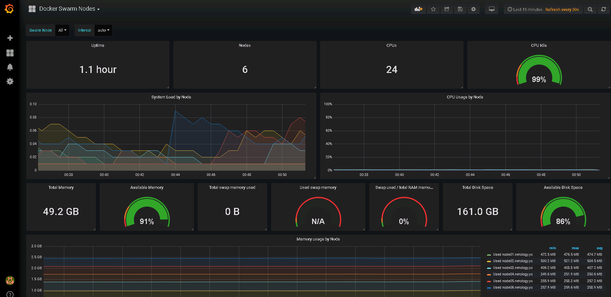

# Домашнее задание к занятию "5.5. Оркестрация кластером Docker контейнеров на примере Docker Swarm"

---
Все исходники по этому ДЗ выложены в папке src_dz_5.5

## Задача 1

Дайте письменые ответы на следующие вопросы:

- В чём отличие режимов работы сервисов в Docker Swarm кластере: replication и global?
- Какой алгоритм выбора лидера используется в Docker Swarm кластере?
- Что такое Overlay Network?

### Ответ
- В чём отличие режимов работы сервисов в Docker Swarm кластере: replication и global?

В случае режима replication, включённого для какого-либо сервиса, DS запустит указанное количество экземпларов (реплик) этого сервиса.

Для сервиса в режиме Global, в кластере DS будет запущены по одному экземпляру сервиса на каждой ноде DS (не важно, управляющая она или рабочая). 

- Какой алгоритм выбора лидера используется в Docker Swarm кластере?
Используется алгоритм распеределённого консенсуса Raft Consensus Algorithm.

- Что такое Overlay Network?
Если я правильно понял, Overlay сеть это сеть связывающая контейнеры (ну и сервисы, которые в них живут). Сеть строится поверх ip сети между docker-хостами. Это получается что-то типа L2 поверх L4 с помощью протокола vxlan (udp 4789) между хостами. 

## Задача 2

Создать ваш первый Docker Swarm кластер в Яндекс.Облаке

Для получения зачета, вам необходимо предоставить скриншот из терминала (консоли), с выводом команды:
```
docker node ls
```

### Ответ
Для выполнения этого развёртывания нам были предоставлены конфиги terraform и ansible. Как и в прошлом ДЗ, мы вписали  них свои данные, а именно:
в файле `variables.tf`
- id своего ЯО
- id папки в ЯО
- id образа OS для развёртывания
в файле `provider.tf`
- Ключ сервисного аккаунта ЯО

Обращаем внимание на то, что у нас теперь 6 файлов node01 - node06?, то есть будет создано 6 ВМ в ЯО. Также важно, что у нас в папке с terraform теперь  присутствуют файлы:
```
ansible.tf 
inventory.tf
ansible.cfg
```
в нашем сценарии в этот раз запуск ansible-playbook будет происходить прямо из плана terraform.

Познакомимся с содержимым папок, чтобы дальше было понятно что происходит.
```bash
user1@devopserubuntu:~$ tree
.
├── ansible
│       ├── inventory
│       ├── monitoring
│       │       ├── alertmanager
│       │       │       ├── conf
│       │       │       │       ├── alertmanager.yml
│       │       │       │       └── docker-entrypoint.sh
│       │       │       └── Dockerfile
│       │       ├── caddy
│       │       │       └── Caddyfile
│       │       ├── docker-compose.yml
│       │       ├── dockerd-exporter
│       │       │       └── Caddyfile
│       │       ├── grafana
│       │       │       ├── dashboards
│       │       │       │       ├── swarmprom-nodes-dash.json
│       │       │       │       ├── swarmprom-prometheus-dash.json
│       │       │       │       └── swarmprom-services-dash.json
│       │       │       ├── datasources
│       │       │       │       └── prometheus.yaml
│       │       │       ├── Dockerfile
│       │       │       └── swarmprom_dashboards.yml
│       │       ├── node-exporter
│       │       │       ├── conf
│       │       │       │       └── docker-entrypoint.sh
│       │       │       └── Dockerfile
│       │       └── prometheus
│       │           ├── conf
│       │           │       ├── docker-entrypoint.sh
│       │           │       ├── prometheus.yml
│       │           │       └── weave-cortex.yml
│       │           ├── Dockerfile
│       │           └── rules
│       │               ├── swarm_node.rules.yml
│       │               └── swarm_task.rules.yml
│       ├── roles
│       │       ├── configure-hosts-file
│       │       │       └── tasks
│       │       │           └── main.yml
│       │       ├── docker-installation
│       │       │       └── tasks
│       │       │           └── main.yml
│       │       ├── docker-swarm-add-manager
│       │       │       └── tasks
│       │       │           └── main.yml
│       │       ├── docker-swarm-add-worker
│       │       │       └── tasks
│       │       │           └── main.yml
│       │       ├── docker-swarm-init
│       │       │       └── tasks
│       │       │           └── main.yml
│       │       ├── docker-swarm-leave
│       │       │       └── tasks
│       │       │           └── main.yml
│       │       └── install-tools
│       │           └── tasks
│       │               └── main.yml
│       ├── swarm-deploy-cluster.yml
│       ├── swarm-deploy-stack.yml
│       └── swarm-deploy-sync.yml
├── terraform
│       ├── ansible.cfg
│       ├── ansible.tf
│       ├── inventory.tf
│       ├── network.tf
│       ├── node01.tf
│       ├── node02.tf
│       ├── node03.tf
│       ├── node04.tf
│       ├── node05.tf
│       ├── node06.tf
│       ├── output.tf
│       ├── provider.tf
│       ├── sa-akazand-key.json
│       ├── terraform.tfstate
│       └── variables.tf
├── terraform.tfstate
```

Выполняем инициализацию teraform
```bash
cd ~/terraform
user1@devopserubuntu:~/terraform$ terraform init

Initializing the backend...

Initializing provider plugins...
- Finding latest version of yandex-cloud/yandex...
- Finding latest version of hashicorp/null...
- Finding latest version of hashicorp/local...
- Installing yandex-cloud/yandex v0.70.0...
- Installed yandex-cloud/yandex v0.70.0 (self-signed, key ID E40F590B50BB8E40)
- Installing hashicorp/null v3.1.0...
- Installed hashicorp/null v3.1.0 (signed by HashiCorp)
- Installing hashicorp/local v2.1.0...
- Installed hashicorp/local v2.1.0 (signed by HashiCorp)

Partner and community providers are signed by their developers.
If you'd like to know more about provider signing, you can read about it here:
https://www.terraform.io/docs/cli/plugins/signing.html

Terraform has created a lock file .terraform.lock.hcl to record the provider
selections it made above. Include this file in your version control repository
so that Terraform can guarantee to make the same selections by default when
you run "terraform init" in the future.

Terraform has been successfully initialized!

You may now begin working with Terraform. Try running "terraform plan" to see
any changes that are required for your infrastructure. All Terraform commands
should now work.

If you ever set or change modules or backend configuration for Terraform,
rerun this command to reinitialize your working directory. If you forget, other
commands will detect it and remind you to do so if necessary.
```
Затем проверим конфигурацию
```bash
user1@devopserubuntu:~/terraform$ terraform validate
Success! The configuration is valid.
```
Теперь проверим план
```bash
user1@devopserubuntu:~/terraform$ terraform plan

Terraform used the selected providers to generate the following execution plan. Resource actions are indicated with the following symbols:
  + create

Terraform will perform the following actions:
..... очень много текста ....

Plan: 13 to add, 0 to change, 0 to destroy.

Changes to Outputs:
  + external_ip_address_node01 = (known after apply)
  + external_ip_address_node02 = (known after apply)
  + external_ip_address_node03 = (known after apply)
  + external_ip_address_node04 = (known after apply)
  + external_ip_address_node05 = (known after apply)
  + external_ip_address_node06 = (known after apply)
  + internal_ip_address_node01 = "192.168.101.11"
  + internal_ip_address_node02 = "192.168.101.12"
  + internal_ip_address_node03 = "192.168.101.13"
  + internal_ip_address_node04 = "192.168.101.14"
  + internal_ip_address_node05 = "192.168.101.15"
  + internal_ip_address_node06 = "192.168.101.16"
```
Теперь можно запустить применение этого сценария:
```bash
user1@devopserubuntu:~/terraform$ terraform apply

.... 

Apply complete! Resources: 13 added, 0 changed, 0 destroyed.

Outputs:

external_ip_address_node01 = "51.250.10.109"
external_ip_address_node02 = "51.250.1.189"
external_ip_address_node03 = "51.250.14.100"
external_ip_address_node04 = "51.250.4.3"
external_ip_address_node05 = "51.250.6.184"
external_ip_address_node06 = "51.250.4.12"
internal_ip_address_node01 = "192.168.101.11"
internal_ip_address_node02 = "192.168.101.12"
internal_ip_address_node03 = "192.168.101.13"
internal_ip_address_node04 = "192.168.101.14"
internal_ip_address_node05 = "192.168.101.15"
internal_ip_address_node06 = "192.168.101.16"
```

В результате:
- Будет выполнен весь сценарий в ходе которого создаются 6 ВМ, виртуальная сеть и подсеть. 
- Затем с помощью ansible на них доустанавливаются нужные пакеты, и копируются папки с настройками сервисов, которые должны запускаться в контейнерах.
- создаётся кластер DS с назначением управляющих и рабочих нод.
- Затем запускаются все контейнеры в соответствии с режимами. Какие-то контейнеры на каждой ноде, какие-то только на одной.


Посмотрм, что у нас творится в ЯО:
```bash
user1@devopserubuntu:~$ yc compute instance list
+----------------------+--------+---------------+---------+---------------+----------------+
|          ID          |  NAME  |    ZONE ID    | STATUS  |  EXTERNAL IP  |  INTERNAL IP   |
+----------------------+--------+---------------+---------+---------------+----------------+
| fhm35ad9mkolru9p8krr | node06 | ru-central1-a | RUNNING | 51.250.4.12   | 192.168.101.16 |
| fhme1s8jgncon441pv62 | node03 | ru-central1-a | RUNNING | 51.250.14.100 | 192.168.101.13 |
| fhmfrcsjrpulnpu8471u | node05 | ru-central1-a | RUNNING | 51.250.6.184  | 192.168.101.15 |
| fhmjsi6hpbgj0tocunrj | node01 | ru-central1-a | RUNNING | 51.250.10.109 | 192.168.101.11 |
| fhmrr46v4ok4aer67ld3 | node04 | ru-central1-a | RUNNING | 51.250.4.3    | 192.168.101.14 |
| fhmuvtnhh4n2c5h3c9ls | node02 | ru-central1-a | RUNNING | 51.250.1.189  | 192.168.101.12 |
+----------------------+--------+---------------+---------+---------------+----------------+
```
Видим, что все 6 ВМ создались и запустились.

Попробуем подключиться к node01 и посмотреть что у нас получилось:
```bash
user1@devopserubuntu:~$ ssh centos@51.250.10.109
[centos@node01 ~]$ sudo -i
[root@node01 ~]# docker node ls
ID                            HOSTNAME             STATUS    AVAILABILITY   MANAGER STATUS   ENGINE VERSION
5zdw2jzslba7yhyosf451bvps *   node01.netology.yc   Ready     Active         Reachable        20.10.12
jzp72zbitwhpd01sdyduskp7w     node02.netology.yc   Ready     Active         Reachable        20.10.12
l5lead65tnhot26k5wpe8d5xf     node03.netology.yc   Ready     Active         Leader           20.10.12
f2ls30xdwf33fhryaajrf4hyb     node04.netology.yc   Ready     Active                          20.10.12
iqn76iq3oz8fj81agfcqy0nhc     node05.netology.yc   Ready     Active                          20.10.12
s3w74jqtretqshs2ss1yd81fh     node06.netology.yc   Ready     Active                          20.10.12
```
Тут мы видим, что на всех 6 ВМ запущен docker. Собран кластер Docker swarm. 3 докер-хоста в режиме manager, из которых ,node03 является лидером, а остальные 3 с ролью worker. 

## Задача 3

Создать ваш первый, готовый к боевой эксплуатации кластер мониторинга, состоящий из стека микросервисов.

Для получения зачета, вам необходимо предоставить скриншот из терминала (консоли), с выводом команды:
```
docker service ls
```
### Ответ
Судя по всему это задание сделалось автоматически.
```bash
[root@node01 ~]# docker service ls
ID             NAME                                MODE         REPLICAS   IMAGE                                          PORTS
qxnbm0irj87g   swarm_monitoring_alertmanager       replicated   1/1        stefanprodan/swarmprom-alertmanager:v0.14.0
7270owzkwomz   swarm_monitoring_caddy              replicated   1/1        stefanprodan/caddy:latest                      *:3000->3000/tcp, *:9090->9090/tcp, *:9093-9094->9093-9094/tcp
23furilyv72b   swarm_monitoring_cadvisor           global       6/6        google/cadvisor:latest
11jz16294th9   swarm_monitoring_dockerd-exporter   global       6/6        stefanprodan/caddy:latest
t08k46bsdnmc   swarm_monitoring_grafana            replicated   1/1        stefanprodan/swarmprom-grafana:5.3.4
1ask8mls7013   swarm_monitoring_node-exporter      global       6/6        stefanprodan/swarmprom-node-exporter:v0.16.0
votrbmx8zz9m   swarm_monitoring_prometheus         replicated   1/1        stefanprodan/swarmprom-prometheus:v2.5.0
pzbecmg41biy   swarm_monitoring_unsee              replicated   1/1        cloudflare/unsee:v0.8.0
```
Как мы видим некоторые сервисы запустились в режиме global, то есть по одному экземпляру (реплике) на каждом докер-хосте. А некоторые в режиме Replicated, но при этом только в 1 экзепляре.


Попробуем открыть мониторинг и посмотреть что там видно. Благодаря особенностям overlay сети мы можем открыть 3000 порт , который слушает Caddy И пробрасывает на сервис grafana , обратившись к внешнему публичном ip-адресу любого из докер-хостов.




## Задача 4 (*)

Выполнить на лидере Docker Swarm кластера команду (указанную ниже) и дать письменное описание её функционала, что она делает и зачем она нужна:
```
# см.документацию: https://docs.docker.com/engine/swarm/swarm_manager_locking/
docker swarm update --autolock=true
```

### Ответ
Команда `docker swarm update --autolock=true` включает механизм шифрования RAFT-журналов на managed-нодах кластера DS. Это делается в целях безопасности, чтобы злоумышленник не смог вмешаться в работу кластера DS. 
```bash
[root@node01 ~]# docker swarm update --autolock=true
Swarm updated.
To unlock a swarm manager after it restarts, run the `docker swarm unlock`
command and provide the following key:

    SWMKEY-1-cKTDLbNqi+qv8NQZRG4YEWp8TYCKArvOa33jPX1ejuA

Please remember to store this key in a password manager, since without it you
will not be able to restart the manager.
```
нам сообщается ключ, с помощью которого будет возможно запустить кластер DS с зашифрованными журналами.
Попробуем перезапустить службу докера на этой node01:
```bash
[root@node01 ~]# service docker restart
Redirecting to /bin/systemctl restart docker.service
[root@node01 ~]#
[root@node01 ~]#
[root@node01 ~]# docker node ls
Error response from daemon: Swarm is encrypted and needs to be unlocked before it can be used. Please use "docker swarm unlock" to unlock it.
```
Видим, что нам не удаётся даже посмотреть список нод кластера.
А если посмотреть с другой ноды, то видно, что на первой ноде докер не работает:
```bash
[root@node02 ~]# docker node ls
ID                            HOSTNAME             STATUS    AVAILABILITY   MANAGER STATUS   ENGINE VERSION
5zdw2jzslba7yhyosf451bvps     node01.netology.yc   Down      Active         Unreachable      20.10.12
jzp72zbitwhpd01sdyduskp7w *   node02.netology.yc   Ready     Active         Reachable        20.10.12
l5lead65tnhot26k5wpe8d5xf     node03.netology.yc   Ready     Active         Leader           20.10.12
f2ls30xdwf33fhryaajrf4hyb     node04.netology.yc   Ready     Active                          20.10.12
iqn76iq3oz8fj81agfcqy0nhc     node05.netology.yc   Ready     Active                          20.10.12
s3w74jqtretqshs2ss1yd81fh     node06.netology.yc   Ready     Active                          20.10.12
```
Видим, что так как мы не сделали раскрытие докера на первой ноде, она как-бы не работает.

Интересно, а если я перезапущу на второй:
```bash
[root@node02 ~]# service docker restart
Redirecting to /bin/systemctl restart docker.service
[root@node02 ~]# docker node ls
Error response from daemon: Swarm is encrypted and needs to be unlocked before it can be used. Please use "docker swarm unlock" to unlock it.
[root@node02 ~]#
```
Видим, что и на второй ноде теперь не рабоает докер.
До того, как мы это сделали, с третьей ноды мы видели, что не работает только первая нода
```bash
[root@node03 ~]# docker node ls
ID                            HOSTNAME             STATUS    AVAILABILITY   MANAGER STATUS   ENGINE VERSION
5zdw2jzslba7yhyosf451bvps     node01.netology.yc   Down      Active         Unreachable      20.10.12
jzp72zbitwhpd01sdyduskp7w     node02.netology.yc   Ready     Active         Unreachable      20.10.12
l5lead65tnhot26k5wpe8d5xf *   node03.netology.yc   Ready     Active         Leader           20.10.12
f2ls30xdwf33fhryaajrf4hyb     node04.netology.yc   Ready     Active                          20.10.12
iqn76iq3oz8fj81agfcqy0nhc     node05.netology.yc   Ready     Active                          20.10.12
s3w74jqtretqshs2ss1yd81fh     node06.netology.yc   Ready     Active                          20.10.12
```
А после перезапуска (без раскрытия) докера на втрой ноде мы вообще получаем это:
```bash
[root@node03 ~]# docker node ls
Error response from daemon: rpc error: code = Unknown desc = The swarm does not have a leader. Its possible that too few managers are online. Make sure more than half of the managers are online.
```
Это нам говорит, что и на второй ноде докер не работает. То есть настрока запирания докера введённая на первой ноде будет действовать на весь кластер. Теперь у нас в кластере теперь нехватает managed нод. И команда не работает.
Попробуем разлочить докер на первой ноде:
```bash
[root@node01 ~]# docker swarm unlock
Please enter unlock key:
[root@node01 ~]#
```
Теперь и на третьей ноде в докер показывает состав кластера:
```bash
[root@node03 ~]# docker node ls
ID                            HOSTNAME             STATUS    AVAILABILITY   MANAGER STATUS   ENGINE VERSION
5zdw2jzslba7yhyosf451bvps     node01.netology.yc   Ready     Active         Reachable        20.10.12
jzp72zbitwhpd01sdyduskp7w     node02.netology.yc   Down      Active         Unreachable      20.10.12
l5lead65tnhot26k5wpe8d5xf *   node03.netology.yc   Ready     Active         Leader           20.10.12
f2ls30xdwf33fhryaajrf4hyb     node04.netology.yc   Ready     Active                          20.10.12
iqn76iq3oz8fj81agfcqy0nhc     node05.netology.yc   Ready     Active                          20.10.12
s3w74jqtretqshs2ss1yd81fh     node06.netology.yc   Ready     Active                          20.10.12
```
а после разлочки докера на второй ноде, состав кластера полностью восстанавливается.
```bash
[root@node03 ~]# docker node ls
ID                            HOSTNAME             STATUS    AVAILABILITY   MANAGER STATUS   ENGINE VERSION
5zdw2jzslba7yhyosf451bvps     node01.netology.yc   Ready     Active         Reachable        20.10.12
jzp72zbitwhpd01sdyduskp7w     node02.netology.yc   Ready     Active         Reachable        20.10.12
l5lead65tnhot26k5wpe8d5xf *   node03.netology.yc   Ready     Active         Leader           20.10.12
f2ls30xdwf33fhryaajrf4hyb     node04.netology.yc   Ready     Active                          20.10.12
iqn76iq3oz8fj81agfcqy0nhc     node05.netology.yc   Ready     Active                          20.10.12
s3w74jqtretqshs2ss1yd81fh     node06.netology.yc   Ready     Active                          20.10.12
```
Теперь отключим режим запирания. Сделаем это на ноде 3.
```bash
[root@node03 ~]# docker swarm update --autolock=false
Swarm updated.
```
Защита отключена. теперь перезапуск докера на первой ноде не привёл к его отключению от кластера.
