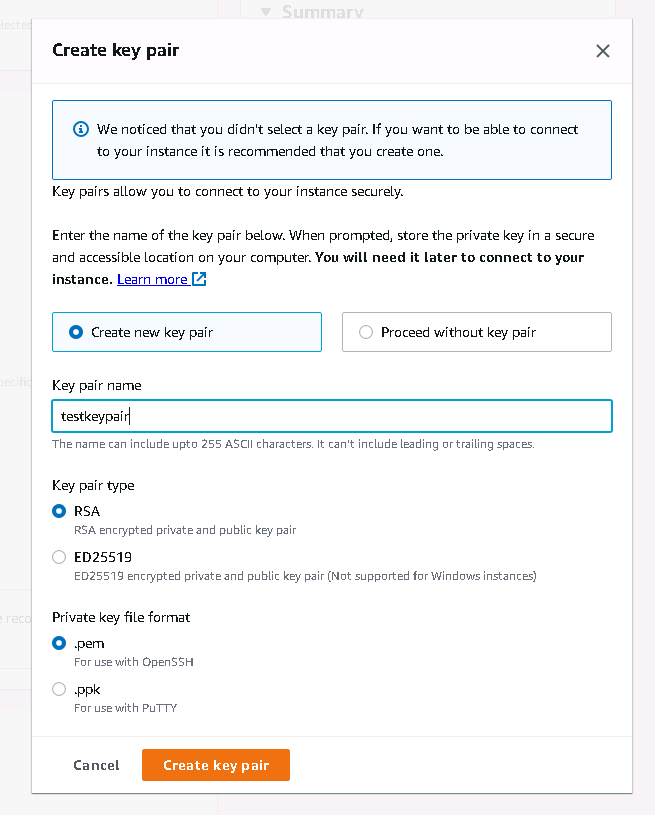
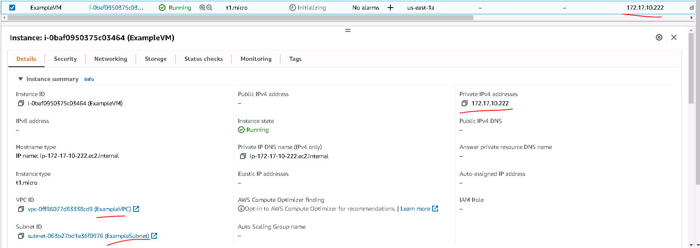

# Домашнее задание к занятию "7.2. Облачные провайдеры и синтаксис Terraform."

Зачастую разбираться в новых инструментах гораздо интересней понимая то, как они работают изнутри. 
Поэтому в рамках первого *необязательного* задания предлагается завести свою учетную запись в AWS (Amazon Web Services) или Yandex.Cloud.
Идеально будет познакомится с обоими облаками, потому что они отличаются. 

## Задача 1 (вариант с AWS). Регистрация в aws и знакомство с основами (необязательно, но крайне желательно).

Остальные задания можно будет выполнять и без этого аккаунта, но с ним можно будет увидеть полный цикл процессов. 

AWS предоставляет достаточно много бесплатных ресурсов в первый год после регистрации, подробно описано [здесь](https://aws.amazon.com/free/).
1. Создайте аккаут aws.
1. Установите c aws-cli https://aws.amazon.com/cli/.
1. Выполните первичную настройку aws-sli https://docs.aws.amazon.com/cli/latest/userguide/cli-configure-quickstart.html.
1. Создайте IAM политику для терраформа c правами
    * AmazonEC2FullAccess
    * AmazonS3FullAccess
    * AmazonDynamoDBFullAccess
    * AmazonRDSFullAccess
    * CloudWatchFullAccess
    * IAMFullAccess
1. Добавьте переменные окружения 
    ```
    export AWS_ACCESS_KEY_ID=(your access key id)
    export AWS_SECRET_ACCESS_KEY=(your secret access key)
    ```
1. Создайте, остановите и удалите ec2 инстанс (любой с пометкой `free tier`) через веб интерфейс. 

В виде результата задания приложите вывод команды `aws configure list`.

## Задача 2. Создание aws ec2 через терраформ. 

1. В каталоге `terraform` вашего основного репозитория, который был создан в начале курсе, создайте файл `main.tf` и `versions.tf`.
2. Зарегистрируйте провайдер 
   1. для [aws](https://registry.terraform.io/providers/hashicorp/aws/latest/docs). В файл `main.tf` добавьте
   блок `provider`, а в `versions.tf` блок `terraform` с вложенным блоком `required_providers`. Укажите любой выбранный вами регион 
   внутри блока `provider`.
   2. либо для [yandex.cloud](https://registry.terraform.io/providers/yandex-cloud/yandex/latest/docs). Подробную инструкцию можно найти 
   [здесь](https://cloud.yandex.ru/docs/solutions/infrastructure-management/terraform-quickstart).
3. Внимание! В гит репозиторий нельзя пушить ваши личные ключи доступа к аккаунту. Поэтому в предыдущем задании мы указывали
их в виде переменных окружения. 
4. В файле `main.tf` воспользуйтесь блоком `data "aws_ami` для поиска ami образа последнего Ubuntu.  
5. В файле `main.tf` создайте рессурс 
   1. либо [ec2 instance](https://registry.terraform.io/providers/hashicorp/aws/latest/docs/resources/instance).
   Постарайтесь указать как можно больше параметров для его определения. Минимальный набор параметров указан в первом блоке 
   `Example Usage`, но желательно, указать большее количество параметров.
   2. либо [yandex_compute_image](https://registry.terraform.io/providers/yandex-cloud/yandex/latest/docs/resources/compute_image).
6. Также в случае использования aws:
   1. Добавьте data-блоки `aws_caller_identity` и `aws_region`.
   2. В файл `outputs.tf` поместить блоки `output` с данными об используемых в данный момент: 
       * AWS account ID,
       * AWS user ID,
       * AWS регион, который используется в данный момент, 
       * Приватный IP ec2 инстансы,
       * Идентификатор подсети в которой создан инстанс.  
7. Если вы выполнили первый пункт, то добейтесь того, что бы команда `terraform plan` выполнялась без ошибок. 


В качестве результата задания предоставьте:
1. Ответ на вопрос: при помощи какого инструмента (из разобранных на прошлом занятии) можно создать свой образ ami?
1. Ссылку на репозиторий с исходной конфигурацией терраформа.  
 
---
## Выполнение

## Задача 1 (вариант с AWS). 
1. Создайте аккаут aws.
Сделано. Аккаунт зарегистрирован. Портал https://console.aws.amazon.com/console открывается

2. Установите c aws-cli https://aws.amazon.com/cli/
Для этого сначала устанавливаем Python3-pip, а затем уже утилиту:
```bash
user1@devopserubuntu:~$ sudo apt install python3-pip
....
user1@devopserubuntu:~$ sudo pip install awscli
Collecting awscli
  Downloading awscli-1.24.6-py3-none-any.whl (3.9 MB)
     |████████████████████████████████| 3.9 MB 1.1 MB/s
Collecting docutils<0.17,>=0.10
  Downloading docutils-0.16-py2.py3-none-any.whl (548 kB)
     |████████████████████████████████| 548 kB 16.9 MB/s
Requirement already satisfied: colorama<0.4.5,>=0.2.5 in /usr/lib/python3/dist-packages (from awscli) (0.4.4)
Collecting s3transfer<0.6.0,>=0.5.0
  Downloading s3transfer-0.5.2-py3-none-any.whl (79 kB)
     |████████████████████████████████| 79 kB 8.3 MB/s
Requirement already satisfied: PyYAML<5.5,>=3.10 in /usr/lib/python3/dist-packages (from awscli) (5.3.1)
Collecting botocore==1.26.6
  Downloading botocore-1.26.6-py3-none-any.whl (8.8 MB)
     |████████████████████████████████| 8.8 MB 5.0 MB/s
Collecting rsa<4.8,>=3.1.2
  Downloading rsa-4.7.2-py3-none-any.whl (34 kB)
Requirement already satisfied: urllib3<1.27,>=1.25.4 in /usr/lib/python3/dist-packages (from botocore==1.26.6->awscli) (1.26.5)
Requirement already satisfied: jmespath<2.0.0,>=0.7.1 in /usr/lib/python3/dist-packages (from botocore==1.26.6->awscli) (0.10.0)
Collecting python-dateutil<3.0.0,>=2.1
  Downloading python_dateutil-2.8.2-py2.py3-none-any.whl (247 kB)
     |████████████████████████████████| 247 kB 7.5 MB/s
Requirement already satisfied: six>=1.5 in /usr/lib/python3/dist-packages (from python-dateutil<3.0.0,>=2.1->botocore==1.26.6->awscli) (1.16.0)
Requirement already satisfied: pyasn1>=0.1.3 in /usr/lib/python3/dist-packages (from rsa<4.8,>=3.1.2->awscli) (0.4.8)
Installing collected packages: python-dateutil, botocore, s3transfer, rsa, docutils, awscli
Successfully installed awscli-1.24.6 botocore-1.26.6 docutils-0.16 python-dateutil-2.8.2 rsa-4.7.2 s3transfer-0.5.2
```
3. Выполните первичную настройку aws-sli https://docs.aws.amazon.com/cli/latest/userguide/cli-configure-quickstart.html.
Перейдя по ссылке мы узнаём, что для работы `aws configure` требуются следующие вещи:
- Access key ID
- Secret access key
- AWS Region
- Output format

Их надо настроить.
Создаём ключ доступа. Переходим https://console.aws.amazon.com/iam/
Создаём пользователя 'DevOps_console_user'. Потом заходим в его настройки и создаём ключ доступа.
```bash
Access key ID
AKIAVSF_______ILJKFLP

Secret access key
azkh2QQYh1________RFb5kQunLMWfpMIT9j7ZGs
```
Находим, какой регион присвоен аккаунту: `us-east-1`
Output format будем указывать `json`.

6. Создайте IAM политику для терраформа c правами
    * AmazonEC2FullAccess
    * AmazonS3FullAccess
    * AmazonDynamoDBFullAccess
    * AmazonRDSFullAccess
    * CloudWatchFullAccess
    * IAMFullAccess

Не вполне согласен с формулировкой пункта. Но в свойствах юзера идём в раздел Permissions И добавляем права из списка.
А, теперь понятно. Можно было отдельно сдалать политику и видимо потом назначить её юзеру, но это думаю, одно и то же.

7. Добавьте переменные окружения 
    ```
    export AWS_ACCESS_KEY_ID=(your access key id)
    export AWS_SECRET_ACCESS_KEY=(your secret access key)
    ```
```bash
user1@devopserubuntu:~$ export export AWS_ACCESS_KEY_ID=AKIAVS_______ILJKFLP
user1@devopserubuntu:~$ export AWS_SECRET_ACCESS_KEY=azkh2QQY__________FRFb5kQunLMWfpMIT9j7ZGs

user1@devopserubuntu:~$ env | grep AWS
AWS_SECRET_ACCESS_KEY=azkh2QQYh1________5kQunLMWfpMIT9j7ZGs
AWS_ACCESS_KEY_ID=AKIA____________XGILJKFLP
```
Пробуем воспользоваться CLI. Как и ожидалось утилита запросила данные:
```bash
user1@devopserubuntu:~$ aws configure
AWS Access Key ID [None]: azkh2QQYh1_________WfpMIT9j7ZGs
AWS Secret Access Key [None]: AKI_________KFLP
Default region name [None]: us-east-1
Default output format [None]: json
```


8. Создайте, остановите и удалите ec2 инстанс (любой с пометкой `free tier`) через веб интерфейс. 
Переходим в раздел EC2-Instances-Launch an instance . Пробуем создать ВМ.


при попытке закуска AWS предложил создать пару ключей:

Затем ВМ запустилась.


Попробуем вывести список ВМ в AWS:
Единственная команда выдала хоть что-то:
```bash
user1@devopserubuntu:~$ aws ec2 describe-instances
{
    "Reservations": [
        {
            "Groups": [],
            "Instances": [
                {
                    "AmiLaunchIndex": 0,
                    "ImageId": "ami-09d56f8956ab235b3",
                    "InstanceId": "i-07ed75e76b0e13466",
                    "InstanceType": "t2.micro",
                    "KeyName": "testkeypair",
                    "LaunchTime": "2022-05-24T15:04:36.000Z",
дальше много букв
```
В виде результата задания приложите вывод команды `aws configure list`.
```bash
user1@devopserubuntu:~$ aws configure list
      Name                    Value             Type    Location
      ----                    -----             ----    --------
   profile                <not set>             None    None
access_key     ****************KFLP              env
secret_key     ****************7ZGs              env
    region                us-east-1      config-file    ~/.aws/config
```

Итак, что же мы получили запустив тестовую ВМ Ubuntu.
Попробуем подключиться к ней с нашей Ubuntu, используя полученный файл ключа:
```bash
user1@devopserubuntu:~$ sudo ssh -i testkeypair.pem ubuntu@54.205.148.35
[sudo] password for user1:
The authenticity of host 54.205.148.35 (54.205.148.35) cant be established.
ECDSA key fingerprint is SHA256:LoRA06vfLlUlbomHL517E3k8vOY1n51SCnmxNAtB+8U.
Are you sure you want to continue connecting (yes/no/[fingerprint])? yes
Warning: Permanently added '54.205.148.35' (ECDSA) to the list of known hosts.
Welcome to Ubuntu 22.04 LTS (GNU/Linux 5.15.0-1004-aws x86_64)
...
ubuntu@ip-172-31-90-176:~$ ip addr
1: lo: <LOOPBACK,UP,LOWER_UP> mtu 65536 qdisc noqueue state UNKNOWN group default qlen 1000
    link/loopback 00:00:00:00:00:00 brd 00:00:00:00:00:00
    inet 127.0.0.1/8 scope host lo
       valid_lft forever preferred_lft forever
    inet6 ::1/128 scope host
       valid_lft forever preferred_lft forever
2: eth0: <BROADCAST,MULTICAST,UP,LOWER_UP> mtu 9001 qdisc fq_codel state UP group default qlen 1000
    link/ether 12:9a:79:13:7d:c1 brd ff:ff:ff:ff:ff:ff
    inet 172.31.90.176/20 metric 100 brd 172.31.95.255 scope global dynamic eth0
       valid_lft 2150sec preferred_lft 2150sec
    inet6 fe80::109a:79ff:fe13:7dc1/64 scope link
       valid_lft forever preferred_lft forever
```
Помним, что для разных ОС aws создаёт разных юзеров для которых выгружает ключ:
-Ubuntu: ubuntu
-Amazon Linux: ec2-user
-Centos: root
А для подключения используется команда:
```bash
 ssh -i file.pem username@ip-address
```

## Задача 2. Создание aws ec2 через терраформ. 

1. В каталоге `terraform` вашего основного репозитория, который был создан в начале курсе, создайте файл `main.tf` и `versions.tf`.
2. Зарегистрируйте провайдер 
   1. для [aws](https://registry.terraform.io/providers/hashicorp/aws/latest/docs). В файл `main.tf` добавьте
   блок `provider`, а в `versions.tf` блок `terraform` с вложенным блоком `required_providers`. Укажите любой выбранный вами регион 
   внутри блока `provider`.
   2. либо для [yandex.cloud](https://registry.terraform.io/providers/yandex-cloud/yandex/latest/docs). Подробную инструкцию можно найти 
   [здесь](https://cloud.yandex.ru/docs/solutions/infrastructure-management/terraform-quickstart).
3. Внимание! В гит репозиторий нельзя пушить ваши личные ключи доступа к аккаунту. Поэтому в предыдущем задании мы указывали
их в виде переменных окружения. 
4. В файле `main.tf` воспользуйтесь блоком `data "aws_ami` для поиска ami образа последнего Ubuntu.  
5. В файле `main.tf` создайте рессурс 
   1. либо [ec2 instance](https://registry.terraform.io/providers/hashicorp/aws/latest/docs/resources/instance).
   Постарайтесь указать как можно больше параметров для его определения. Минимальный набор параметров указан в первом блоке 
   `Example Usage`, но желательно, указать большее количество параметров.
   2. либо [yandex_compute_image](https://registry.terraform.io/providers/yandex-cloud/yandex/latest/docs/resources/compute_image).
6. Также в случае использования aws:
   1. Добавьте data-блоки `aws_caller_identity` и `aws_region`.
   2. В файл `outputs.tf` поместить блоки `output` с данными об используемых в данный момент: 
       * AWS account ID,
       * AWS user ID,
       * AWS регион, который используется в данный момент, 
       * Приватный IP ec2 инстансы,
       * Идентификатор подсети в которой создан инстанс.  
7. Если вы выполнили первый пункт, то добейтесь того, что бы команда `terraform plan` выполнялась без ошибок. 


В качестве результата задания предоставьте:
1. Ответ на вопрос: при помощи какого инструмента (из разобранных на прошлом занятии) можно создать свой образ ami?
1. Ссылку на репозиторий с исходной конфигурацией терраформа.  

## Выполнение

1. В каталоге `terraform` вашего основного репозитория, который был создан в начале курсе, создайте файл `main.tf` и `versions.tf`.
```bash
user1@devopserubuntu:~$ mkdir terraform
user1@devopserubuntu:~$ cd terraform/
user1@devopserubuntu:~/terraform$ touch main.tf
user1@devopserubuntu:~/terraform$ touch versions.tf
```
2. Зарегистрируйте провайдер 
   для [aws](https://registry.terraform.io/providers/hashicorp/aws/latest/docs). В файл `main.tf` добавьте
   блок `provider`, а в `versions.tf` блок `terraform` с вложенным блоком `required_providers`. Укажите любой выбранный вами регион 
   внутри блока `provider`.
Сделано.
```bash
user1@devopserubuntu:~/terraform$ cat main.tf
# Configure the AWS Provider
provider "aws" {
  region = "us-east-1"
}

user1@devopserubuntu:~/terraform$ cat versions.tf
terraform {
  required_providers {
    aws = {
      source  = "hashicorp/aws"
      version = "~> 3.0"
    }
  }
} 
```

Для пробы попробовал инициализировать terraform:
```bash
user1@devopserubuntu:~$ cd terraform/
user1@devopserubuntu:~/terraform$ terraform init

Initializing the backend...

Initializing provider plugins...
- Finding hashicorp/aws versions matching "~> 3.0"...
- Installing hashicorp/aws v3.75.2...
- Installed hashicorp/aws v3.75.2 (signed by HashiCorp)

Terraform has created a lock file .terraform.lock.hcl to record the provider
selections it made above. Include this file in your version control repository
so that Terraform can guarantee to make the same selections by default when
you run "terraform init" in the future.

Terraform has been successfully initialized!

You may now begin working with Terraform. Try running "terraform plan" to see
any changes that are required for your infrastructure. All Terraform commands
should now work.

If you ever set or change modules or backend configuration for Terraform,
rerun this command to reinitialize your working directory. If you forget, other
commands will detect it and remind you to do so if necessary.
user1@devopserubuntu:~/terraform$
```
Ошибок нет.
Теперь попробуем сделать самую простую вещь - поднять ВМ без всяких наворотов, просто, что бы убедиться, что она создаётся и запускается.
```bash
user1@devopserubuntu:~/terraform$ cat main.tf
# Configure the AWS Provider
provider "aws" {
  region = "us-east-1"
}

resource "aws_instance" "first-vm-from-terraform" {
  ami           = "ami-09d56f8956ab235b3"
  instance_type = "t1.micro"

  tags = {
    Name = "ExampleVM"
  }
}
```
Выполняем
```bash
terraform plan
terraform apply
```
Вм создалась и запустилась. Там даже создался какой-то сетевой интерфейс и ему даже дали адрес.

Но тут мы использовали предопределённый образ Ubuntu. Вот он задан ` ami = "ami-09d56f8956ab235b3"`, а в задании ниже просят найти последний.
Не забываем удалять ВМ:
```bash
terraform destroy
```

3. Внимание! В гит репозиторий нельзя пушить ваши личные ключи доступа к аккаунту. Поэтому в предыдущем задании мы указывали
их в виде переменных окружения. 
4. В файле `main.tf` воспользуйтесь блоком `data "aws_ami` для поиска ami образа последнего Ubuntu.  
5. В файле `main.tf` создайте рессурс 
   [ec2 instance](https://registry.terraform.io/providers/hashicorp/aws/latest/docs/resources/instance).
   Постарайтесь указать как можно больше параметров для его определения. Минимальный набор параметров указан в первом блоке 
   `Example Usage`, но желательно, указать большее количество параметров.
6. Также в случае использования aws:
   1. Добавьте data-блоки `aws_caller_identity` и `aws_region`.
   2. В файл `outputs.tf` поместить блоки `output` с данными об используемых в данный момент: 
       * AWS account ID,
       * AWS user ID,
       * AWS регион, который используется в данный момент, 
       * Приватный IP ec2 инстансы,
       * Идентификатор подсети в которой создан инстанс.  
7. Если вы выполнили первый пункт, то добейтесь того, что бы команда `terraform plan` выполнялась без ошибок. 

Выполняем пункты с 3 по 7.
В файле `main.tf` используем такую конструкцию:
```bash
user1@devopserubuntu:~/terraform$ cat main.tf
# Настраиваем AWS Provider
provider "aws" {
  region = "us-east-1"
}

# Ищем свежайший образ Ubuntu server
data "aws_ami" "ubuntu" {
  most_recent = true

  filter {
    name   = "name"
    values = ["ubuntu/images/hvm-ssd/ubuntu-focal-20.04-amd64-server-*"]
  }

  filter {
    name   = "virtualization-type"
    values = ["hvm"]
  }

  owners = ["099720109477"] # Canonical
}

# Создаём блок адресации
resource "aws_vpc" "my_vpc" {
  cidr_block = "172.17.0.0/16"

  tags = {
    Name = "ExampleVPC"
  }
}

# Создаём подсеть
resource "aws_subnet" "my_subnet" {
  vpc_id            = aws_vpc.my_vpc.id
  cidr_block        = "172.17.10.0/24"
  availability_zone = "us-east-1a"

  tags = {
    Name = "ExampleSubnet"
  }
}

# Создаём сетевой интерфейс с ip-адресом
resource "aws_network_interface" "my_interface" {
  subnet_id   = aws_subnet.my_subnet.id
  private_ips = ["172.17.10.222"]

  tags = {
    Name = "Example_network_interface"
  }
}


# Описываем создаваемую ВМ
resource "aws_instance" "first-vm-from-terraform" {

# Для создания ВМ указываем найденный нами образ, точнее его id
  ami           = data.aws_ami.ubuntu.id

  instance_type = "t1.micro"

# При описании ВМ указываем свой, созданный сетевой интерфейс
  network_interface {
    network_interface_id = aws_network_interface.my_interface.id
    device_index         = 0
  }


  tags = {
    Name = "ExampleVM"
  }
}
```
В разделе `data "aws_ami" "ubuntu" ` мы находим последний образ Ubuntu-server при помощи  фильтров, а затем 
в разделе `resource` мы указываем образ из которого разворачивать ВМ мы укажем id найденного образа.
Попробовал, действительно получилось. Образ выбрался совсем свежий с датой создания позавчера.
Если при предыдущих экспериментах у нас внутренняя адресация ВМ назначалась автоматически, то теперь мы саим назначили внутреннюю подсеть и адрес.

Получилось, правда теперь внешний паблик адрес ВМ не получила, но это было ожидаемо, так как мы сами взялись настраивать сеть.


Я пытался изменить количество vCPU у создаваемой ВМ, но AWS не дал мне это сделать, сказав, что для ВМ типа `t1.micro` не может быть больше 1 процессора.

Для вывода данных о создаваемой ВМ и параметрах аккаунта AWS файл `output.tf` был сделан так:
```bash
user1@devopserubuntu:~/terraform$ cat output.tf

# Получаем данные Региона AWS
data "aws_region" "current" {}

# Выводим регион
output "region" {
  value = data.aws_region.current.id
}

# Получаем данные под которыми Terraform работает с AWS
data "aws_caller_identity" "current" {}

# Выводим номер аккаунта
output "account_id" {
  value = data.aws_caller_identity.current.account_id
}

# Выводим пользователя
output "caller_user" {
  value = data.aws_caller_identity.current.user_id
}

# Выводим ID ВМ
output "instance_id" {
  description = "ID of the EC2 instance"
  value       = aws_instance.first-vm-from-terraform.id
}


output "instance_subnet" {
#  description = "Subnet of the EC2 instance"
  value       = aws_instance.first-vm-from-terraform.subnet_id
}

output "instance_local_ip" {
  description = "Local IP address of the EC2 instance"
  value       = aws_instance.first-vm-from-terraform.private_ip
}

output "instance_public_ip" {
  description = "Public IP address of the EC2 instance"
  value       = aws_instance.first-vm-from-terraform.public_ip
}
```
В результате после запуска `terraform apply` Мы в конце получаем вывод:
```bash
Outputs:

account_id = "382622941230"
caller_user = "AIDAVSFQ2YAXP2YAMAMKC"
instance_id = "i-0102b74640fcff7c4"
instance_local_ip = "172.17.10.222"
instance_public_ip = ""
instance_subnet = "subnet-02e521d26bdba4686"
region = "us-east-1"
```

В качестве результата задания предоставьте:
1. Ответ на вопрос: при помощи какого инструмента (из разобранных на прошлом занятии) можно создать свой образ ami?
Ответ: Для создания образов можно использовать инструмент Packer.
2. Все файлы для развёртывания ВМ сохранены тут https://github.com/Alexander-Kazandzhiyan/devops-netology/tree/main/src_dz_7.2


---