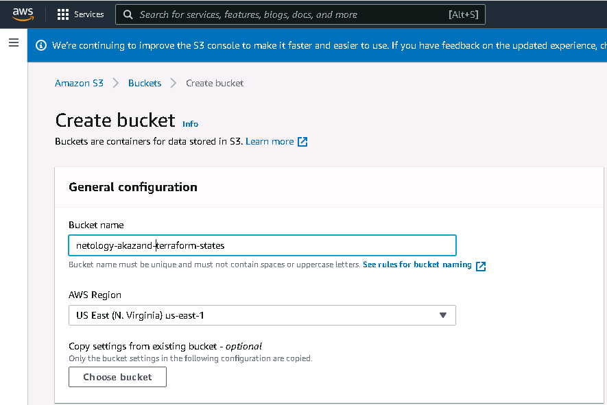
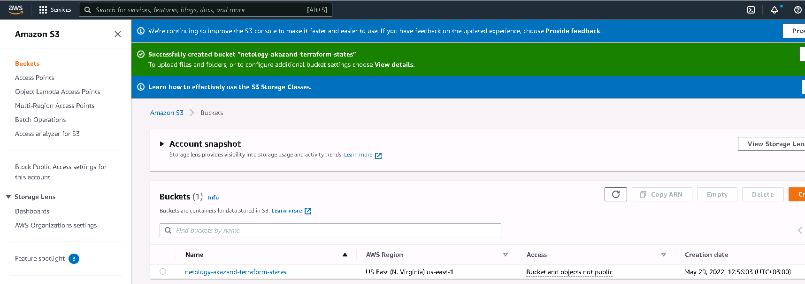
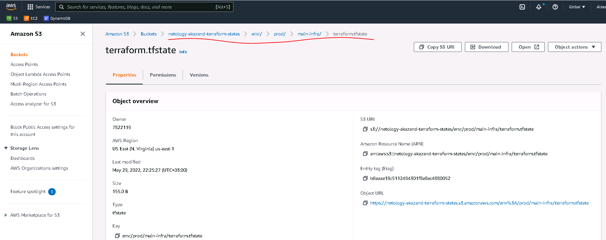
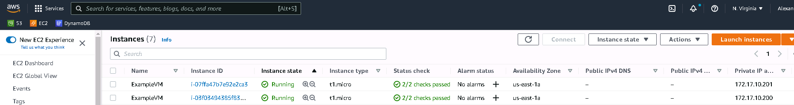
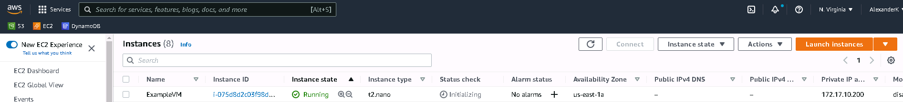
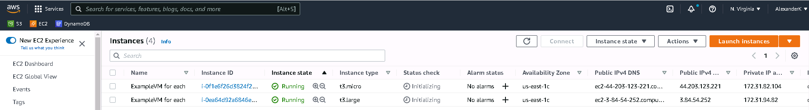

# Домашнее задание к занятию "7.3. Основы и принцип работы Терраформ"

## Задача 1. Создадим бэкэнд в S3 (необязательно, но крайне желательно).

Если в рамках предыдущего задания у вас уже есть аккаунт AWS, то давайте продолжим знакомство со взаимодействием
терраформа и aws. 

1. Создайте s3 бакет, iam роль и пользователя от которого будет работать терраформ. Можно создать отдельного пользователя,
а можно использовать созданного в рамках предыдущего задания, просто добавьте ему необходимы права, как описано 
[здесь](https://www.terraform.io/docs/backends/types/s3.html).
1. Зарегистрируйте бэкэнд в терраформ проекте как описано по ссылке выше. 


## Задача 2. Инициализируем проект и создаем воркспейсы. 

1. Выполните `terraform init`:
    * если был создан бэкэнд в S3, то терраформ создат файл стейтов в S3 и запись в таблице 
dynamodb.
    * иначе будет создан локальный файл со стейтами.  
1. Создайте два воркспейса `stage` и `prod`.
1. В уже созданный `aws_instance` добавьте зависимость типа инстанса от вокспейса, что бы в разных ворскспейсах 
использовались разные `instance_type`.
1. Добавим `count`. Для `stage` должен создаться один экземпляр `ec2`, а для `prod` два. 
1. Создайте рядом еще один `aws_instance`, но теперь определите их количество при помощи `for_each`, а не `count`.
1. Что бы при изменении типа инстанса не возникло ситуации, когда не будет ни одного инстанса добавьте параметр
жизненного цикла `create_before_destroy = true` в один из рессурсов `aws_instance`.
1. При желании поэкспериментируйте с другими параметрами и рессурсами.

В виде результата работы пришлите:
* Вывод команды `terraform workspace list`.
* Вывод команды `terraform plan` для воркспейса `prod`.  

---

## Выполнение

## Задача 1. Создадим бэкэнд в S3 (необязательно, но крайне желательно).

Если в рамках предыдущего задания у вас уже есть аккаунт AWS, то давайте продолжим знакомство со взаимодействием
терраформа и aws. 

1. Создайте s3 бакет, iam роль и пользователя от которого будет работать терраформ. Можно создать отдельного пользователя,
а можно использовать созданного в рамках предыдущего задания, просто добавьте ему необходимы права, как описано 
[здесь](https://www.terraform.io/docs/backends/types/s3.html).
1. Зарегистрируйте бэкэнд в терраформ проекте как описано по ссылке выше. 

### Выполнение
Не сразу понял, что бакет для бекэнда надо создать в AWS руками заранее https://s3.console.aws.amazon.com/s3/bucket/create

готово


До этого у меня при попытке выполнить `terraform init` выдавал ошибку доступа 403. А оказывается сначала надо было создать S3 бакет.

В файл `versions.md` добавляем описание бекэнда, и указываем имя созданного бакета хранящегося в S3.
```bash
user1@devopserubuntu:~/terraform$ cat backend.tf
terraform {
  backend "s3" {
    bucket = "netology-akazand-terraform-states"
    encrypt = true
    key = "main-infra/terraform.tfstate"
    region = "us-east-1"
    dynamodb_table = "terraform-locks"
    }
}
```
Ещё важно перед выполнением `terraform init`  удалить папку `.terraform` и весь мусор (стейты там и прочие .lock) :) за исключением самих файлов проекта .tf


## Задача 2. Инициализируем проект и создаем воркспейсы. 

1. Выполните `terraform init`:
    * если был создан бэкэнд в S3, то терраформ создат файл стейтов в S3 и запись в таблице 
dynamodb.
    * иначе будет создан локальный файл со стейтами.
Выполняем
```bash
user1@devopserubuntu:~/terraform$ terraform init

Initializing the backend...

Successfully configured the backend "s3"! Terraform will automatically
use this backend unless the backend configuration changes.

Initializing provider plugins...
- Finding hashicorp/aws versions matching "~> 3.0"...
- Installing hashicorp/aws v3.75.2...
- Installed hashicorp/aws v3.75.2 (signed by HashiCorp)

Terraform has created a lock file .terraform.lock.hcl to record the provider
selections it made above. Include this file in your version control repository
so that Terraform can guarantee to make the same selections by default when
you run "terraform init" in the future.

Terraform has been successfully initialized!

You may now begin working with Terraform. Try running "terraform plan" to see
any changes that are required for your infrastructure. All Terraform commands
should now work.

If you ever set or change modules or backend configuration for Terraform,
rerun this command to reinitialize your working directory. If you forget, other
commands will detect it and remind you to do so if necessary.
```
Смотрим через веб-интерфейс AWS https://s3.console.aws.amazon.com/s3/buckets/ , что пока в хранилище пусто.
Но, забегая вперёд можно сказать, что после создания воркспейсов и/или развёртывания ВМ в хранилище появились папки и файлы.



Правда вот с базой что-то не получилось, пришлёсь закомментировать строку `dynamodb_table = "terraform-locks"`
Без неё  всё начало работать.

2. Создайте два воркспейса `stage` и `prod`.
До этого использовался один дефолтный воркспейс `default`. Создаём новые:
```bash
user1@devopserubuntu:~/terraform$ terraform workspace new stage
Created and switched to workspace "stage"!

You re now on a new, empty workspace. Workspaces isolate their state,
so if you run "terraform plan" Terraform will not see any existing state
for this configuration.


user1@devopserubuntu:~/terraform$ terraform workspace new prod
Created and switched to workspace "prod"!

You re now on a new, empty workspace. Workspaces isolate their state,
so if you run "terraform plan" Terraform will not see any existing state
for this configuration.

user1@devopserubuntu:~/terraform$ terraform workspace list
  default
* prod
  stage
```
Как видно, текущий воркспейс Prod.

3. В уже созданный `aws_instance` добавьте зависимость типа инстанса от вокспейса, что бы в разных ворскспейсах 
использовались разные `instance_type`.


Итак в файле `mine.tf` указываем зависимость от workspace:
```bash
user1@devopserubuntu:~/terraform$ cat main.tf
# Настраиваем AWS Provider
provider "aws" {
  region = "us-east-1"
}

# Ищем свежайший образ Ubuntu server
data "aws_ami" "ubuntu" {
  most_recent = true

  filter {
    name   = "name"
    values = ["ubuntu/images/hvm-ssd/ubuntu-focal-20.04-amd64-server-*"]
  }

  filter {
    name   = "virtualization-type"
    values = ["hvm"]
  }

  owners = ["099720109477"] # Canonical
}

# Создаём блок адресации
resource "aws_vpc" "my_vpc" {
  cidr_block = "172.17.0.0/16"

  tags = {
    Name = "ExampleVPC"
  }
}

# Создаём подсеть
resource "aws_subnet" "my_subnet" {
  vpc_id            = aws_vpc.my_vpc.id
  cidr_block        = "172.17.10.0/24"
  availability_zone = "us-east-1a"

  tags = {
    Name = "ExampleSubnet"
  }
}

# Создаём сетевой интерфейс с ip-адресом
resource "aws_network_interface" "my_interface" {
  subnet_id   = aws_subnet.my_subnet.id
  private_ips = ["172.17.10.222"]

  tags = {
    Name = "Example_network_interface"
  }
}

#Добавляем зависимость типа ВМ от воркспейса
locals {
    VM_instance_type_map = {
      stage = "t1.nano"
      prod = "t1.micro"}
}

# Описываем создаваемую ВМ
resource "aws_instance" "first-vm-from-terraform" {

# Для создания ВМ указываем найденный нами образ, точнее его id
  ami           = data.aws_ami.ubuntu.id

#  Без зависимости от workspace
#  instance_type = "t1.micro"

# С зависимостью от workspace
 instance_type = local.VM_instance_type_map[terraform.workspace]

# При описании ВМ указываем свой, созданный сетевой интерфейс
  network_interface {
    network_interface_id = aws_network_interface.my_interface.id
    device_index         = 0
  }

  tags = {
    Name = "ExampleVM"
  }
}
```
Снова Посмотрим план терраформа. Какой тип ВМ он будет требовать от AWS:
```bash
user1@devopserubuntu:~/terraform$ terraform plan | grep instance_type
      + instance_type                        = "t1.micro"
```
Переключимся на воркспейс `stage`:
```bash
user1@devopserubuntu:~/terraform$ terraform workspace select stage
Switched to workspace "stage".

user1@devopserubuntu:~/terraform$ terraform workspace list
  default
  prod
* stage
```
Снова Посмотрим план терраформа в смысле  какой тип ВМ он будет требовать от AWS:
```bash
user1@devopserubuntu:~/terraform$ terraform plan | grep instance_type
      + instance_type                        = "t1.nano"
```

Как мы могли убедиться теперь в зависимости от воркспейса терраформ будет создавать разные типы ВМ.

4. Добавим `count`. Для `stage` должен создаться один экземпляр `ec2`, а для `prod` два. 
Добавим Переменную и зависимость количества ВМ от воркспейса. Вот так теперь выглядит  `mine.tf`:
```bash
user1@devopserubuntu:~/terraform$ cat main.tf
# Настраиваем AWS Provider
provider "aws" {
  region = "us-east-1"
}

# Ищем свежайший образ Ubuntu server
data "aws_ami" "ubuntu" {
  most_recent = true

  filter {
    name   = "name"
    values = ["ubuntu/images/hvm-ssd/ubuntu-focal-20.04-amd64-server-*"]
  }

  filter {
    name   = "virtualization-type"
    values = ["hvm"]
  }

  owners = ["099720109477"] # Canonical
}

# Создаём блок адресации
resource "aws_vpc" "my_vpc" {
  cidr_block = "172.17.0.0/16"

  tags = {
    Name = "ExampleVPC"
  }
}

# Создаём подсеть
resource "aws_subnet" "my_subnet" {
  vpc_id            = aws_vpc.my_vpc.id
  cidr_block        = "172.17.10.0/24"
  availability_zone = "us-east-1a"

  tags = {
    Name = "ExampleSubnet"
  }
}

# Создаём сетевые интерфейсы с разными ip-адресами
resource "aws_network_interface" "my_interface" {

  # количество берётся как и количество ВМ
  count = local.VM_instance_count_map[terraform.workspace]

  subnet_id   = aws_subnet.my_subnet.id
  # адрес генерируем на основе номера ВМ
  private_ips = ["172.17.10.${200+count.index}"]

  tags = {
    Name = "Example_network_interface"
  }
}


#Добавляем зависимость от воркспейса
locals {
    VM_instance_type_map = {
      stage = "t2.nano"
      prod = "t1.micro"}

    VM_instance_count_map = {
      stage = 1
      prod = 2}
}

# Описываем создаваемую ВМ
resource "aws_instance" "first-vm-from-terraform" {

# Для создания ВМ указываем найденный нами образ, точнее его id
  ami           = data.aws_ami.ubuntu.id

# С зависимостью от workspace
 instance_type = local.VM_instance_type_map[terraform.workspace]
 count = local.VM_instance_count_map[terraform.workspace]

# При описании ВМ указываем, созданный сетевой интерфейс с таким же номером
  network_interface {
    network_interface_id = aws_network_interface.my_interface[count.index].id
    device_index         = 0
  }


  tags = {
    Name = "ExampleVM"
  }
} 
```
Тут важная проблема с которой я бился долго, что интерфейсов тоже надо создавать столько-же сколько ВМ и при том с разными ip.
Победил. Пробуем деплоить но разным воркспейсам.
Пробуем переключиться на `workspace prod`.
```bash
user1@devopserubuntu:~/terraform$ terraform workspace select prod

user1@devopserubuntu:~/terraform$ terraform workspace list
  default
* prod
  stage
```
Делаем деплой (показано не всё):
```bash
user1@devopserubuntu:~/terraform$ terraform apply -auto-approve

Terraform used the selected providers to generate the following execution plan. Resource actions are indicated with the following symbols:
  + create

Terraform will perform the following actions:

  # aws_instance.first-vm-from-terraform[0] will be created
  + resource "aws_instance" "first-vm-from-terraform" {
      + ami                                  = "ami-01f18be4e32df20e2"
      + instance_type                        = "t1.micro"

  # aws_instance.first-vm-from-terraform[1] will be created
  + resource "aws_instance" "first-vm-from-terraform" {
      + ami                                  = "ami-01f18be4e32df20e2"
      + instance_type                        = "t1.micro"

  # aws_network_interface.my_interface[0] will be created
  + resource "aws_network_interface" "my_interface" {
...
      + private_ips               = [
          + "172.17.10.200",
        ]
...
    }

  # aws_network_interface.my_interface[1] will be created
  + resource "aws_network_interface" "my_interface" {
...
      + private_ips               = [
          + "172.17.10.201",
        ]
...
    }
...

Plan: 6 to add, 0 to change, 0 to destroy.

Changes to Outputs:
  + account_id  = "382622941230"
  + caller_user = "AIDAVSFQ2YAXP2YAMAMKC"
  + region      = "us-east-1"
aws_vpc.my_vpc: Creating...
aws_vpc.my_vpc: Creation complete after 6s [id=vpc-057cd6c18a4b4342d]
aws_subnet.my_subnet: Creating...
aws_subnet.my_subnet: Creation complete after 2s [id=subnet-004dabca1209eb956]
aws_network_interface.my_interface[1]: Creating...
aws_network_interface.my_interface[0]: Creating...
aws_network_interface.my_interface[0]: Creation complete after 3s [id=eni-0ffee229e84db0651]
aws_network_interface.my_interface[1]: Creation complete after 3s [id=eni-0ec0b7711fb81ef54]
aws_instance.first-vm-from-terraform[1]: Creating...
aws_instance.first-vm-from-terraform[0]: Creating...
aws_instance.first-vm-from-terraform[1]: Still creating... [10s elapsed]
aws_instance.first-vm-from-terraform[0]: Still creating... [10s elapsed]
aws_instance.first-vm-from-terraform[0]: Still creating... [20s elapsed]
aws_instance.first-vm-from-terraform[1]: Still creating... [20s elapsed]
aws_instance.first-vm-from-terraform[1]: Creation complete after 28s [id=i-07ffa47b7e92e2ca3]
aws_instance.first-vm-from-terraform[0]: Creation complete after 28s [id=i-03f03494385f831d9]

Apply complete! Resources: 6 added, 0 changed, 0 destroyed.

Outputs:

account_id = "382622941230"
caller_user = "AIDAVSFQ2YAXP2YAMAMKC"
region = "us-east-1"
```
Сразу хочу сказать, что долго бился, но так и не мог сделать в аутпуте настройку чтоб выводилась информация по всем созданным ВМ.

Смотрим что создалось в AWS:

Как и ожидалось создались 2 ВМ с 2 ip.

Теперь переключаем воркспейс и повторяем деплой, но перед этим обязательно надо удалить всё, что было создано в воркспейсе prod. оно само не исчезнет и не заменится новым так как это другой воркспейс.
```bash
user1@devopserubuntu:~/terraform$ terraform destroy -auto-approve
aws_vpc.my_vpc: Refreshing state... [id=vpc-057cd6c18a4b4342d]
aws_subnet.my_subnet: Refreshing state... [id=subnet-004dabca1209eb956]
aws_network_interface.my_interface[0]: Refreshing state... [id=eni-0ffee229e84db0651]
aws_network_interface.my_interface[1]: Refreshing state... [id=eni-0ec0b7711fb81ef54]
aws_instance.first-vm-from-terraform[1]: Refreshing state... [id=i-07ffa47b7e92e2ca3]
aws_instance.first-vm-from-terraform[0]: Refreshing state... [id=i-03f03494385f831d9]

Terraform used the selected providers to generate the following execution plan. Resource actions are indicated with the following symbols:
  - destroy

Terraform will perform the following actions:

.....

aws_instance.first-vm-from-terraform[0]: Destroying... [id=i-03f03494385f831d9]
aws_instance.first-vm-from-terraform[1]: Destroying... [id=i-07ffa47b7e92e2ca3]
aws_instance.first-vm-from-terraform[1]: Still destroying... [id=i-07ffa47b7e92e2ca3, 10s elapsed]
aws_instance.first-vm-from-terraform[0]: Still destroying... [id=i-03f03494385f831d9, 10s elapsed]
aws_instance.first-vm-from-terraform[0]: Still destroying... [id=i-03f03494385f831d9, 20s elapsed]
aws_instance.first-vm-from-terraform[1]: Still destroying... [id=i-07ffa47b7e92e2ca3, 20s elapsed]
aws_instance.first-vm-from-terraform[1]: Still destroying... [id=i-07ffa47b7e92e2ca3, 30s elapsed]
aws_instance.first-vm-from-terraform[0]: Still destroying... [id=i-03f03494385f831d9, 30s elapsed]
aws_instance.first-vm-from-terraform[1]: Destruction complete after 33s
aws_instance.first-vm-from-terraform[0]: Destruction complete after 33s
aws_network_interface.my_interface[0]: Destroying... [id=eni-0ffee229e84db0651]
aws_network_interface.my_interface[1]: Destroying... [id=eni-0ec0b7711fb81ef54]
aws_network_interface.my_interface[1]: Destruction complete after 1s
aws_network_interface.my_interface[0]: Destruction complete after 2s
aws_subnet.my_subnet: Destroying... [id=subnet-004dabca1209eb956]
aws_subnet.my_subnet: Destruction complete after 1s
aws_vpc.my_vpc: Destroying... [id=vpc-057cd6c18a4b4342d]
aws_vpc.my_vpc: Destruction complete after 1s

Destroy complete! Resources: 6 destroyed.
```
Обе ВМ удалились.

```bash
user1@devopserubuntu:~/terraform$ terraform workspace list
  default
* prod
  stage

user1@devopserubuntu:~/terraform$ terraform workspace select stage
Switched to workspace "stage".
```
```bash
user1@devopserubuntu:~/terraform$ terraform apply -auto-approve

Terraform used the selected providers to generate the following execution plan. Resource actions are indicated with the following symbols:
  + create

Terraform will perform the following actions:

  # aws_instance.first-vm-from-terraform[0] will be created
  + resource "aws_instance" "first-vm-from-terraform" {
      + ami                                  = "ami-01f18be4e32df20e2"
...
      + instance_type                        = "t2.nano"
...
        }

  # aws_network_interface.my_interface[0] will be created
  + resource "aws_network_interface" "my_interface" {
...
      + private_ips               = [
          + "172.17.10.200",
        ]
...
    }
...

Plan: 4 to add, 0 to change, 0 to destroy.

Changes to Outputs:
  + account_id  = "382622941230"
  + caller_user = "AIDAVSFQ2YAXP2YAMAMKC"
  + region      = "us-east-1"
aws_vpc.my_vpc: Creating...
aws_vpc.my_vpc: Creation complete after 6s [id=vpc-07025809515f84cf1]
aws_subnet.my_subnet: Creating...
aws_subnet.my_subnet: Creation complete after 2s [id=subnet-098532f7d7c930452]
aws_network_interface.my_interface[0]: Creating...
aws_network_interface.my_interface[0]: Creation complete after 2s [id=eni-053ae3bfe3d7a77c8]
aws_instance.first-vm-from-terraform[0]: Creating...
aws_instance.first-vm-from-terraform[0]: Still creating... [10s elapsed]
aws_instance.first-vm-from-terraform[0]: Still creating... [20s elapsed]
aws_instance.first-vm-from-terraform[0]: Still creating... [30s elapsed]
aws_instance.first-vm-from-terraform[0]: Creation complete after 40s [id=i-075d8d2c03f98de14]

Apply complete! Resources: 4 added, 0 changed, 0 destroyed.

Outputs:

account_id = "382622941230"
caller_user = "AIDAVSFQ2YAXP2YAMAMKC"
region = "us-east-1"
```
Всё получилось, создалась 1 ВМ


5. Создайте рядом еще один `aws_instance`, но теперь определите их количество при помощи `for_each`, а не `count`.
Я решил не смешивать инстансы и сделать новое задание с нуля. Я удалил из `main.tf` всё, что касалось `count`. И сделал с помощью списка и цикла `for_each`.
Чтоб не усложнять задачу- решил теперь не генерировать сеть и интерфейсы.
Вот что получилось:
```bash
user1@devopserubuntu:~/terraform$ cat main.tf
# Настраиваем AWS Provider
provider "aws" {
  region = "us-east-1"
}

# Ищем свежайший образ Ubuntu server
data "aws_ami" "ubuntu" {
  most_recent = true

  filter {
    name   = "name"
    values = ["ubuntu/images/hvm-ssd/ubuntu-focal-20.04-amd64-server-*"]
  }

  filter {
    name   = "virtualization-type"
    values = ["hvm"]
  }

  owners = ["099720109477"] # Canonical
}

#Добавляем список instances в виде  ключ-значение с указанием типа ВМ и образа ВМ
locals {
    instances = {
        "t3.micro" = data.aws_ami.ubuntu.id
        "t3.large" = data.aws_ami.ubuntu.id
            }
}

# Описываем создаваемые ВМ
resource "aws_instance" "Second-vms-from-terraform" {

# проходим по каждому пункту списка instances
    for_each = local.instances
    ami = each.value # берём образ ВМ
    instance_type = each.key  # берём тип ВМ

  tags = {
    Name = "ExampleVM for each"
  }
}
 
```
Пробуем развернуть:
```bash
user1@devopserubuntu:~/terraform$ terraform apply -auto-approve
............
aws_instance.Second-vms-from-terraform["t3.micro"]: Creating...
aws_instance.Second-vms-from-terraform["t3.large"]: Creating...
aws_instance.Second-vms-from-terraform["t3.micro"]: Still creating... [10s elapsed]
aws_instance.Second-vms-from-terraform["t3.large"]: Still creating... [10s elapsed]
aws_instance.Second-vms-from-terraform["t3.micro"]: Creation complete after 18s [id=i-0f1e6f26d3824f211]
aws_instance.Second-vms-from-terraform["t3.large"]: Creation complete after 18s [id=i-0ea64d92a6846ea36]

Apply complete! Resources: 2 added, 0 changed, 0 destroyed.

Outputs:

account_id = "382622941230"
caller_user = "AIDAVSFQ2YAXP2YAMAMKC"
region = "us-east-1"
```

Получилось.

7. Что бы при изменении типа инстанса не возникло ситуации, когда не будет ни одного инстанса добавьте параметр
жизненного цикла `create_before_destroy = true` в один из рессурсов `aws_instance`.

Итак сделаем простую конфигурацию  1 ВМ типа `t3.micro`. Укажем, что при изменении конфигурации нужно сначала создать новую ВМ и лишь потом удалять старую.
```bash
user1@devopserubuntu:~/terraform$ cat main.tf
# Настраиваем AWS Provider
provider "aws" {
  region = "us-east-1"
}

# Ищем свежайший образ Ubuntu server
data "aws_ami" "ubuntu" {
  most_recent = true

  filter {
    name   = "name"
    values = ["ubuntu/images/hvm-ssd/ubuntu-focal-20.04-amd64-server-*"]
  }

  filter {
    name   = "virtualization-type"
    values = ["hvm"]
  }

  owners = ["099720109477"] # Canonical
}


# Описываем создаваемые ВМ
resource "aws_instance" "Last-vm-from-terraform" {

    ami = data.aws_ami.ubuntu.id
    instance_type = "t2.large"

lifecycle {
    create_before_destroy = true
    }

  tags = {
    Name = "ExampleVM for life-cicle"
  }
}

```

В виде результата работы пришлите:
* Вывод команды `terraform workspace list`.
* Вывод команды `terraform plan` для воркспейса `prod`.  

```bash
user1@devopserubuntu:~/terraform$ terraform workspace list
  default
* prod
  stage
```
Для наглядности вернул `main.tf` c Count.
```bash
user1@devopserubuntu:~/terraform$ terraform plan

Terraform used the selected providers to generate the following execution plan. Resource actions are indicated with the following symbols:
  + create

Terraform will perform the following actions:

  # aws_instance.first-vm-from-terraform[0] will be created
  + resource "aws_instance" "first-vm-from-terraform" {
      + ami                                  = "ami-01f18be4e32df20e2"
      + arn                                  = (known after apply)
      + associate_public_ip_address          = (known after apply)
      + availability_zone                    = (known after apply)
      + cpu_core_count                       = (known after apply)
      + cpu_threads_per_core                 = (known after apply)
      + disable_api_termination              = (known after apply)
      + ebs_optimized                        = (known after apply)
      + get_password_data                    = false
      + host_id                              = (known after apply)
      + id                                   = (known after apply)
      + instance_initiated_shutdown_behavior = (known after apply)
      + instance_state                       = (known after apply)
      + instance_type                        = "t1.micro"
      + ipv6_address_count                   = (known after apply)
      + ipv6_addresses                       = (known after apply)
      + key_name                             = (known after apply)
      + monitoring                           = (known after apply)
      + outpost_arn                          = (known after apply)
      + password_data                        = (known after apply)
      + placement_group                      = (known after apply)
      + placement_partition_number           = (known after apply)
      + primary_network_interface_id         = (known after apply)
      + private_dns                          = (known after apply)
      + private_ip                           = (known after apply)
      + public_dns                           = (known after apply)
      + public_ip                            = (known after apply)
      + secondary_private_ips                = (known after apply)
      + security_groups                      = (known after apply)
      + subnet_id                            = (known after apply)
      + tags                                 = {
          + "Name" = "ExampleVM"
        }
      + tags_all                             = {
          + "Name" = "ExampleVM"
        }
      + tenancy                              = (known after apply)
      + user_data                            = (known after apply)
      + user_data_base64                     = (known after apply)
      + vpc_security_group_ids               = (known after apply)

      + capacity_reservation_specification {
          + capacity_reservation_preference = (known after apply)

          + capacity_reservation_target {
              + capacity_reservation_id = (known after apply)
            }
        }

      + ebs_block_device {
          + delete_on_termination = (known after apply)
          + device_name           = (known after apply)
          + encrypted             = (known after apply)
          + iops                  = (known after apply)
          + kms_key_id            = (known after apply)
          + snapshot_id           = (known after apply)
          + tags                  = (known after apply)
          + throughput            = (known after apply)
          + volume_id             = (known after apply)
          + volume_size           = (known after apply)
          + volume_type           = (known after apply)
        }

      + enclave_options {
          + enabled = (known after apply)
        }

      + ephemeral_block_device {
          + device_name  = (known after apply)
          + no_device    = (known after apply)
          + virtual_name = (known after apply)
        }

      + metadata_options {
          + http_endpoint               = (known after apply)
          + http_put_response_hop_limit = (known after apply)
          + http_tokens                 = (known after apply)
          + instance_metadata_tags      = (known after apply)
        }

      + network_interface {
          + delete_on_termination = false
          + device_index          = 0
          + network_interface_id  = (known after apply)
        }

      + root_block_device {
          + delete_on_termination = (known after apply)
          + device_name           = (known after apply)
          + encrypted             = (known after apply)
          + iops                  = (known after apply)
          + kms_key_id            = (known after apply)
          + tags                  = (known after apply)
          + throughput            = (known after apply)
          + volume_id             = (known after apply)
          + volume_size           = (known after apply)
          + volume_type           = (known after apply)
        }
    }

  # aws_instance.first-vm-from-terraform[1] will be created
  + resource "aws_instance" "first-vm-from-terraform" {
      + ami                                  = "ami-01f18be4e32df20e2"
      + arn                                  = (known after apply)
      + associate_public_ip_address          = (known after apply)
      + availability_zone                    = (known after apply)
      + cpu_core_count                       = (known after apply)
      + cpu_threads_per_core                 = (known after apply)
      + disable_api_termination              = (known after apply)
      + ebs_optimized                        = (known after apply)
      + get_password_data                    = false
      + host_id                              = (known after apply)
      + id                                   = (known after apply)
      + instance_initiated_shutdown_behavior = (known after apply)
      + instance_state                       = (known after apply)
      + instance_type                        = "t1.micro"
      + ipv6_address_count                   = (known after apply)
      + ipv6_addresses                       = (known after apply)
      + key_name                             = (known after apply)
      + monitoring                           = (known after apply)
      + outpost_arn                          = (known after apply)
      + password_data                        = (known after apply)
      + placement_group                      = (known after apply)
      + placement_partition_number           = (known after apply)
      + primary_network_interface_id         = (known after apply)
      + private_dns                          = (known after apply)
      + private_ip                           = (known after apply)
      + public_dns                           = (known after apply)
      + public_ip                            = (known after apply)
      + secondary_private_ips                = (known after apply)
      + security_groups                      = (known after apply)
      + subnet_id                            = (known after apply)
      + tags                                 = {
          + "Name" = "ExampleVM"
        }
      + tags_all                             = {
          + "Name" = "ExampleVM"
        }
      + tenancy                              = (known after apply)
      + user_data                            = (known after apply)
      + user_data_base64                     = (known after apply)
      + vpc_security_group_ids               = (known after apply)

      + capacity_reservation_specification {
          + capacity_reservation_preference = (known after apply)

          + capacity_reservation_target {
              + capacity_reservation_id = (known after apply)
            }
        }

      + ebs_block_device {
          + delete_on_termination = (known after apply)
          + device_name           = (known after apply)
          + encrypted             = (known after apply)
          + iops                  = (known after apply)
          + kms_key_id            = (known after apply)
          + snapshot_id           = (known after apply)
          + tags                  = (known after apply)
          + throughput            = (known after apply)
          + volume_id             = (known after apply)
          + volume_size           = (known after apply)
          + volume_type           = (known after apply)
        }

      + enclave_options {
          + enabled = (known after apply)
        }

      + ephemeral_block_device {
          + device_name  = (known after apply)
          + no_device    = (known after apply)
          + virtual_name = (known after apply)
        }

      + metadata_options {
          + http_endpoint               = (known after apply)
          + http_put_response_hop_limit = (known after apply)
          + http_tokens                 = (known after apply)
          + instance_metadata_tags      = (known after apply)
        }

      + network_interface {
          + delete_on_termination = false
          + device_index          = 0
          + network_interface_id  = (known after apply)
        }

      + root_block_device {
          + delete_on_termination = (known after apply)
          + device_name           = (known after apply)
          + encrypted             = (known after apply)
          + iops                  = (known after apply)
          + kms_key_id            = (known after apply)
          + tags                  = (known after apply)
          + throughput            = (known after apply)
          + volume_id             = (known after apply)
          + volume_size           = (known after apply)
          + volume_type           = (known after apply)
        }
    }

  # aws_network_interface.my_interface[0] will be created
  + resource "aws_network_interface" "my_interface" {
      + arn                       = (known after apply)
      + id                        = (known after apply)
      + interface_type            = (known after apply)
      + ipv4_prefix_count         = (known after apply)
      + ipv4_prefixes             = (known after apply)
      + ipv6_address_count        = (known after apply)
      + ipv6_address_list         = (known after apply)
      + ipv6_address_list_enabled = false
      + ipv6_addresses            = (known after apply)
      + ipv6_prefix_count         = (known after apply)
      + ipv6_prefixes             = (known after apply)
      + mac_address               = (known after apply)
      + outpost_arn               = (known after apply)
      + owner_id                  = (known after apply)
      + private_dns_name          = (known after apply)
      + private_ip                = (known after apply)
      + private_ip_list           = (known after apply)
      + private_ip_list_enabled   = false
      + private_ips               = [
          + "172.17.10.200",
        ]
      + private_ips_count         = (known after apply)
      + security_groups           = (known after apply)
      + source_dest_check         = true
      + subnet_id                 = (known after apply)
      + tags                      = {
          + "Name" = "Example_network_interface"
        }
      + tags_all                  = {
          + "Name" = "Example_network_interface"
        }

      + attachment {
          + attachment_id = (known after apply)
          + device_index  = (known after apply)
          + instance      = (known after apply)
        }
    }

  # aws_network_interface.my_interface[1] will be created
  + resource "aws_network_interface" "my_interface" {
      + arn                       = (known after apply)
      + id                        = (known after apply)
      + interface_type            = (known after apply)
      + ipv4_prefix_count         = (known after apply)
      + ipv4_prefixes             = (known after apply)
      + ipv6_address_count        = (known after apply)
      + ipv6_address_list         = (known after apply)
      + ipv6_address_list_enabled = false
      + ipv6_addresses            = (known after apply)
      + ipv6_prefix_count         = (known after apply)
      + ipv6_prefixes             = (known after apply)
      + mac_address               = (known after apply)
      + outpost_arn               = (known after apply)
      + owner_id                  = (known after apply)
      + private_dns_name          = (known after apply)
      + private_ip                = (known after apply)
      + private_ip_list           = (known after apply)
      + private_ip_list_enabled   = false
      + private_ips               = [
          + "172.17.10.201",
        ]
      + private_ips_count         = (known after apply)
      + security_groups           = (known after apply)
      + source_dest_check         = true
      + subnet_id                 = (known after apply)
      + tags                      = {
          + "Name" = "Example_network_interface"
        }
      + tags_all                  = {
          + "Name" = "Example_network_interface"
        }

      + attachment {
          + attachment_id = (known after apply)
          + device_index  = (known after apply)
          + instance      = (known after apply)
        }
    }

  # aws_subnet.my_subnet will be created
  + resource "aws_subnet" "my_subnet" {
      + arn                                            = (known after apply)
      + assign_ipv6_address_on_creation                = false
      + availability_zone                              = "us-east-1a"
      + availability_zone_id                           = (known after apply)
      + cidr_block                                     = "172.17.10.0/24"
      + enable_dns64                                   = false
      + enable_resource_name_dns_a_record_on_launch    = false
      + enable_resource_name_dns_aaaa_record_on_launch = false
      + id                                             = (known after apply)
      + ipv6_cidr_block_association_id                 = (known after apply)
      + ipv6_native                                    = false
      + map_public_ip_on_launch                        = false
      + owner_id                                       = (known after apply)
      + private_dns_hostname_type_on_launch            = (known after apply)
      + tags                                           = {
          + "Name" = "ExampleSubnet"
        }
      + tags_all                                       = {
          + "Name" = "ExampleSubnet"
        }
      + vpc_id                                         = (known after apply)
    }

  # aws_vpc.my_vpc will be created
  + resource "aws_vpc" "my_vpc" {
      + arn                                  = (known after apply)
      + cidr_block                           = "172.17.0.0/16"
      + default_network_acl_id               = (known after apply)
      + default_route_table_id               = (known after apply)
      + default_security_group_id            = (known after apply)
      + dhcp_options_id                      = (known after apply)
      + enable_classiclink                   = (known after apply)
      + enable_classiclink_dns_support       = (known after apply)
      + enable_dns_hostnames                 = (known after apply)
      + enable_dns_support                   = true
      + id                                   = (known after apply)
      + instance_tenancy                     = "default"
      + ipv6_association_id                  = (known after apply)
      + ipv6_cidr_block                      = (known after apply)
      + ipv6_cidr_block_network_border_group = (known after apply)
      + main_route_table_id                  = (known after apply)
      + owner_id                             = (known after apply)
      + tags                                 = {
          + "Name" = "ExampleVPC"
        }
      + tags_all                             = {
          + "Name" = "ExampleVPC"
        }
    }

Plan: 6 to add, 0 to change, 0 to destroy.

Changes to Outputs:
  + account_id  = "382622941230"
  + caller_user = "AIDAVSFQ2YAXP2YAMAMKC"
  + region      = "us-east-1"

────────────────────────────────────────────────────────────────────────────────────────────────────────────────────────────────────────────────────────────────────────────────────────────

Note: You didn't use the -out option to save this plan, so Terraform can't guarantee to take exactly these actions if you run "terraform apply" now.
user1@devopserubuntu:~/terraform
```
Как видно эта конфигурация сгенерирует 2 ВМ с разными внутренними ip. Протестирова развернув. Получилось.

Все файлыпо этому ДЗ сохранены тут https://github.com/Alexander-Kazandzhiyan/devops-netology/tree/main/src_dz_7.3


---