# Домашнее задание к занятию "09.01 Жизненный цикл ПО"

## Подготовка к выполнению
1. Получить бесплатную [JIRA](https://www.atlassian.com/ru/software/jira/free)
2. Настроить её для своей "команды разработки"
3. Создать доски kanban и scrum

## Основная часть
В рамках основной части необходимо создать собственные workflow для двух типов задач: bug и остальные типы задач. Задачи типа bug должны проходить следующий жизненный цикл:
1. Open -> On reproduce
2. On reproduce <-> Open, Done reproduce
3. Done reproduce -> On fix
4. On fix <-> On reproduce, Done fix
5. Done fix -> On test
6. On test <-> On fix, Done
7. Done <-> Closed, Open

Остальные задачи должны проходить по упрощённому workflow:
1. Open -> On develop
2. On develop <-> Open, Done develop
3. Done develop -> On test
4. On test <-> On develop, Done
5. Done <-> Closed, Open

Создать задачу с типом bug, попытаться провести его по всему workflow до Done. Создать задачу с типом epic, к ней привязать несколько задач с типом task, провести их по всему workflow до Done. При проведении обеих задач по статусам использовать kanban. Вернуть задачи в статус Open.
Перейти в scrum, запланировать новый спринт, состоящий из задач эпика и одного бага, стартовать спринт, провести задачи до состояния Closed. Закрыть спринт.

Если всё отработало в рамках ожидания - выгрузить схемы workflow для импорта в XML. Файлы с workflow приложить к решению задания.

---

### Ответ

Используя VPN (в связи с блокировкой РФ ip) зашёл и зарегистрировал аккаунт на сайте [JIRA](https://www.atlassian.com/ru/software/jira/free).

При первом входе Jira предложила создать проект.

Далее идём в настройки (шестерёнка в углу) и далее Задачи.
В Типах задач удаляем всё лишнее. 
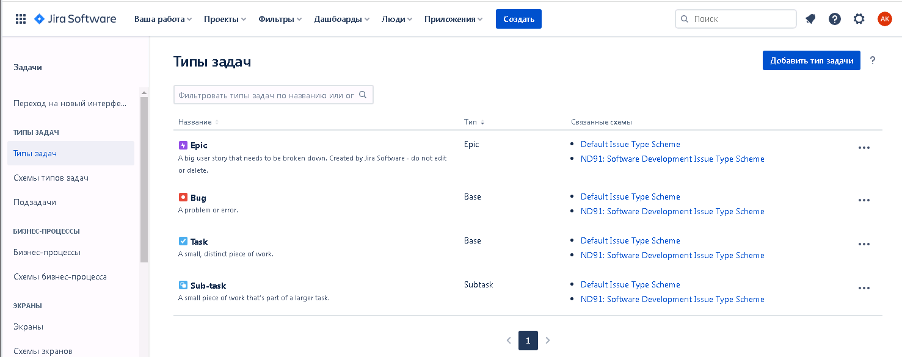
Создаём схему типов задач
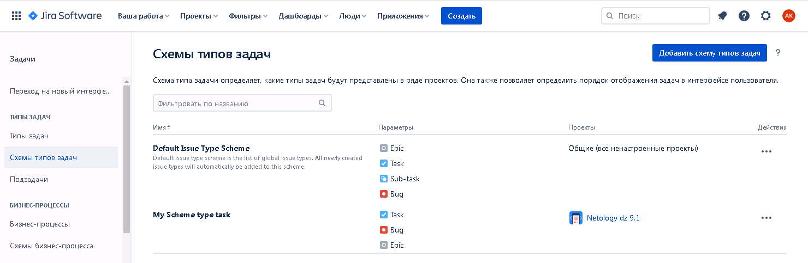
В разделе Бизнес-процессы создаём процессы:
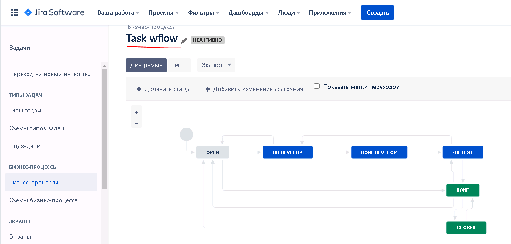
и
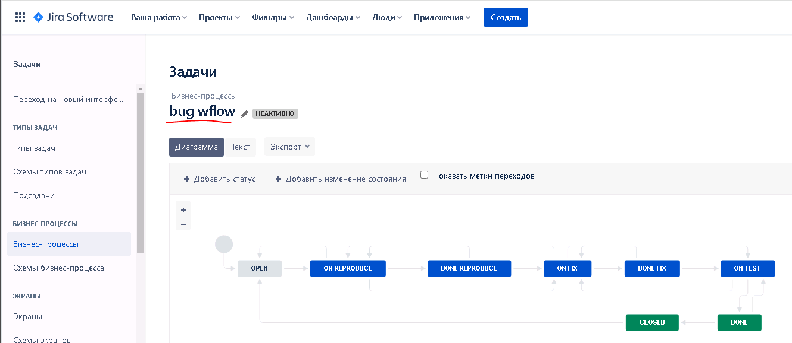
Выгружаем схемы процессов в xml и также загружаем в git в папку `src_dz_9.1`.

Идём в Схемы бизнес-процессов и создаём схему, где наззначаем типам задач соответствующие бизнес-процессы.
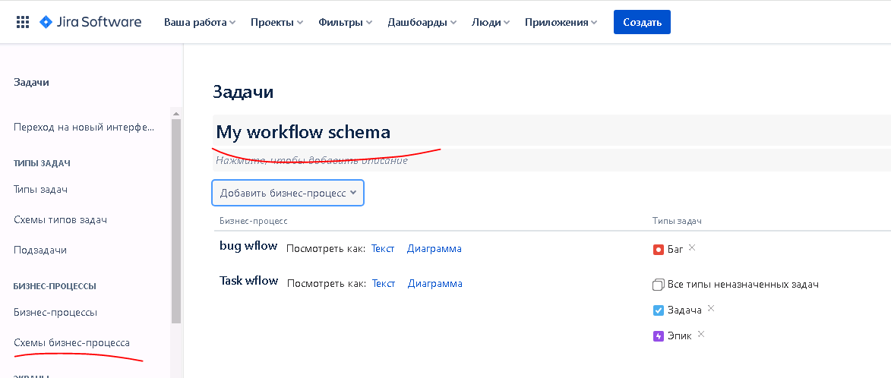
На этом подготовка закончена.

В свойствах проекта создаём дашборд (доску):
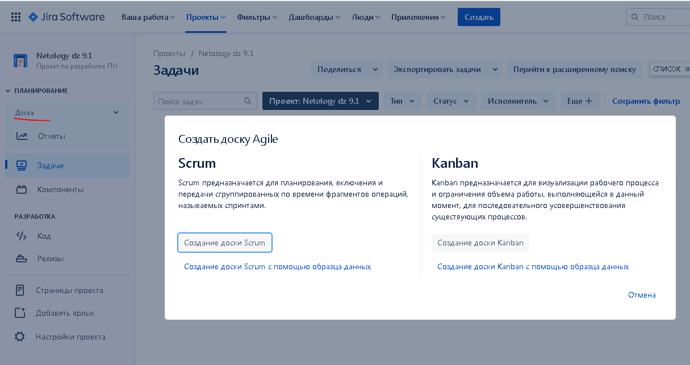
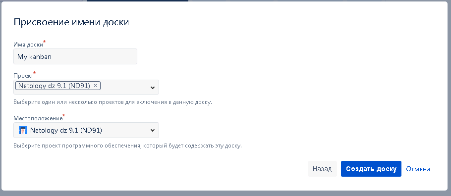
В настройках проекта надо переключить схему бизнес процессов на сделанную ранее

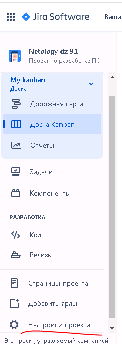
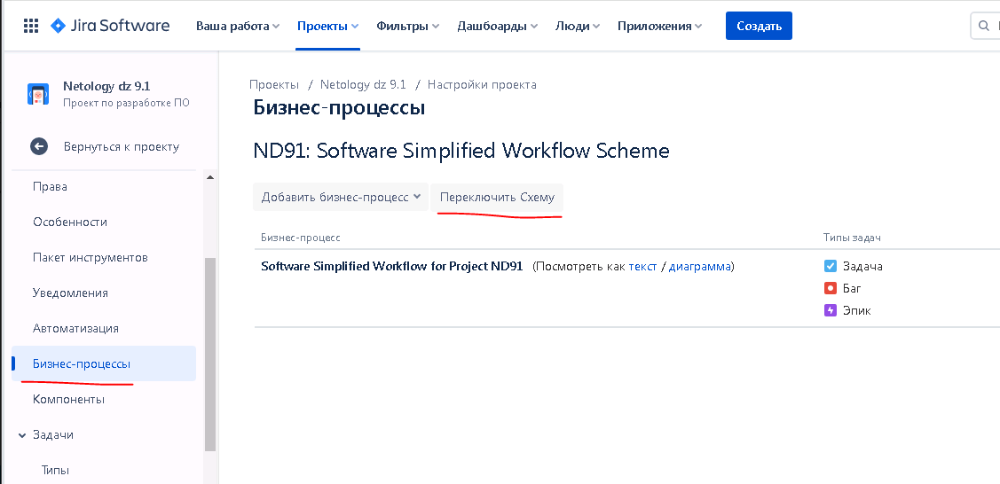
переключили
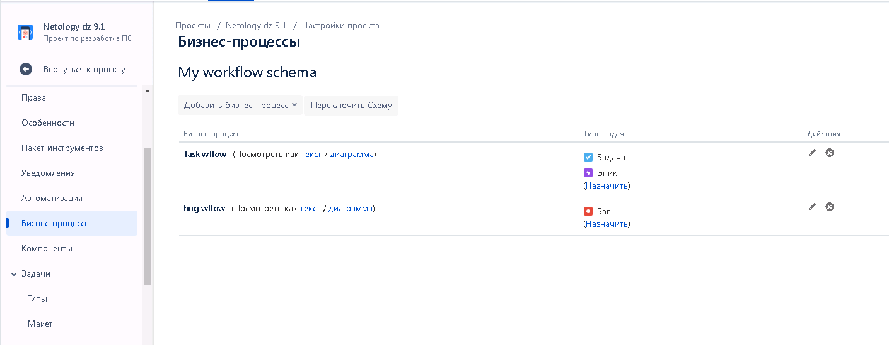

Создаём задачу
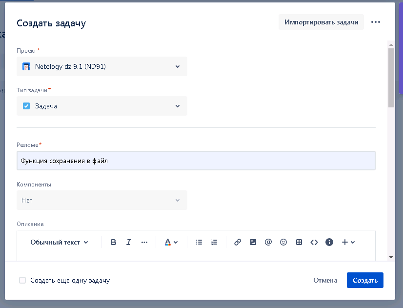
Сейчас Канбан может не отображать задачу. Отредактируем его настройки. Тут я распределил состояния по столбцам Кнбана и если нужно создать новые столбцы. Я создал Test&Fix.
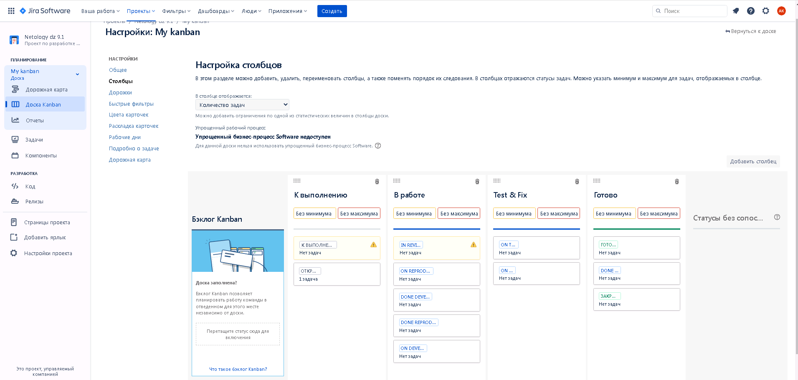
Теперь задача отображается

При изменении статуса, она передвигается между столбцами
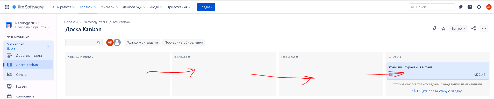

С заявкой типа Bug то же самое
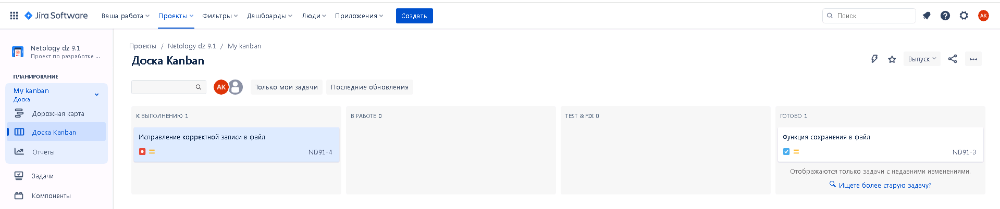
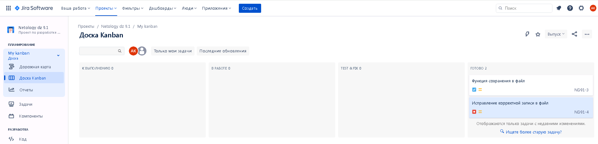
Возвращаем состояние задач в Open.

Похоже я не внимательно прочитал задание и таскал по кнбану задачу типа Task, а не Epic. Теперь создали Epic и создаём Task-и в нём.
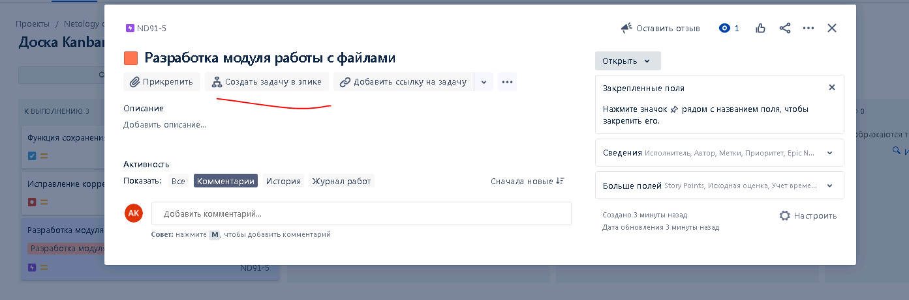
Создали
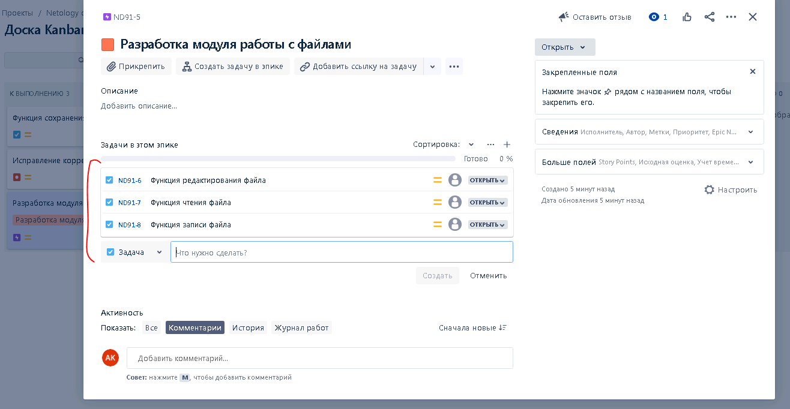
В Канбане это стало выглядеть так:
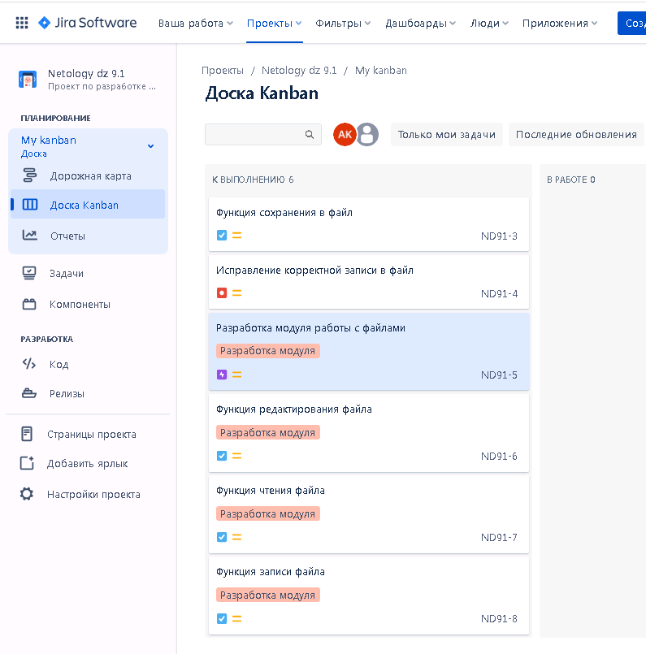

Теперь посмотрим, как работает Scrum. Создадим его. И перейдём в BackLog
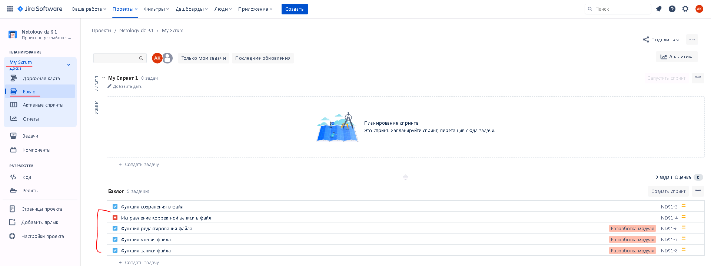
Видим все наши задачи. Теперь надо создать Спринт:
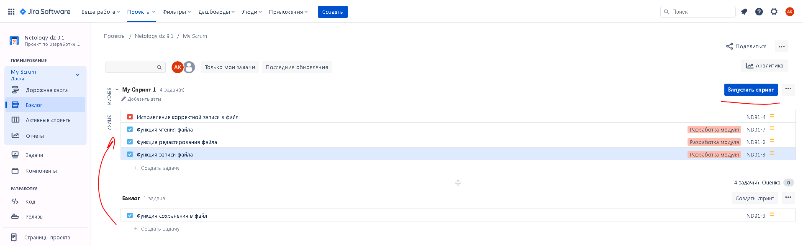
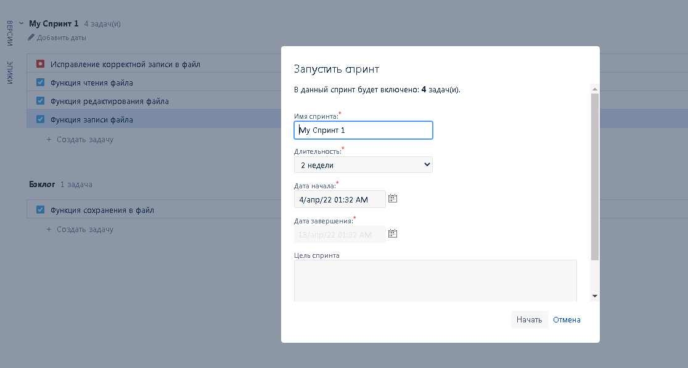
Затем продвинем задачи по Спринту до конца:
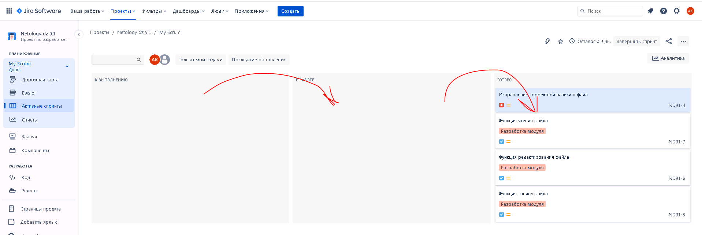

Всё получилось.
---

А с чем конкретно сложность? Создать рабочий процесс (workflow) и схему - шестеренка справа вверху рядом с аватаркой, там же создать типы задач и прицепить к ним процессы, создать схему задач. Создать проект через меню - первая папка Software чегототам, там третий шаблон. Дальше в проекте слева резюме, там настройка подключения схемы процессов и схемы задач. Там же слева доски, нажать и создать, там же переключение между досками.
