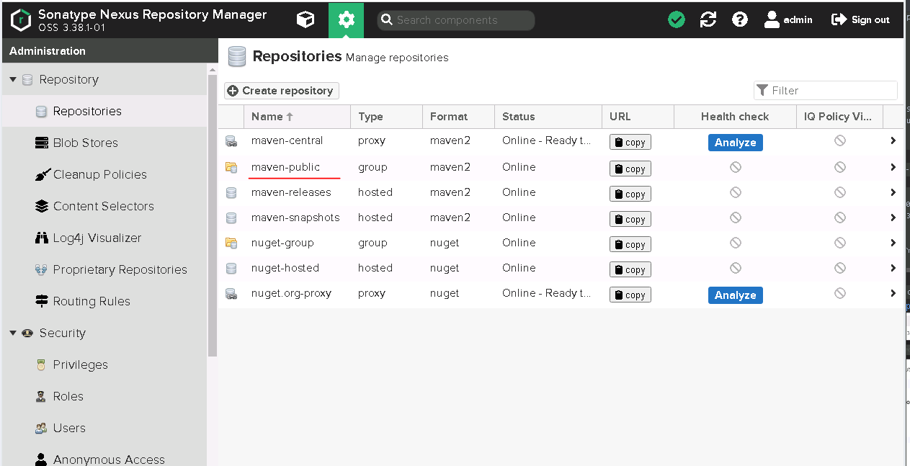

# Домашнее задание к занятию "09.02 CI\CD"

## Знакомоство с SonarQube

### Подготовка к выполнению

1. Выполняем `docker pull sonarqube:8.7-community`
2. Выполняем `docker run -d --name sonarqube -e SONAR_ES_BOOTSTRAP_CHECKS_DISABLE=true -p 9000:9000 sonarqube:8.7-community`
3. Ждём запуск, смотрим логи через `docker logs -f sonarqube`
4. Проверяем готовность сервиса через [браузер](http://localhost:9000)
5. Заходим под admin\admin, меняем пароль на свой

В целом, в [этой статье](https://docs.sonarqube.org/latest/setup/install-server/) описаны все варианты установки, включая и docker, но так как нам он нужен разово, то достаточно того набора действий, который я указал выше.

### Выполнение
1. Закачиваем образ для контейнера из глобального репозитория в локальный:
```bash
root@devopserubuntu:~# sudo docker pull sonarqube:8.7-community
8.7-community: Pulling from library/sonarqube
22599d3e9e25: Pull complete
00bb4d95f2aa: Pull complete
3ef8cf8a60c8: Pull complete
928990dd1bda: Pull complete
07cca701c22e: Pull complete
Digest: sha256:70496f44067bea15514f0a275ee898a7e4a3fedaaa6766e7874d24a39be336dc
Status: Downloaded newer image for sonarqube:8.7-community
docker.io/library/sonarqube:8.7-community

root@devopserubuntu:~# sudo docker image ls
REPOSITORY        TAG             IMAGE ID       CREATED         SIZE
centoselastic     0.5             2987dfd3aff1   8 weeks ago     2GB
postgres          13              42878d8cabb3   2 months ago    371MB
mysql             latest          6126b4587b1b   2 months ago    519MB
postgres          latest          6a3c44872108   2 months ago    374MB
akazand/ansible   2.9.24          885b0988c5e0   3 months ago    227MB
postgres          13.5            e01c76bb1351   3 months ago    371MB
debian            latest          04fbdaf87a6a   3 months ago    124MB
mynginx           0.7             fcf6f4373363   3 months ago    141MB
akazand/mynginx   0.7             fcf6f4373363   3 months ago    141MB
mynginx           0.5             2cc6139e76e9   3 months ago    141MB
nginx             latest          605c77e624dd   4 months ago    141MB
alpine            3.14            0a97eee8041e   5 months ago    5.61MB
centos            latest          5d0da3dc9764   7 months ago    231MB
**sonarqube         8.7-community   a4947e146b75   13 months ago   494MB**
```
Как видно, образ добавился в репозиторий.
2. Создаём и запускаем контейнер с `SonarQube`
```bash
root@devopserubuntu:~# sudo docker run -d --name sonarqube -e SONAR_ES_BOOTSTRAP_CHECKS_DISABLE=true -p 9000:9000 sonarqube:8.7-community
08b81ab637a853ae04b8dd3f719d0a699bf4a76d5bdf55fb325eca79a80084a2
root@devopserubuntu:~# sudo docker ps
CONTAINER ID   IMAGE                     COMMAND                  CREATED              STATUS              PORTS                                       NAMES
08b81ab637a8   sonarqube:8.7-community   "bin/run.sh bin/sona…"   About a minute ago   Up About a minute   0.0.0.0:9000->9000/tcp, :::9000->9000/tcp   sonarqube
```
Как видно он запустился.
3. Лог посмотрел, ошибок нет, но есть варнинги и их много:
```bash
root@devopserubuntu:~# sudo docker logs -f sonarqube
....
2022.05.07 13:37:29 WARN  es[][o.e.c.r.a.DiskThresholdMonitor] high disk watermark [90%] exceeded on [SapPen31R3qYHc6oWwKBJQ][sonarqube][/opt/sonarqube/data/es7/nodes/0] free: 2.3gb[8.3%], shards will be relocated away from this node; currently relocating away shards totalling [0] bytes; the node is expected to continue to exceed the high disk watermark when these relocations are complete
```
Судя по тексту Софтина переживает, что места мало на диске, но нам думаю хватит

4. Так как у нас контейнер запущен на ВМ с Ubuntu сервером, то браузера у нас там нет. Откроем с соседней виндовой ВМ.
5. Там действительно запросили пароль admin\admin и сменили мы его на свой. 
В итоге у нас открылся интерфейс:


### Основная часть

1. Создаём новый проект, название произвольное
2. Скачиваем пакет sonar-scanner, который нам предлагает скачать сам sonarqube
3. Делаем так, чтобы binary был доступен через вызов в shell (или меняем переменную PATH или любой другой удобный вам способ)
4. Проверяем `sonar-scanner --version`
5. Запускаем анализатор против кода из директории [example](./example) с дополнительным ключом `-Dsonar.coverage.exclusions=fail.py`
6. Смотрим результат в интерфейсе
7. Исправляем ошибки, которые он выявил(включая warnings)
8. Запускаем анализатор повторно - проверяем, что QG пройдены успешно
9. Делаем скриншот успешного прохождения анализа, прикладываем к решению ДЗ

### Выполнение
1. Нажимаем создать проект и выбираем вариант Manual. Имя задаём произвольное: `SonarTest1` и Project key = netology:java


Запрашивают создание токена


3. Как видно, нам предлагают скачать `sonar-scanner`, правда не говорят откуда.
Нашёл тут: [https://binaries.sonarsource.com/?prefix=Distribution/sonar-scanner-cli/](https://binaries.sonarsource.com/?prefix=Distribution/sonar-scanner-cli/)
скачиваем:
```bash
root@devopserubuntu:~# wget https://binaries.sonarsource.com/Distribution/sonar-scanner-cli/sonar-scanner-cli-4.7.0.2747-linux.zip 
```
Распаковываем архив в папку `/home/user1/sonar-scanner-4.7.0.2747-linux`
В конфиге `conf/sonar-scanner.properties` раскомментируем строчку `sonar.host.url=http://localhost:9000` для указания, где находится сам `SonarQube`.

3. Добавляем путь к папке bin В переменную PATH:
```bash
# export PATH="$PATH:/home/user1/sonar-scanner-4.7.0.2747-linux/bin"
```

4. Проверяем запуск сканера:
```bash
user1@devopserubuntu:~$ sonar-scanner --version
-bash: /home/user1/sonar-scanner-4.7.0.2747-linux/bin/sonar-scanner: Permission denied
user1@devopserubuntu:~$ sonar-scanner --version
Could not find 'java' executable in JAVA_HOME or PATH. 
```
Явно не хватает Java. Устанавливаем:
```bash
user1@devopserubuntu:~$ sudo apt install default-jre
```
Ещё раз пробуем запуск сканера - результат точно такой-же. Дальше в ход пошёл бубен и на долго...
Оказалось, что скрипт `home/user1/sonar-scanner-4.7.0.2747-linux/bin/sonar-scanner` пытается использовать яву, которая была у него в комплекте в том же архиве, а не ту, которая есть в системе.
А та, ява, которая была в архиве не запускается из-за недостатка прав. Исправляем:
```bash
user1@devopserubuntu:~$ sudo chmod 777 /home/user1/sonar-scanner-4.7.0.2747-linux/jre/bin/java
```
Теперь всё работает:
```bash
user1@devopserubuntu:~$ sonar-scanner --version
INFO: Scanner configuration file: /home/user1/sonar-scanner-4.7.0.2747-linux/conf/sonar-scanner.properties
INFO: Project root configuration file: NONE
INFO: SonarScanner 4.7.0.2747
INFO: Java 11.0.14.1 Eclipse Adoptium (64-bit)
INFO: Linux 5.13.0-30-generic amd64
```

5. Скачиваем демонстрационный файл с кодом для проверки сканером. И размещаем в папке:
`/home/user1/example_sonar/fail.py`
Пытаемся запустить сканер для проверки этого файла:

```bash
user1@devopserubuntu:~/example_sonar$ sonar-scanner \
  -Dsonar.projectKey=netology:java \
  -Dsonar.sources=. \
  -Dsonar.host.url=http://10.20.8.77:9000 \
  -Dsonar.login=0854566b26e4b552bddfdeada84bc45b0d6a4830 \
  -Dsonar.coverage.exclusions=fail.py
  
тут дальше выводится много букв
WARN: SCM provider autodetection failed. Please use "sonar.scm.provider" to define SCM of your project, or disable the SCM Sensor in the project settings.
тут дальше выводится много букв
```
Теперь в Веб-интерфейсе можно увидеть результаты проверки файла

6. Смотрим результаты:

Также обнаружилась проблема, которую мы видели и в листинге. Для её устранения мы просто отключаем использование SCM-провайдера. В разделе Administratoion-SCM.
Смотрим, какие ошибки нам нашла система в демо-файле:


7. Исправляем показанные ошибки.

8. заново запускаем сканирование файла. 
```bash
user1@devopserubuntu:~/example_sonar$ sonar-scanner   -Dsonar.projectKey=Sonar-Test-Py2   -Dsonar.sources=.   -Dsonar.host.url=http://10.20.8.77:9000   -Dsonar.login=51e8d026acd7f430237665e2eee49c36443d13fe -Dsonar.coverage.exclusions=fail.py
INFO: Scanner configuration file: /home/user1/sonar-scanner-4.7.0.2747-linux/conf/sonar-scanner.properties
INFO: Project root configuration file: NONE
INFO: SonarScanner 4.7.0.2747
INFO: Java 11.0.14.1 Eclipse Adoptium (64-bit)
INFO: Linux 5.13.0-30-generic amd64
INFO: User cache: /home/user1/.sonar/cache
INFO: Scanner configuration file: /home/user1/sonar-scanner-4.7.0.2747-linux/conf/sonar-scanner.properties
INFO: Project root configuration file: NONE
INFO: Analyzing on SonarQube server 8.7.1
INFO: Default locale: "en_US", source code encoding: "UTF-8" (analysis is platform dependent)
INFO: Load global settings
INFO: Load global settings (done) | time=109ms
INFO: Server id: BF41A1F2-AYDS57UIFgmGKwzjVYZr
INFO: User cache: /home/user1/.sonar/cache
INFO: Load/download plugins
INFO: Load plugins index
INFO: Load plugins index (done) | time=55ms
INFO: Load/download plugins (done) | time=128ms
INFO: Process project properties
INFO: Process project properties (done) | time=8ms
INFO: Execute project builders
INFO: Execute project builders (done) | time=1ms
INFO: Project key: Sonar-Test-Py2
INFO: Base dir: /home/user1/example_sonar
INFO: Working dir: /home/user1/example_sonar/.scannerwork
INFO: Load project settings for component key: 'Sonar-Test-Py2'
INFO: Load project settings for component key: 'Sonar-Test-Py2' (done) | time=16ms
INFO: Load quality profiles
INFO: Load quality profiles (done) | time=53ms
INFO: Load active rules
INFO: Load active rules (done) | time=1563ms
INFO: Indexing files...
INFO: Project configuration:
INFO:   Excluded sources for coverage: fail.py
INFO: 1 file indexed
INFO: Quality profile for py: Sonar way
INFO: ------------- Run sensors on module Sonar-Test-Py2
INFO: Load metrics repository
INFO: Load metrics repository (done) | time=24ms
INFO: Sensor Python Sensor [python]
INFO: Starting global symbols computation
INFO: 1 source files to be analyzed
INFO: Load project repositories
INFO: Load project repositories (done) | time=17ms
INFO: Starting rules execution
INFO: 1 source files to be analyzed
INFO: 1/1 source files have been analyzed
INFO: 1/1 source files have been analyzed
INFO: Sensor Python Sensor [python] (done) | time=5853ms
INFO: Sensor Cobertura Sensor for Python coverage [python]
INFO: Sensor Cobertura Sensor for Python coverage [python] (done) | time=9ms
INFO: Sensor PythonXUnitSensor [python]
INFO: Sensor PythonXUnitSensor [python] (done) | time=1ms
INFO: Sensor CSS Rules [cssfamily]
INFO: No CSS, PHP, HTML or VueJS files are found in the project. CSS analysis is skipped.
INFO: Sensor CSS Rules [cssfamily] (done) | time=1ms
INFO: Sensor JaCoCo XML Report Importer [jacoco]
INFO: 'sonar.coverage.jacoco.xmlReportPaths' is not defined. Using default locations: target/site/jacoco/jacoco.xml,target/site/jacoco-it/jacoco.xml,build/reports/jacoco/test/jacocoTestReport.xml
INFO: No report imported, no coverage information will be imported by JaCoCo XML Report Importer
INFO: Sensor JaCoCo XML Report Importer [jacoco] (done) | time=3ms
INFO: Sensor C# Properties [csharp]
INFO: Sensor C# Properties [csharp] (done) | time=1ms
INFO: Sensor JavaXmlSensor [java]
INFO: Sensor JavaXmlSensor [java] (done) | time=1ms
INFO: Sensor HTML [web]
INFO: Sensor HTML [web] (done) | time=3ms
INFO: Sensor VB.NET Properties [vbnet]
INFO: Sensor VB.NET Properties [vbnet] (done) | time=0ms
INFO: ------------- Run sensors on project
INFO: Sensor Zero Coverage Sensor
INFO: Sensor Zero Coverage Sensor (done) | time=0ms
INFO: SCM Publisher is disabled
INFO: CPD Executor Calculating CPD for 1 file
INFO: CPD Executor CPD calculation finished (done) | time=8ms
INFO: Analysis report generated in 66ms, dir size=91 KB
INFO: Analysis report compressed in 20ms, zip size=12 KB
INFO: Analysis report uploaded in 18ms
INFO: ANALYSIS SUCCESSFUL, you can browse http://10.20.8.77:9000/dashboard?id=Sonar-Test-Py2
INFO: Note that you will be able to access the updated dashboard once the server has processed the submitted analysis report
INFO: More about the report processing at http://10.20.8.77:9000/api/ce/task?id=AYDTtPcuI0eTsaG_HsXC
INFO: Analysis total time: 9.253 s
INFO: ------------------------------------------------------------------------
INFO: EXECUTION SUCCESS
INFO: ------------------------------------------------------------------------
INFO: Total time: 10.440s
INFO: Final Memory: 70M/240M
INFO: ------------------------------------------------------------------------
 
```
9. Ошибок больше нет:


## Знакомство с Nexus

### Подготовка к выполнению

1. Выполняем `docker pull sonatype/nexus3`
2. Выполняем `docker run -d -p 8081:8081 --name nexus sonatype/nexus3`
3. Ждём запуск, смотрим логи через `docker logs -f nexus`
4. Проверяем готовность сервиса через [бразуер](http://localhost:8081)
5. Узнаём пароль от admin через `docker exec -it nexus /bin/bash`
6. Подключаемся под админом, меняем пароль, сохраняем анонимный доступ

### Выполнение
1. Выполняем `docker pull sonatype/nexus3`

```bash
user1@devopserubuntu:~$ sudo docker pull sonatype/nexus3
Using default tag: latest
latest: Pulling from sonatype/nexus3
3de00bb8554b: Pull complete
c530010fb61c: Pull complete
7702e8da5f17: Pull complete
17eb9ed9829d: Pull complete
43371288717f: Pull complete
Digest: sha256:66fe12b1eb3e97bae72eb3c2c4e436499d41ff144cdfd1dcd0718df738304732
Status: Downloaded newer image for sonatype/nexus3:latest
docker.io/sonatype/nexus3:latest
```

2. Выполняем `docker run -d -p 8081:8081 --name nexus sonatype/nexus3`
```bash
user1@devopserubuntu:~$ sudo docker run -d -p 8081:8081 --name nexus sonatype/nexus3
c96dee055fe9f242f016e9d2acf70143f4d46d2f46c782d3150e7cf05a771bf1
user1@devopserubuntu:~$ sudo docker ps
CONTAINER ID   IMAGE             COMMAND                  CREATED          STATUS          PORTS                                       NAMES
c96dee055fe9   sonatype/nexus3   "sh -c ${SONATYPE_DI…"   14 seconds ago   Up 13 seconds   0.0.0.0:8081->8081/tcp, :::8081->8081/tcp   nexus
```
3. Ждём запуск, смотрим логи через `docker logs -f nexus`
Ошибок в логе нет.
4. Проверяем готовность сервиса через [бразуер](http://localhost:8081)
Пробуем открыть сервис по адресу: http://10.20.8.77:8081/

5. Узнаём пароль от admin через `docker exec -it nexus /bin/bash`
```bash
user1@devopserubuntu:~$ sudo docker exec -it nexus /bin/bash
bash-4.4$ ls
bin  boot  dev  etc  help.1  home  lib  lib64  licenses  lost+found  media  mnt  nexus-data  opt  proc  root  run  sbin  srv  sys  tmp  uid_entrypoint.sh  uid_template.sh  usr  var
bash-4.4$ cd nexus-data/
bash-4.4$ ls
admin.password  blobs  cache  db  elasticsearch  etc  generated-bundles  instances  javaprefs  karaf.pid  keystores  lock  log  orient  port  restore-from-backup  tmp
bash-4.4$ cat admin.password
6aab8172-9965-4328-8db3-a55b06b8caaab 
```
6. Подключаемся под админом, меняем пароль, сохраняем анонимный доступ
Сделано.

### Основная часть

1. В репозиторий `maven-public` загружаем артефакт с GAV параметрами:
   1. groupId: netology
   2. artifactId: java
   3. version: 8_282
   4. classifier: distrib
   5. type: tar.gz
2. В него же загружаем такой же артефакт, но с version: 8_102
3. Проверяем, что все файлы загрузились успешно
4. В ответе присылаем файл `maven-metadata.xml` для этого артефекта

### Выполнение
Вот наши репозитории:


1. Загружаем файл

Смотрим, как он записался:

2. Теперь загрузим этот же файл с указанием другой версии
3. Вот что получилось

4. Посмотрим на содержимое файла `maven-metadata.xml`
```xml
<metadata modelVersion="1.1.0">
<groupId>netology</groupId>
<artifactId>java</artifactId>
<versioning>
<latest>8_282</latest>
<release>8_282</release>
<versions>
<version>8_102</version>
<version>8_282</version>
</versions>
<lastUpdated>20220518011310</lastUpdated>
</versioning>
</metadata>
```

### Знакомство с Maven

### Подготовка к выполнению

1. Скачиваем дистрибутив с [maven](https://maven.apache.org/download.cgi)
2. Разархивируем, делаем так, чтобы binary был доступен через вызов в shell (или меняем переменную PATH или любой другой удобный вам способ)
3. Проверяем `mvn --version`
4. Забираем директорию [mvn](./mvn) с pom

#### Выполнение
1. скачиваем
```bash
user1@devopserubuntu:~/maven$ wget https://dlcdn.apache.org/maven/maven-3/3.8.5/binaries/apache-maven-3.8.5-bin.tar.gz
--2022-05-18 01:26:47--  https://dlcdn.apache.org/maven/maven-3/3.8.5/binaries/apache-maven-3.8.5-bin.tar.gz
Resolving dlcdn.apache.org (dlcdn.apache.org)... 151.101.2.132, 2a04:4e42::644
Connecting to dlcdn.apache.org (dlcdn.apache.org)|151.101.2.132|:443... connected.
HTTP request sent, awaiting response... 200 OK
Length: 8673123 (8.3M) [application/x-gzip]
Saving to: ‘apache-maven-3.8.5-bin.tar.gz’

apache-maven-3.8.5-bin.tar.gz                   100%[=====================================================================================================>]   8.27M  5.52MB/s    in 1.5s

2022-05-18 01:26:49 (5.52 MB/s) - ‘apache-maven-3.8.5-bin.tar.gz’ saved [8673123/8673123]
```
2. распаковка и добавляем путь в PATH
```bash
user1@devopserubuntu:~/maven$ tar xvzf apache-maven-3.8.5-bin.tar.gz

user1@devopserubuntu:~/maven$ ls -la /home/user1/maven/apache-maven-3.8.5/bin/mvn
-rwxr-xr-x 1 user1 user1 5790 Mar  5 11:30 /home/user1/maven/apache-maven-3.8.5/bin/mvn

user1@devopserubuntu:~/maven$ export PATH="$PATH:/home/user1/maven/apache-maven-3.8.5/bin"
```
3. Проверяем 
```bash
user1@devopserubuntu:~/maven$ mvn --version
Apache Maven 3.8.5 (3599d3414f046de2324203b78ddcf9b5e4388aa0)
Maven home: /home/user1/maven/apache-maven-3.8.5
Java version: 11.0.15, vendor: Private Build, runtime: /usr/lib/jvm/java-11-openjdk-amd64
Default locale: en_US, platform encoding: UTF-8
OS name: "linux", version: "5.13.0-30-generic", arch: "amd64", family: "unix"
```
4. Забираем директорию mvn с pom
```bash
user1@devopserubuntu:~$ mkdir mvn
user1@devopserubuntu:~$ cd mvn
user1@devopserubuntu:~/mvn$ wget https://raw.githubusercontent.com/netology-code/mnt-homeworks/master/09-ci-02-cicd/mvn/pom.xml
--2022-05-18 01:40:24--  https://raw.githubusercontent.com/netology-code/mnt-homeworks/master/09-ci-02-cicd/mvn/pom.xml
Resolving raw.githubusercontent.com (raw.githubusercontent.com)... 185.199.108.133, 185.199.109.133, 185.199.110.133, ...
Connecting to raw.githubusercontent.com (raw.githubusercontent.com)|185.199.108.133|:443... connected.
HTTP request sent, awaiting response... 200 OK
Length: 812 [text/plain]
Saving to: ‘pom.xml’

pom.xml                                         100%[=====================================================================================================>]     812  --.-KB/s    in 0s

2022-05-18 01:40:24 (37.7 MB/s) - ‘pom.xml’ saved [812/812]
```

### Основная часть

1. Меняем в `pom.xml` блок с зависимостями под наш артефакт из первого пункта задания для Nexus (java с версией 8_282)
2. Запускаем команду `mvn package` в директории с `pom.xml`, ожидаем успешного окончания
3. Проверяем директорию `~/.m2/repository/`, находим наш артефакт
4. В ответе присылаем исправленный файл `pom.xml`

#### Выполнение

1. Меняем параметры в блоке dependencies, который был весь закомментирован.
```bash
user1@devopserubuntu:~/mvn$ cat pom.xml
<project xmlns="http://maven.apache.org/POM/4.0.0" xmlns:xsi="http://www.w3.org/2001/XMLSchema-instance"
  xsi:schemaLocation="http://maven.apache.org/POM/4.0.0 http://maven.apache.org/xsd/maven-4.0.0.xsd">
  <modelVersion>4.0.0</modelVersion>

  <groupId>com.netology.app</groupId>
  <artifactId>simple-app</artifactId>
  <version>1.0-SNAPSHOT</version>
   <repositories>
    <repository>
      <id>my-repo</id>
      <name>maven-public</name>
      <url>http://localhost:8081/repository/maven-public/</url>
    </repository>
  </repositories>
  <dependencies>
    <dependency>
      <groupId>netology</groupId>
      <artifactId>java</artifactId>
      <version>8_282</version>
      <classifier>distrib</classifier>
      <type>tar.gz</type>
    </dependency>
  </dependencies>
</project>
```
2. Запускаем команду mvn package в директории с pom.xml, ожидаем успешного окончания
```bash
>user1@devopserubuntu:~/mvn$ mvn package
[INFO] Scanning for projects...
[INFO]
[INFO] --------------------< com.netology.app:simple-app >---------------------
[INFO] Building simple-app 1.0-SNAPSHOT
[INFO] --------------------------------[ jar ]---------------------------------
Downloading from central: https://repo.maven.apache.org/maven2/org/apache/maven/plugins/maven-resources-plugin/2.6/maven-resources-plugin-2.6.pom
Downloaded from central: https://repo.maven.apache.org/maven2/org/apache/maven/plugins/maven-resources-plugin/2.6/maven-resources-plugin-2.6.pom (8.1 kB at 11 kB/s)
....много букв....
Downloaded from central: https://repo.maven.apache.org/maven2/commons-lang/commons-lang/2.1/commons-lang-2.1.jar (208 kB at 855 kB/s)
[WARNING] JAR will be empty - no content was marked for inclusion!
[INFO] Building jar: /home/user1/mvn/target/simple-app-1.0-SNAPSHOT.jar
[INFO] ------------------------------------------------------------------------
[INFO] BUILD SUCCESS
[INFO] ------------------------------------------------------------------------
[INFO] Total time:  23.991 s
[INFO] Finished at: 2022-05-18T01:52:06Z
[INFO] ------------------------------------------------------------------------
```
3. Проверяем директорию ~/.m2/repository/, находим наш артефакт:
```bash
user1@devopserubuntu:~$ ls -la /home/user1/.m2/repository/netology/java/8_282
total 4228
drwxrwxr-x 2 user1 user1    4096 May 18 01:51 .
drwxrwxr-x 3 user1 user1    4096 May 18 01:51 ..
-rw-rw-r-- 1 user1 user1 4308426 May 18 01:51 java-8_282-distrib.tar.gz
-rw-rw-r-- 1 user1 user1      40 May 18 01:51 java-8_282-distrib.tar.gz.sha1
-rw-rw-r-- 1 user1 user1     382 May 18 01:51 java-8_282.pom.lastUpdated
-rw-rw-r-- 1 user1 user1     175 May 18 01:51 _remote.repositories
```
4. файл `pom.xml` см выше.


---

### Как оформить ДЗ?

Выполненное домашнее задание пришлите ссылкой на .md-файл в вашем репозитории.

---